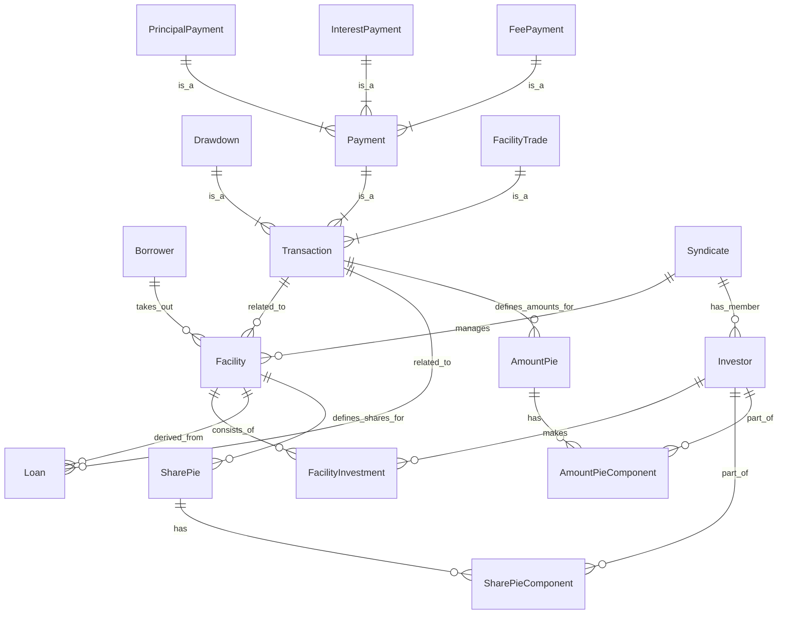

# System Patterns: Syndicated Loan Management System

## 1. Architecture Overview

### 1.1 Layer Architecture (Clean Architecture influenced)

Our system architecture follows a layered approach influenced by Clean Architecture (or Onion Architecture). The core layers (Domain, Application) contain the business logic and are independent of external concerns like databases or UI. The Infrastructure layer handles external interactions. Dependencies flow inwards.

```mermaid
graph LR
    Inf[Infrastructure<br/>(Adapters)] --> App[Application<br/>(Services)]
    App --> Dom[Domain<br/>(Entities, VO, Services)]
    Inf -- DB Access --> DomDB[(Database)]
    Inf -- API Calls --> Ext[External Systems]

    subgraph Layers
        Inf
        App
        Dom
    end
```

*   **Domain Layer:** Contains core business logic, Entities, Value Objects, Aggregates, Domain Services, and Repository interfaces. It is the innermost layer and has no dependencies on other layers.
*   **Application Layer:** Contains application-specific logic, Use Cases (Application Services), and DTOs for inter-layer communication. It orchestrates domain objects and calls repositories to perform business workflows. It depends on the Domain Layer but not on Infrastructure.
*   **Infrastructure Layer (Adapters):** Contains external concerns like database implementations (Repository implementations, JPA Entities), REST controllers, external service clients, etc. It depends on the Application and Domain layers. This layer is responsible for mapping between Domain/Application concepts and external formats/technologies.

### 1.2 Package Structure

The package structure is organized primarily by **Bounded Contexts (Features)**, and then by **Layers** within each context. This promotes high cohesion within features and clear separation of concerns between layers.

```
com.example.syndicatelending/
├── common/             # Cross-cutting concerns (common VOs, exceptions, global handlers)
│   ├── domain/         # Domain layer common elements
│   │   └── model/      #   e.g., Money, Percentage
│   ├── application/    # Application layer common elements
│   │   └── exception/  #   e.g., ResourceNotFoundException, BusinessRuleViolationException
│   └── infrastructure/ # Infrastructure layer common elements
│       ├── api/        #   e.g., GlobalExceptionHandler (@ControllerAdvice)
│       └── util/       #   e.g., Common utilities (technical)
│
├── [feature]/          # Bounded Context / Feature (e.g., loanandfacility, transaction, party, syndicate)
│   ├── domain/         # Domain Layer for this feature
│   │   ├── model/      #   Domain Entities (no JPA), Value Objects, Aggregate Roots
│   │   └── repository/ #   Repository Interfaces (Domain-focused)
│   │   └── service/    #   Domain Services (pure business logic)
│   ├── application/    # Application Layer for this feature
│   │   └── service/    #   Application Services (@Service, @Transactional), Use Cases
│   │   └── dto/        #   Input/Output DTOs for Application Services (CommandDTO, ResultDTO)
│   └── infrastructure/ # Infrastructure Layer (Adapters) for this feature
│       ├── persistence/#   Persistence implementation (@Repository)
│       │   ├── entity/ #     JPA Entities (@Entity, @Table, @Id, @GeneratedValue)
│       │   ├── repository/ # Spring Data JPA Repositories
│       │   └── mapper/ #     Mappers (Domain Entity <-> JPA Entity)
│       └── api/        #   API implementation (@RestController)
│           └── dto/    #     Request/Response DTOs for API calls (API-focused)
│
└── ... other [feature] packages ...
```

## 2. Design Patterns

### 2.1 Domain-Driven Design (DDD)

We apply DDD principles to manage the complexity of the syndicated loan domain.

1.  **Entities:**
    *   Represent mutable concepts with a distinct identity (e.g., `Facility`, `Drawdown`).
    *   Encapsulate business logic and state related to the entity.
    *   Identified by a **Business ID** (e.g., UUID) in the Domain Layer, distinct from the JPA-managed auto-generated ID.
2.  **Value Objects (VOs):**
    *   Represent descriptive aspects of the domain with no conceptual identity (e.g., `Money`, `Percentage`, `FacilityId`, `TransactionId`).
    *   Immutable, treated as values.
    *   Encapsulate related data and domain logic specific to the value (e.g., `Money.add()`, `Percentage.applyTo(Money)`).
3.  **Aggregates:**
    *   A cluster of Entities and Value Objects treated as a single unit for data changes. An Aggregate Root is the primary entity reference point (e.g., `Facility`, `Drawdown` might be Aggregate Roots).
    *   Ensures data consistency within the boundary in a single transaction.
4.  **Repositories:**
    *   Provide an abstraction layer for accessing Aggregates.
    *   **Domain Repository Interfaces** (`domain.repository`): Defined in the Domain Layer, specifying *what* can be retrieved/saved (e.g., `findById(FacilityId)`, `save(Facility)`). Operate purely on Domain Entities.
    *   **Infrastructure Repository Implementations** (`infrastructure.persistence`): Implement the Domain Repository Interfaces using specific technologies (e.g., Spring Data JPA). Handle the mapping between Domain Entities and JPA Entities and interact with the database.

### 2.2 Application Service Pattern

Application Services represent the use cases or commands of the application.

1.  **Application Services (`application.service`):**
    *   Orchestrate interactions between Domain objects and Repositories.
    *   Implement specific business workflows (use cases) (e.g., `ProcessDrawdownService`).
    *   Manage transaction boundaries (`@Transactional`).
    *   Depend on Domain Repository Interfaces and Domain Services.
    *   Do **not** contain core business logic that belongs in the Domain layer.

### 2.3 Controller Pattern

Controllers act as the entry point from the outside world (e.g., REST API).

1.  **Feature-based Controllers (`infrastructure.api`):**
    *   Group related API endpoints for a specific feature.
    *   Handle HTTP requests and responses.
    *   Map Request DTOs to Application Service Command DTOs.
    *   Call the appropriate Application Service.
    *   Map Application Service Result DTOs to Response DTOs.
    *   Are kept thin; they delegate business logic execution entirely to Application Services.

## 3. Key Technical Decisions

### 3.1 Error Handling

*   **Layered Exceptions:** Domain layer throws Domain-specific exceptions (e.g., `InsufficientFundsException`). Application layer catches Domain exceptions and throws Application-specific exceptions (`ResourceNotFoundException`, `BusinessRuleViolationException`) that are meaningful at the application level.
*   **Global Exception Handler (`common.infrastructure.api.GlobalExceptionHandler`):** A `@RestControllerAdvice` component that catches Application exceptions (and standard framework exceptions like validation errors) and maps them to appropriate HTTP status codes and structured error responses.
*   **Structured Error Responses:** APIs return consistent JSON format for errors including status, error type, and a message.

### 3.2 Persistence (JPA)

*   **Separation of Domain Entities and JPA Entities:** Domain entities (`domain.model`) are pure Java objects without JPA annotations. JPA entities (`infrastructure.persistence.entity`) are defined in the Infrastructure layer, optimized for database mapping, and contain `@Entity`, `@Table`, `@Id`, `@GeneratedValue` etc.
*   **Auto-generated IDs:** Database-generated primary keys (e.g., `Long` with `IDENTITY` strategy) are used for JPA entities. Domain entities are identified by **Business IDs** (e.g., `UUID` Value Objects) which are distinct from the JPA primary key and are also persisted. Mappers handle the translation.
*   **Repository Implementation:** Infrastructure-level Repository implementations translate between Domain Entities and JPA Entities using Mappers and utilize Spring Data JPA interfaces (`JpaRepository`) for database interaction.

### 3.3 Testing

*   **Layered Testing Strategy:**
    *   **Domain Unit Tests:** Focus on Domain Entities, Value Objects, and Domain Services (`domain.model`, `domain.service`). Pure Java, no dependencies, very fast. Verify core business rules and calculations.
    *   **Application Service Tests:** Focus on Application Services (`application.service`). Use mocks for Repository *interfaces* and external services to test the business workflow orchestration independent of Infrastructure details. Verify use case execution flow and error handling.
    *   **Infrastructure Integration Tests:** Focus on Persistence (`infrastructure.persistence`) and API (`infrastructure.api`) layers. Test mapping between Domain/Application concepts and external technologies (DB, API). These tests are slower and require a running database/API endpoint.
*   **Repository Mocking:** Essential for fast and isolated Application Service tests. We mock the Domain Repository *interfaces* in Application Service tests.

## 4. Data Model (Conceptual)

Based on the identified core entities and relationships:


*(Note: This is a conceptual ER diagram based on the domain concepts. The actual JPA entity relationships might differ slightly due to mapping concerns like inheritance or embedded objects.)*

## 5. Transaction Patterns

Complex transaction processing is a core part of this system, handled by the `transaction` Bounded Context.

1.  **Payment Processing (Interest, Principal, Fee):**
    *   Involves calculation based on `Loan` balance, interest rates, fee types, and dates.
    *   Distribution of the received payment amount to individual investors based on the `Share Pie`, resulting in an `Amount Pie`.
    *   Updating `Loan` balance (for Principal Payments).
    *   Recording the specific `Payment` transaction (`InterestPayment`, `PrincipalPayment`, `FeePayment`).
    *   Domain Services (`FundDistributionService`) handle the complex calculation and distribution logic.
2.  **Trade Settlement (Facility Trade):**
    *   Involves the transfer of a portion of a `Facility` (and potentially associated `Loan`) from a selling investor to a buying investor.
    *   Requires updating the `Share Pie` of the affected `Facility` (and `Loan`).
    *   Recording the `Facility Trade` transaction.
    *   May involve settlement of funds between the selling and buying investors.

## 6. Integration Patterns

### 6.1 REST APIs

*   Provided by the `infrastructure.api` layer within each feature package.
*   Follow RESTful principles with resource-based endpoints (`/api/v1/facilities`, `/api/v1/drawdowns` etc.) and standard HTTP methods.
*   Utilize Request/Response DTOs (`infrastructure.api.dto`) for defining the external API contract.
*   Global Exception Handler ensures consistent error response formats and appropriate HTTP status codes.

### 6.2 Data Transfer (DTOs)

*   **API DTOs** (`infrastructure.api.dto`): Used exclusively at the API boundary for serialization/deserialization of external requests/responses.
*   **Application DTOs** (`application.dto`): Used within the Application layer as input (Command DTOs) and output (Result DTOs) for Application Services. These bridge the gap between the API format and the data needed/returned by the Application layer.
*   **Mappers:** Infrastructure layer is responsible for mapping between API DTOs, Application DTOs, and Domain objects.
*   **Validation:** Bean Validation (`@Valid`) is applied to API Request DTOs. Deeper business validation happens within the Application or Domain layers.
