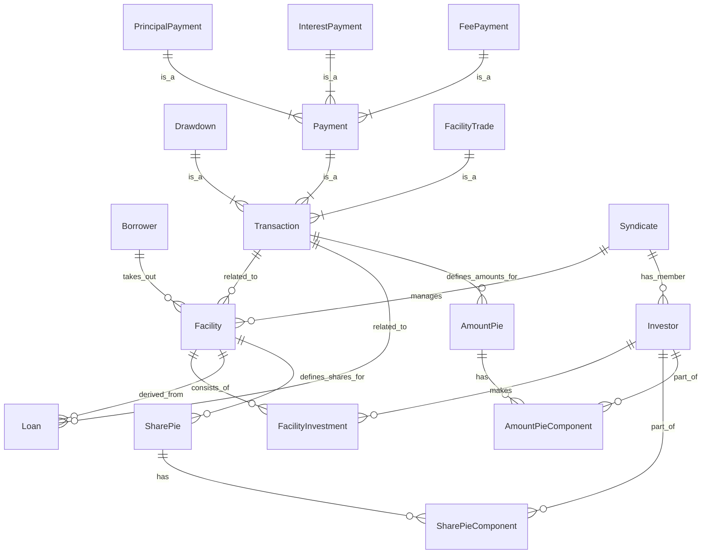

# System Patterns: Syndicated Loan Management System

## 1. Architecture Overview

### 1.1 Layer Architecture (Lightweight DDD / 3-Tier)

本システムは、実用的な3層アーキテクチャ（Controller-Service-Repository）を基本とし、必要に応じてドメイン層の分離や拡張が可能な「軽量級DDD」構造を採用します。

- **Entity/Domain**: JPAエンティティ兼ドメインエンティティ（@Entity, @Table, @Id など）
- **Repository**: Spring Data JPAインターフェース
- **Service**: 業務ロジックを担うサービスクラス（@Service, @Transactional）
- **Controller**: REST APIエンドポイント（@RestController）
- **DTO**: APIリクエスト/レスポンス用DTO

#### パッケージ構成例

```
com.example.syndicatelending/
├── common/         # 共通値オブジェクト・例外
├── party/          # 参加者（Company, Borrower, Investor）
│   ├── entity/
│   ├── repository/
│   ├── service/
│   ├── controller/
│   └── dto/
├── syndicate/      # シンジケート団
│   ├── entity/
│   ├── repository/
│   ├── service/
│   ├── controller/
│   └── dto/
├── facility/       # 融資枠
│   ├── entity/
│   ├── repository/
│   ├── service/
│   ├── controller/
│   └── dto/
├── loan/           # 貸付・返済
│   ├── entity/
│   ├── repository/
│   ├── service/
│   ├── controller/
│   └── dto/
└── ...
```

- 各Bounded Contextごとに entity/repository/service/controller/dto を持つシンプルな構成
- position/domainは、FacilityやLoanなど複数コンテキストで共通利用される「純粋なドメインモデル（POJO）」を集約する役割。JPA非依存で業務ロジックや値オブジェクトを表現する。
- 必要に応じて、将来的にdomain.modelやdomain.service等の分離も可能

---

## 2. Design Patterns

- DDDの原則は意識しつつも、現状は「軽量級DDD」構造（3層＋DTO）を基本とする
- ドメインの複雑化や業務要件の高度化に応じて、段階的に重量級DDD構造へ発展可能

1.  **Entities:**
    *   Represent mutable concepts with a distinct identity (e.g., `Facility`, `Drawdown`).
    *   Encapsulate business logic and state related to the entity.
    *   Identified by a **Business ID** (e.g., UUID) in the Domain Layer, distinct from the JPA-managed auto-generated ID.
2.  **Value Objects (VOs):**
    *   Represent descriptive aspects of the domain with no conceptual identity (e.g., `Money`, `Percentage`, `FacilityId`, `TransactionId`).
    *   Immutable, treated as values.
    *   Encapsulate related data and domain logic specific to the value (e.g., `Money.add()`, `Percentage.applyTo(Money)`).
3.  **Aggregates:**
    *   A cluster of Entities and Value Objects treated as a single unit for data changes. An Aggregate Root is the primary entity reference point (e.g., `Facility`, `Drawdown` might be Aggregate Roots).
    *   Ensures data consistency within the boundary in a single transaction.
4.  **Repositories:**
    *   Spring Data JPAインターフェースを使用したデータアクセス層
    *   各Bounded Contextの `repository` パッケージに配置
    *   JPAエンティティを操作して永続化を行う

### 2.2 Service Pattern

Serviceクラスは業務ロジックとトランザクション管理を担当します。

1.  **Service Classes:**
    *   各Bounded Contextの `service` パッケージに配置（例: `FacilityService`）
    *   業務ロジックの実装とワークフローの制御
    *   トランザクション境界の管理（`@Transactional`）
    *   RepositoryとEntityを協調させた業務処理の実装

### 2.3 Controller Pattern

Controllerクラスは外部からの入り口となるREST APIエンドポイントです。

1.  **REST Controllers:**
    *   各Bounded Contextの `controller` パッケージに配置
    *   HTTPリクエスト/レスポンスの処理
    *   Request DTOの受け取りとResponse DTOの返却
    *   Serviceクラスへの処理委譲
    *   薄いレイヤとして、業務ロジックはServiceに委ねる

## 3. Key Technical Decisions

### 3.1 Error Handling

*   **Layered Exceptions:** Domain layer throws Domain-specific exceptions (e.g., `InsufficientFundsException`). Application layer catches Domain exceptions and throws Application-specific exceptions (`ResourceNotFoundException`, `BusinessRuleViolationException`) that are meaningful at the application level.
*   **Global Exception Handler (`common.infrastructure.api.GlobalExceptionHandler`):** A `@RestControllerAdvice` component that catches Application exceptions (and standard framework exceptions like validation errors) and maps them to appropriate HTTP status codes and structured error responses.
*   **Structured Error Responses:** APIs return consistent JSON format for errors including status, error type, and a message.

### 3.2 Persistence (JPA)

*   **Auto-generated IDs:** Database-generated primary keys (e.g., `Long` with `IDENTITY` strategy) are used for JPA entities. 
*   **Repository Implementation:** Spring Data JPA interfaces (`JpaRepository`) for database interaction.

### 3.3 Testing

*   **Layered Testing Strategy:**
    *   **Domain Unit Tests:** Focus on Domain Entities, Value Objects, and Domain Services. Pure Java, no dependencies, very fast. Verify core business rules and calculations.
    *   **Service Tests:** Focus on Service classes. Use mocks for Repository interfaces and external services to test the business workflow orchestration. Verify use case execution flow and error handling.
    *   **Integration Tests:** Focus on API and persistence layers. Test mapping between concepts and external technologies (DB, API). These tests are slower and require a running database/API endpoint.
*   **Repository Mocking:** Essential for fast and isolated Service tests. We mock the Repository interfaces in Service tests.

## 4. EventSourcingについての検討と判断

本システムでは、FacilityやLoan（Transaction）など履歴や状態遷移が本質的な価値となる集約についてはEventSourcingの採用を検討しました。しかし、現時点でのSyndicateコンテキストは主に静的な構成情報（団体名、リードバンク、メンバー投資家リスト等）を管理するものであり、状態遷移や履歴管理の複雑さが少ないため、実利を重んじてEventSourcingは見送り、通常のエンティティ永続化方式を採用しています。

今後、FacilityやLoanなどで履歴管理や監査要件が高まった場合には、段階的にEventSourcingの導入を再検討します。

## 5. Data Model (Conceptual)

Based on the identified core entities and relationships:


*(Note: This is a conceptual ER diagram based on the domain concepts. The actual JPA entity relationships might differ slightly due to mapping concerns like inheritance or embedded objects.)*

## 6. Transaction Patterns

Complex transaction processing is a core part of this system, handled by the `transaction` Bounded Context.

1.  **Payment Processing (Interest, Principal, Fee):**
    *   Involves calculation based on `Loan` balance, interest rates, fee types, and dates.
    *   Distribution of the received payment amount to individual investors based on the `Share Pie`, resulting in an `Amount Pie`.
    *   Updating `Loan` balance (for Principal Payments).
    *   Recording the specific `Payment` transaction (`InterestPayment`, `PrincipalPayment`, `FeePayment`).
    *   Domain Services (`FundDistributionService`) handle the complex calculation and distribution logic.
2.  **Trade Settlement (Facility Trade):**
    *   Involves the transfer of a portion of a `Facility` (and potentially associated `Loan`) from a selling investor to a buying investor.
    *   Requires updating the `Share Pie` of the affected `Facility` (and `Loan`).
    *   Recording the `Facility Trade` transaction.
    *   May involve settlement of funds between the selling and buying investors.

## 7. Integration Patterns

### 7.1 REST APIs

*   各Bounded Contextの `controller` パッケージ内でREST APIエンドポイントを提供
*   RESTful原則に従い、リソースベースのエンドポイント（`/api/v1/facilities`, `/api/v1/syndicates` など）と標準HTTPメソッドを使用
*   Request/Response DTOを利用してAPIの外部契約を定義
*   Global Exception Handlerで一貫したエラーレスポンス形式と適切なHTTPステータスコードを保証

### 7.2 Data Transfer (DTOs)

*   **DTOs** (`dto`): API境界でのリクエスト/レスポンスのシリアライゼーション/デシリアライゼーションに使用
*   **Validation:** Bean Validation（`@Valid`）をRequest DTOに適用。より深いビジネスバリデーションはServiceやDomainレイヤで実行

---

# Bounded Context（バウンデッドコンテキスト）について

本ドキュメントで示す `common`, `party`, `syndicate`, `facility`, `loan` などのパッケージは、DDD（ドメイン駆動設計）における「Bounded Context（バウンデッドコンテキスト）」を指します。

- **Bounded Context（バウンデッドコンテキスト）** とは、業務全体（ドメイン）を意味的・機能的に分割した業務領域の単位です。
- 各Bounded Contextは、独立した業務的責任やルールを持ち、システム全体の複雑さを分割統治する役割を担います。
- 例: `party`（参加者管理）、`syndicate`（シンジケート団管理）、`facility`（融資枠管理）、`loan`（貸付・返済管理）など。

この構成により、各Bounded Contextごとに entity/repository/service/controller/dto などのレイヤを持つことで、責任の分離と保守性・拡張性の高い設計を実現します。

---
