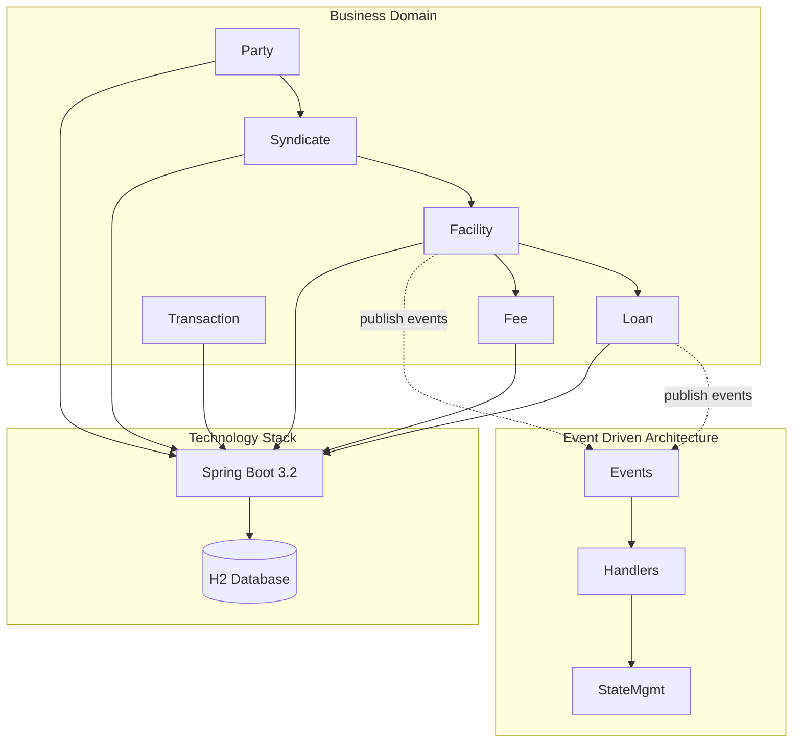
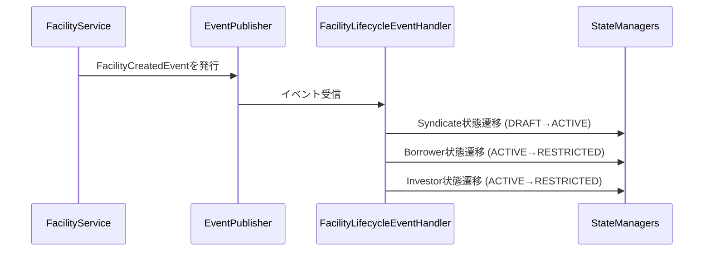
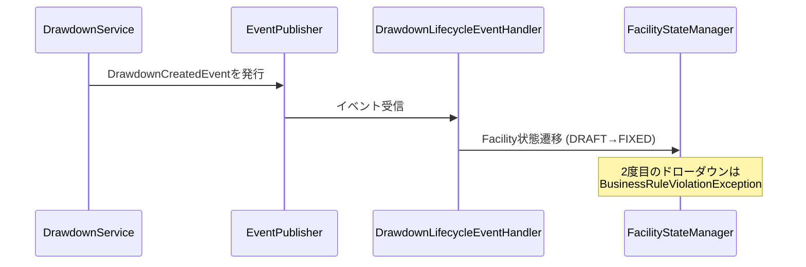

# シンジケートローン管理システム - バックエンドアーキテクチャ

## システム概要

## 主要アーキテクチャ特徴

### イベント駆動状態管理
- **Spring Events**: エンティティ間状態変更の非同期オーケストレーション
- **State Managers**: エンティティ別状態遷移ロジック
- **StateMachine Executor**: 全状態マシンの共通実行基盤
- **Domain Events**: コンテキスト間状態変更を引き起こすビジネスイベント

### 取引基盤
- **統一Transaction基盤**: JPA JOINED継承戦略
- **横断的取引管理**: 一元化された取引ライフサイクル
- **型安全な取引分類**: Enumベースの取引タイプ

### ビジネスドメイン機能
- **SharePie管理**: 100%制約付き投資比率配分
- **AmountPie計算**: 投資家別金額配分の自動計算
- **支払い配分**: 持分比率ベースの自動支払い配分
- **手数料管理**: 7種類の手数料タイプと自動計算・配分

### 状態マシン統合
- **Facility ライフサイクル**: DRAFT → FIXED（初回ドローダウン後不変）
- **Loan ライフサイクル**: DRAFT → ACTIVE → OVERDUE → COMPLETED
- **Party ステータス**: ACTIVE → RESTRICTED（ファシリティ参加時）
- **Transaction ステータス**: PENDING → PROCESSING → COMPLETED/CANCELLED

## アーキテクチャ原則

1. **イベント中心設計**: 「影響を受けるエンティティ状態」ではなく「発生するイベント」を軸とした分割
2. **Spring Events + StateMachine併存**: 既存StateMachine制約を維持しつつイベント駆動オーケストレーションを導入
3. **コンテキスト間参照解決**: 直接Repository依存ではなくイベント駆動による調整
4. **実用的DDD**: 理論的純粋性とビジネス要件・保守性のバランス

## 詳細なアーキテクチャフロー

### Facility作成時のイベントフロー

### Drawdown作成時のイベントフロー

## 主要メリット

### 1. 保守性向上
- **責務分離**: 各コンポーネントが単一責任
- **イベント中心組織**: ビジネスフローが理解しやすい
- **コード重複削減**: 共通基盤による統一化

### 2. テスタビリティ
- **独立テスト**: 各コンポーネントを個別にテスト可能
- **モック対応**: Event PublisherとState Managerを容易にモック化
- **明確なインターフェース**: コンポーネント間の契約が明確

### 3. 拡張性
- **マイクロサービス準備**: イベント駆動による分散システム対応
- **スケーラビリティ**: 非同期処理による性能向上
- **将来発展**: Event Sourcing、CQRSパターンへの自然な発展
