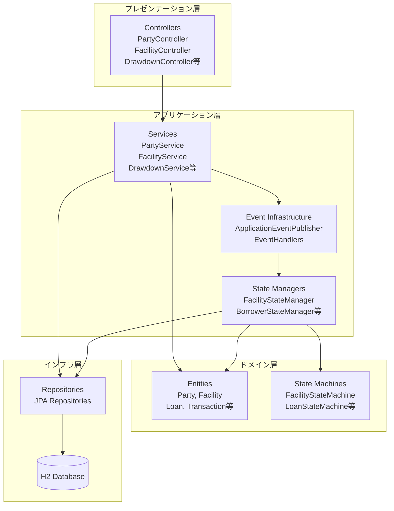
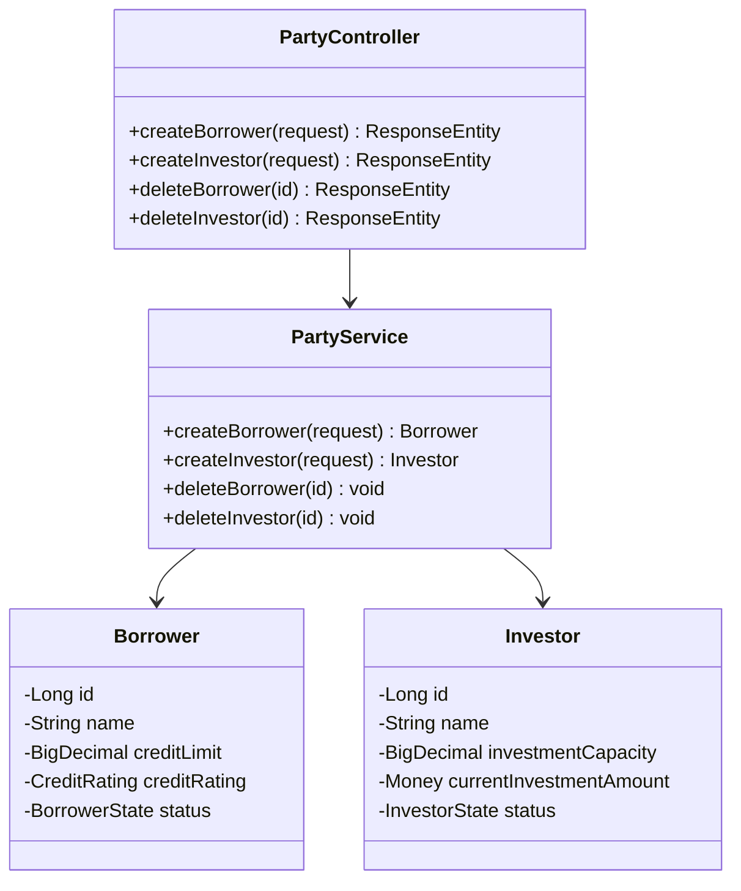
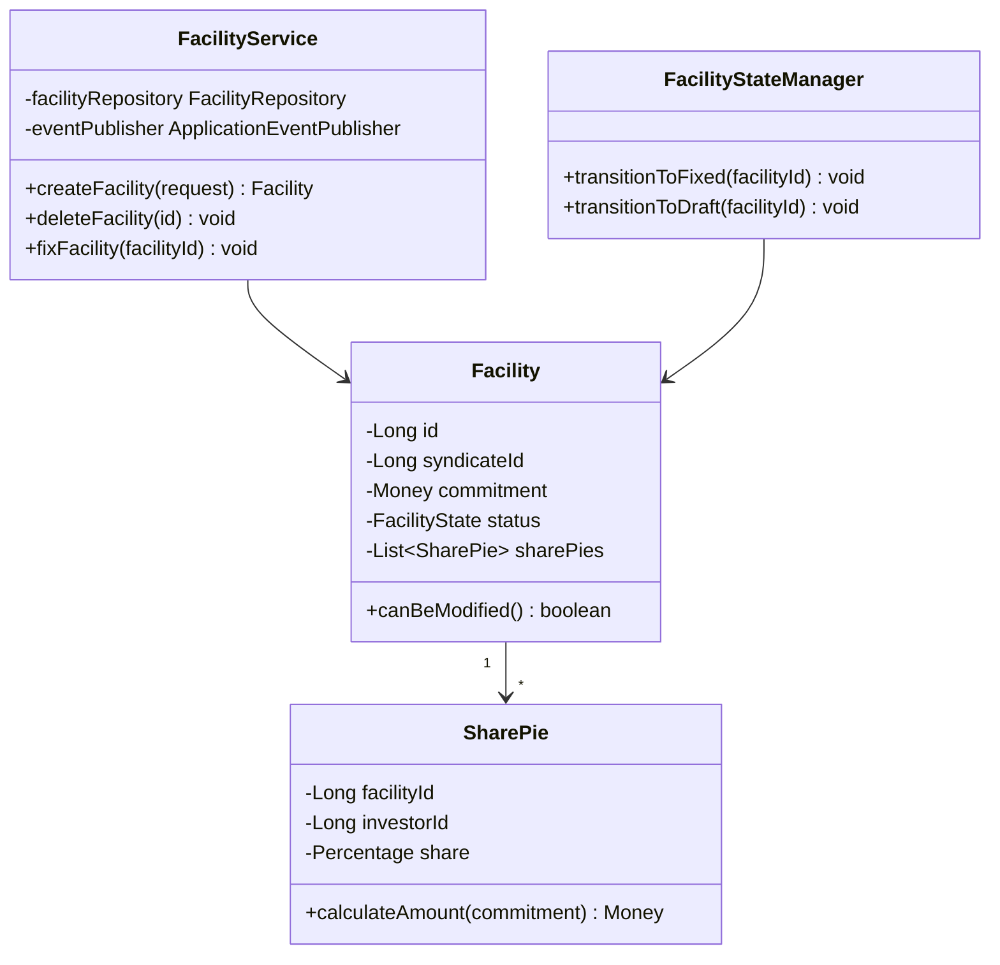
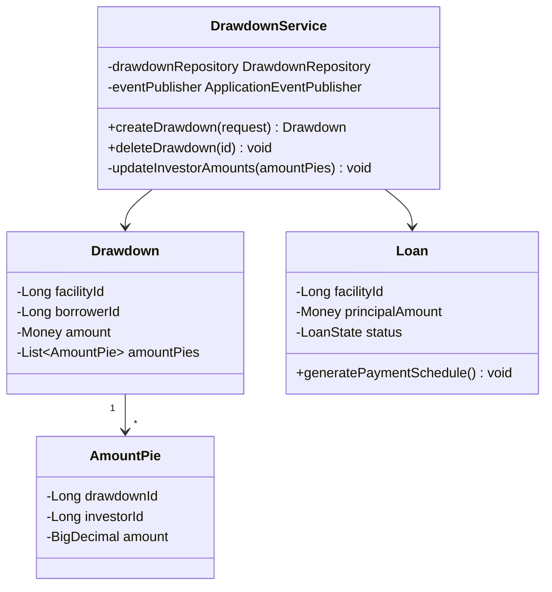
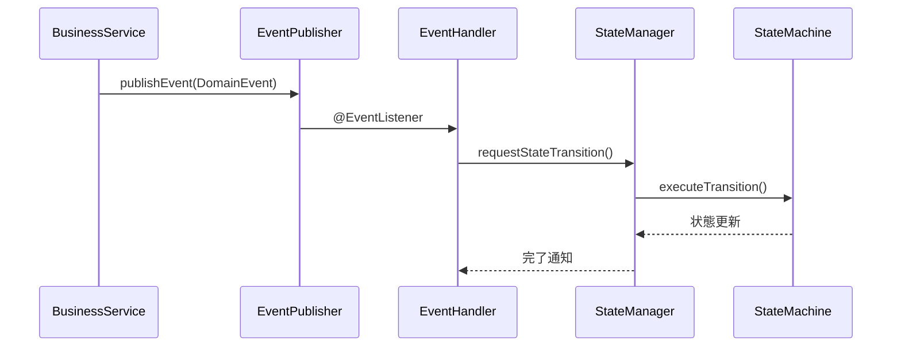
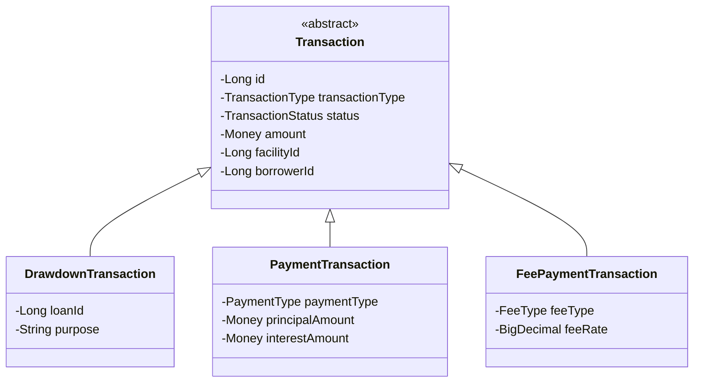
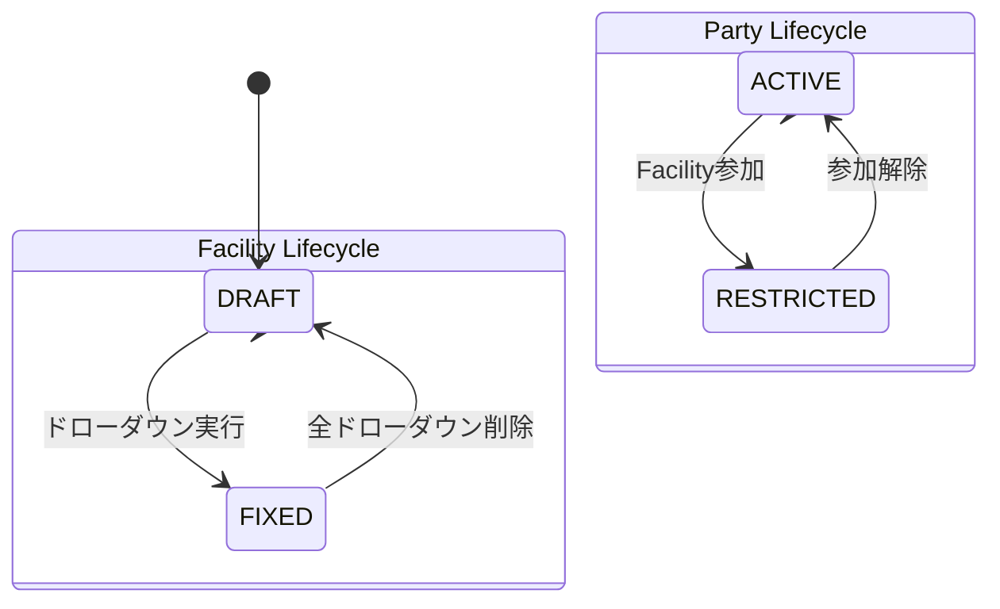

# Bounded Context 内部構造

## イベント駆動調整を含む3層アーキテクチャ

### システム全体構成

## Context別詳細構造

### Party Context（参加者コンテキスト）

**主要責務:**
- **借り手(Borrower)管理**: 信用限度額、信用格付け、状態管理
- **投資家(Investor)管理**: 投資能力、現在投資額、状態管理
- **参照整合性制御**: 他コンテキストでの使用状況チェック

### Facility Context（融資枠コンテキスト）

**主要責務:**
- **融資枠管理**: コミットメント金額、通貨、期間管理
- **持分比率(SharePie)管理**: 投資家別配分、100%制約検証
- **状態管理**: DRAFT ↔ FIXED状態遷移（StateMachine統合）

### Loan Context（ローンコンテキスト）

**主要責務:**
- **ドローダウン実行**: 資金引き出し処理、投資家別金額配分
- **ローン管理**: 返済スケジュール生成、状態管理
- **投資額追跡**: 投資家の現在投資額自動更新

## イベント駆動統合

### イベントフロー

### 主要イベント

- **FacilityCreatedEvent**: Facility組成時の複数エンティティ状態変更
- **DrawdownCreatedEvent**: Drawdown作成時のFacility状態変更
- **FacilityDeletedEvent**: Facility削除時の状態復旧
- **DrawdownDeletedEvent**: Drawdown削除時の状態復旧

## Transaction Context（取引基盤）

### 統一Transaction階層

**主要責務:**
- **統一基盤**: 全取引タイプの共通インフラ
- **横断的管理**: 取引履歴、統計、レポート
- **状態管理**: 取引ライフサイクル制御

## 状態マシン統合

### エンティティ状態遷移

## アーキテクチャの利点

### 1. **明確な責務分離**
- 各層が明確な責任を持つ
- ドメインロジックがインフラ関心事から分離
- イベント処理がビジネス操作から分離

### 2. **イベント駆動調整**
- コンテキスト間オペレーションをイベント経由で調整
- 境界コンテキスト間の疎結合
- 複雑な状態変更の非同期処理

### 3. **状態管理統合**
- 統一的な状態遷移インフラ
- エンティティ間での一貫した状態検証
- イベントオーケストレーションでのStateMachine保持

### 4. **テスタビリティ**
- 各コンポーネントを個別にテスト可能
- 明確なインターフェースと依存関係
- モック対応アーキテクチャ

### 5. **保守性**
- イベント中心組織によるコード明確化
- 共通インフラによる重複削減
- 新機能・イベントハンドラーの追加容易性

この3層アーキテクチャは、前の661行のEntityStateServiceの複雑さを解決し、責務が明確で単一目的のコンポーネントに分散させることで、すべてのビジネスロジックを維持しながら全体システム設計を向上させています。