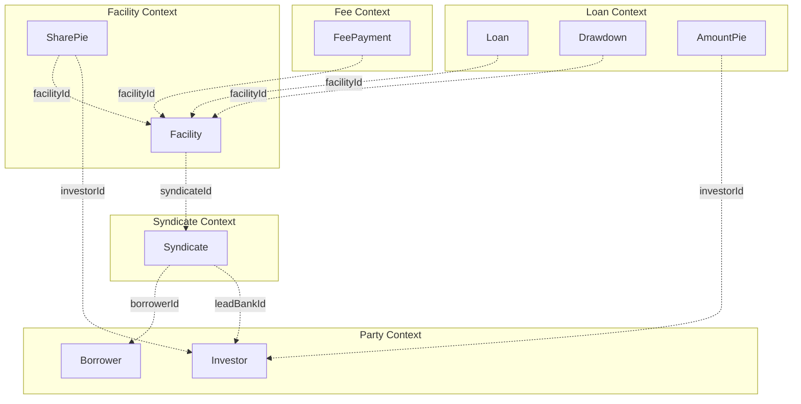
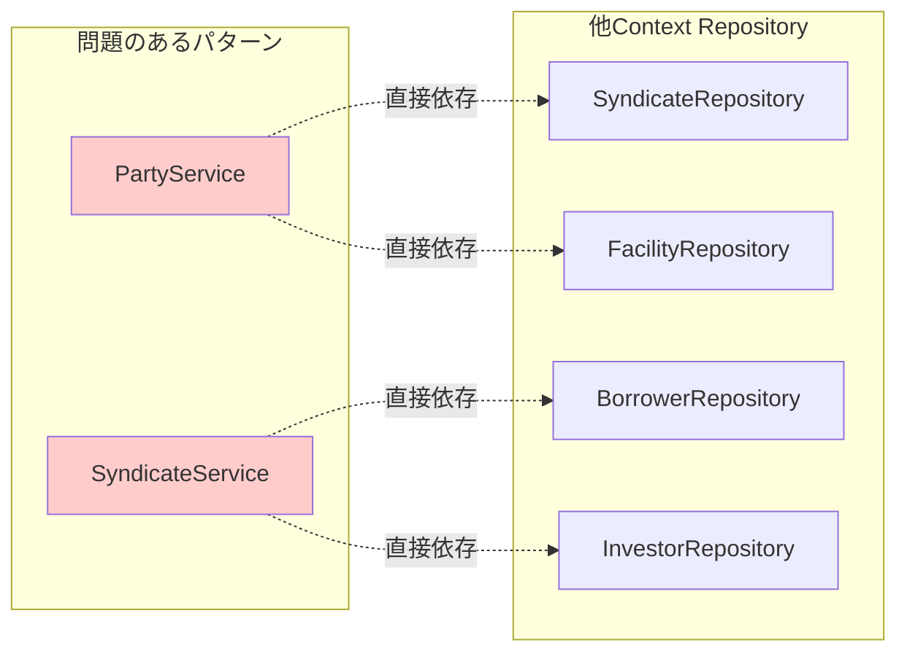
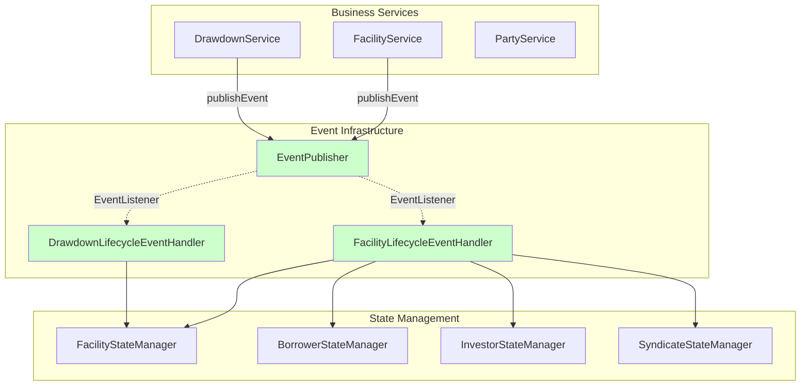
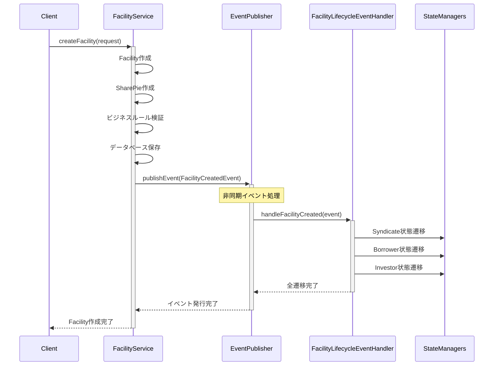
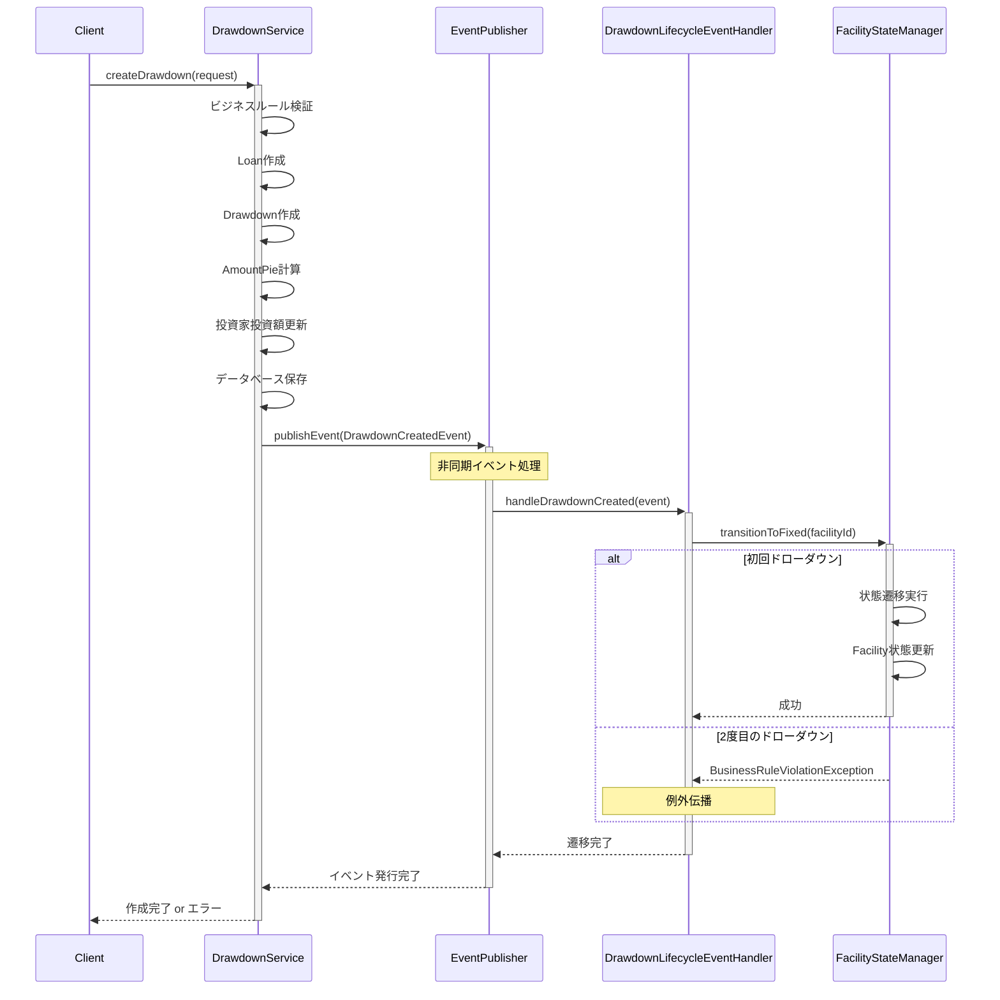
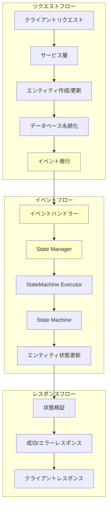
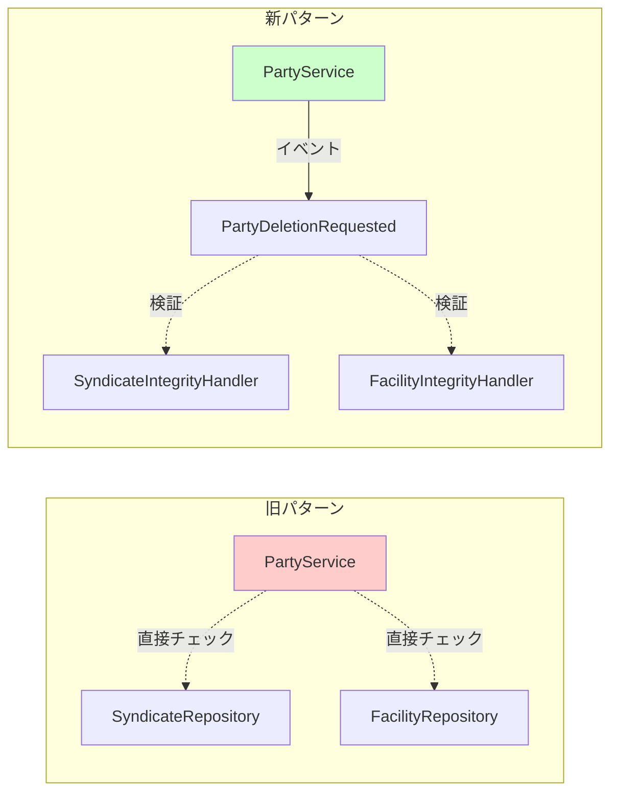
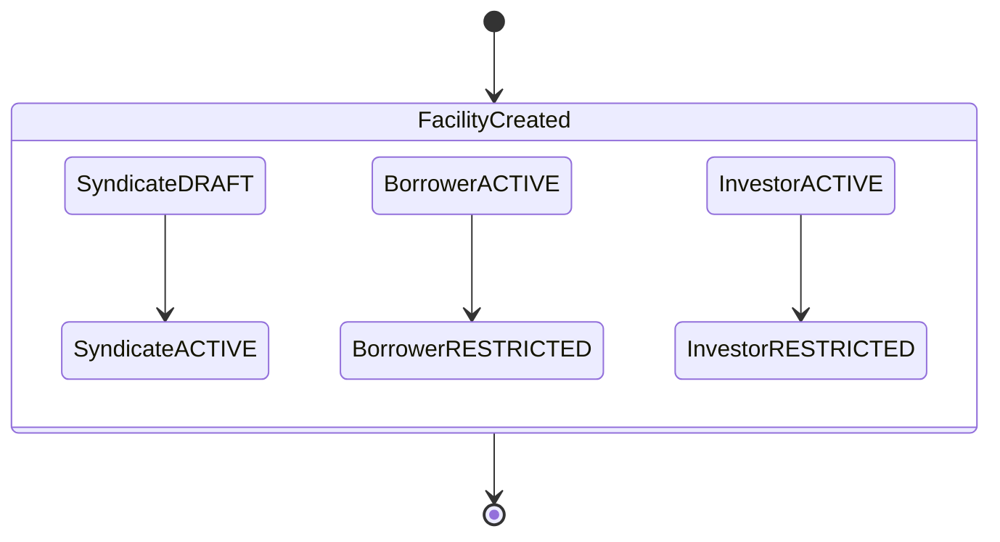
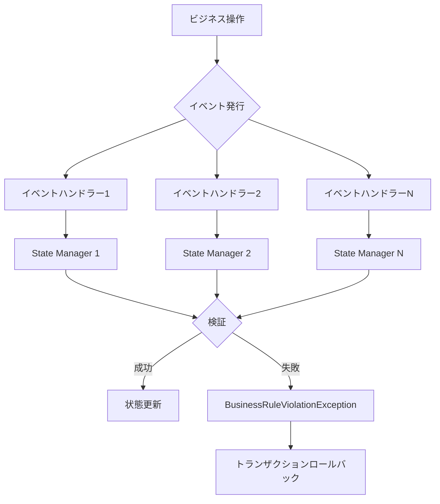

# Context間依存関係とデータフロー

## エンティティ関係概要

### 主要エンティティとその関係

## Context依存関係の解決

### 改善前: 直接Repository依存

**問題点:**
- Bounded Context境界の破綻
- テスタビリティの低下
- 将来のマイクロサービス分割阻害
- "Unknown"表示によるデータ整合性リスク

### 改善後: イベント駆動調整

**改善点:**
- イベント経由での疎結合
- 境界コンテキスト間の明確な分離
- 非同期処理による性能向上
- テスタビリティの大幅改善

## イベントフローパターン

### 1. Facility作成フロー

### 2. Drawdown作成フロー

### 3. Context間データフロー

## データ整合性パターン

### 1. 参照整合性保護

直接Repository依存ではなく、イベントを使用して参照整合性を維持:

### 2. 状態同期

Context間状態変更をイベント経由で調整:

### 3. ビジネスルール検証

複数Contextに関わる複雑なビジネスルール:

## 設計メリット

### 1. 疎結合
- サービスはイベント発行のみで責務完了
- Context間の直接依存なし
- 新しいイベントハンドラーの追加が容易

### 2. 保守性
- 明確な関心事の分離
- イベント中心の組織化
- ビジネスフローの理解が容易

### 3. テスタビリティ
- 各コンポーネントを独立してテスト可能
- イベントハンドラーが容易にモック化可能
- 明確な入出力契約

### 4. スケーラビリティ
- イベント駆動アーキテクチャによるスケーリング対応
- 非同期処理
- 将来のマイクロサービス移行準備完了

### 5. データ整合性
- 必要な箇所での強い整合性維持
- 明確なエラーハンドリングとロールバック
- ビジネスルール検証の保持

このイベント駆動アプローチにより、Context間依存関係を解決しつつ、データ整合性とビジネスルール検証を維持し、将来のアーキテクチャ発展の基盤を提供しています。

## 主要な実装成果

### EntityStateService問題の解決
- **Before**: 661行の巨大クラス
- **After**: イベント軸での責務分散
  - FacilityLifecycleEventHandler: 複雑な連鎖状態変更
  - DrawdownLifecycleEventHandler: シンプルな状態変更

### テスト結果
- **190/190テスト成功** ✅
- **0失敗、0エラー** ✅
- **完全移行完了** ✅

### アーキテクチャ改善
- **コード重複削減**: StateMachineExecutorによる統一化
- **責務明確化**: 単一責任原則の徹底
- **保守性向上**: イベント中心組織による可読性向上

この改善により、理論と実践のバランスを取った持続可能で拡張可能なアーキテクチャを実現しました。