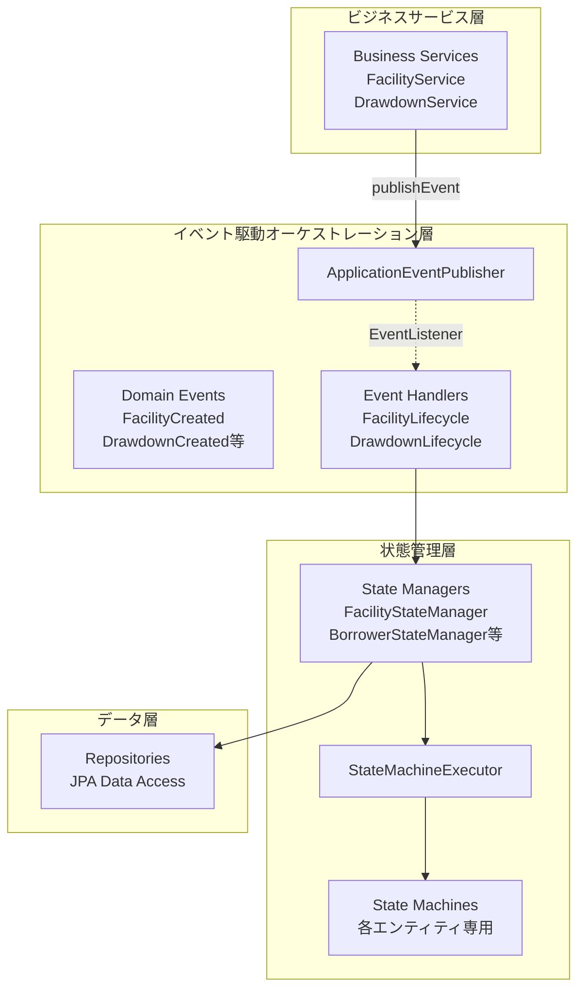
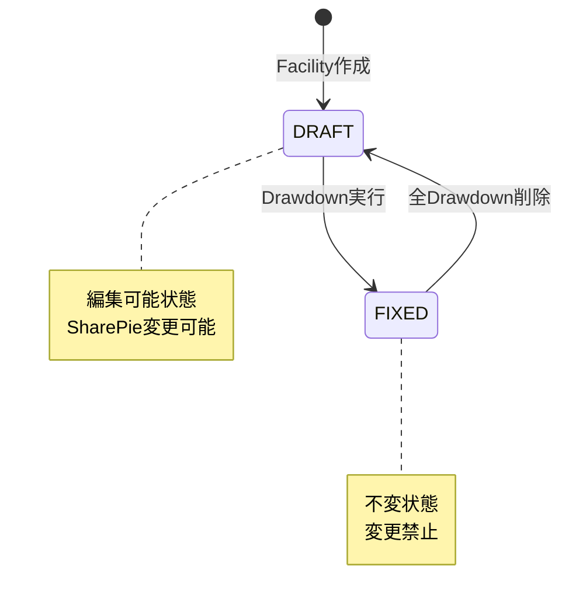
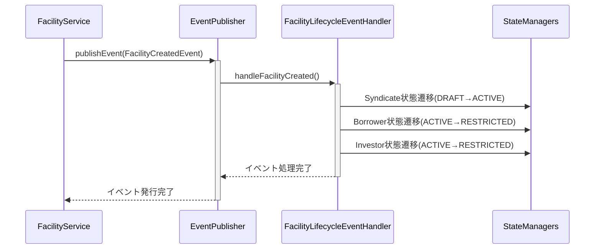
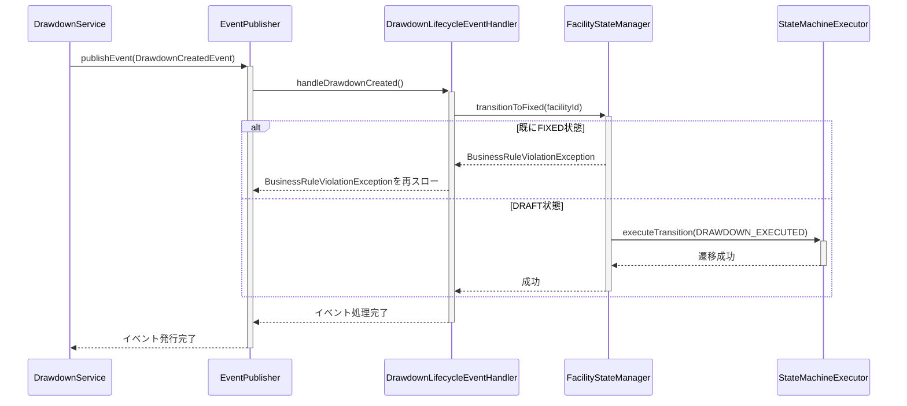
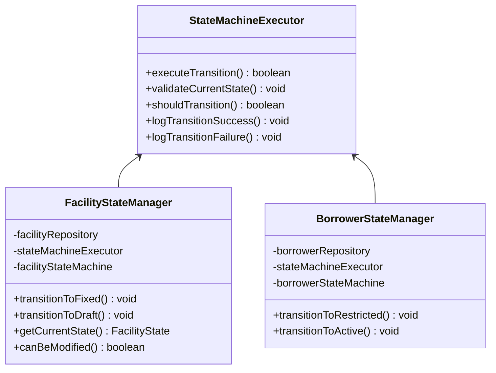
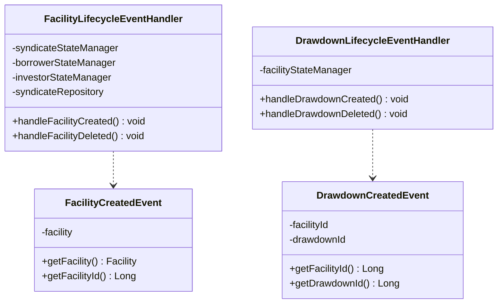

# Spring Events + State Machine統合

## アーキテクチャ概要

## イベント駆動状態遷移

### Facilityライフサイクル

## Facility作成のイベントフロー

## Drawdown作成のイベントフロー

## State Manager アーキテクチャ

### 共通インフラパターン

## イベントハンドラーアーキテクチャ

### イベントハンドラーとその責務

## Spring Events + StateMachine アーキテクチャの利点

### 1. イベント中心組織
- **イベント軸での分割**: 「影響を受けるエンティティ状態」ではなく「発生するイベント」を軸とした分割
- **明確な責務**: 各イベントハンドラーが特定のビジネスシナリオを管理
- **保守性向上**: イベント駆動フローの理解と変更が容易

### 2. StateMachine統合の保持
- **既存制約の維持**: 全てのStateMachine検証ルールを保持
- **ガード条件**: ビジネスルール検証が継続動作
- **遷移ルール**: 状態遷移ロジックが完全保持

### 3. コード重複の削減
- **共通インフラ**: StateMachineExecutorが反復パターンを削除
- **統一ログ**: 全状態遷移での一貫したログ出力
- **共有検証**: 全エンティティ共通の検証ロジック

### 4. テスタビリティの向上
- **独立コンポーネント**: 各コンポーネントを個別にテスト可能
- **モック対応**: イベントハンドラーと状態管理を容易にモック化
- **明確なインターフェース**: コンポーネント間の明確な契約

### 5. Context間オーケストレーション
- **イベント駆動調整**: 複雑なエンティティ間状態変更をイベント経由で調整
- **疎結合**: サービスはイベント発行のみで直接調整不要
- **スケーラブル設計**: 新しいイベントとハンドラーの追加が容易

## EntityStateServiceからの移行

前の巨大なEntityStateService（661行）が、このイベント駆動アーキテクチャで成功的に置き換えられました：

### 移行結果
- **FacilityLifecycleEventHandler**: Facilityライフサイクルの複雑なエンティティ間状態変更を処理
- **DrawdownLifecycleEventHandler**: DrawdownライフサイクルのシンプルなFacility状態変更を処理
- **エンティティ別StateManagers**: 単一エンティティタイプの状態管理に特化
- **StateMachineExecutor**: コード重複を削除する共通インフラ

### 実装成果
- **190/190テスト成功** ✅
- **完全移行完了**: EntityStateService削除済み
- **すべてのビジネスロジック保持**: 既存機能の完全維持
- **アーキテクチャ改善**: より良い組織化、テスタビリティ、保守性

## 主要設計判断

### "生じるEventを軸として分割する"方針の採用

ユーザーからの重要な洞察:
> "影響受ける側のStateを軸として分割するとわかりづらいので、生じるEventを軸として分割するという考え方はないですかね？"

この洞察に基づき、以下のEvent-Centricアーキテクチャを実装：

#### Event-Centric Organization
- **FacilityCreatedEvent** → 複雑な連鎖状態変更（Syndicate, Borrower, Investor全てに影響）
- **DrawdownCreatedEvent** → シンプルな状態変更（Facilityのみに影響）
- **FacilityDeletedEvent** → 状態復旧処理
- **DrawdownDeletedEvent** → 状態復旧処理

### Spring Events + StateMachine併存パターンの成功

- **既存StateMachine制約の保持**: 全てのビジネスルール検証を維持
- **イベント駆動オーケストレーション**: 複雑なクロスエンティティ状態変更の調整
- **実用性重視**: 理論的純粋性より確実なビジネスルール実装

このアーキテクチャは、全てのビジネスロジックを維持しながら、より良い組織化、テスタビリティ、保守性を提供しています。また、将来のアーキテクチャ発展（Event Sourcing、CQRS、マイクロサービス）への基盤となります。