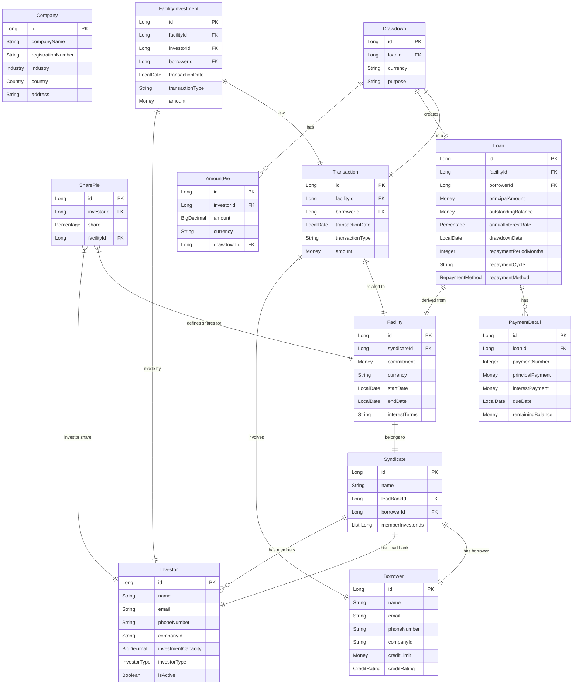
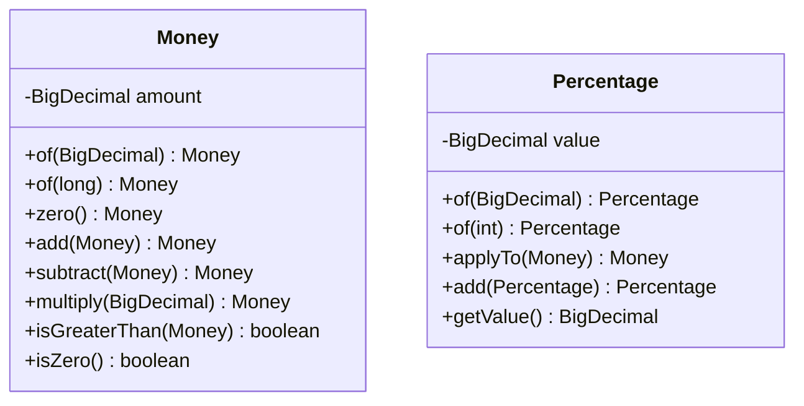
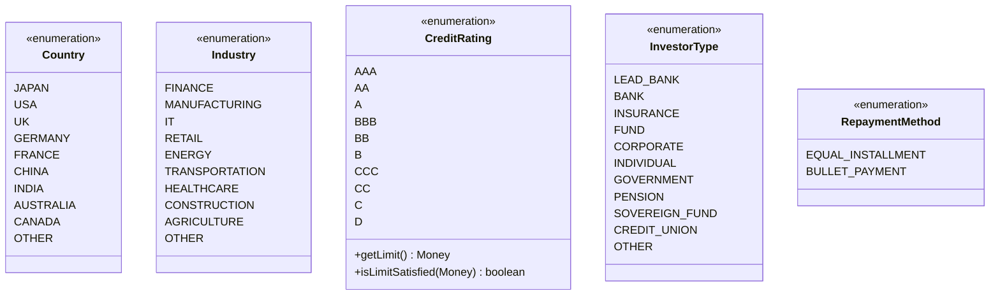
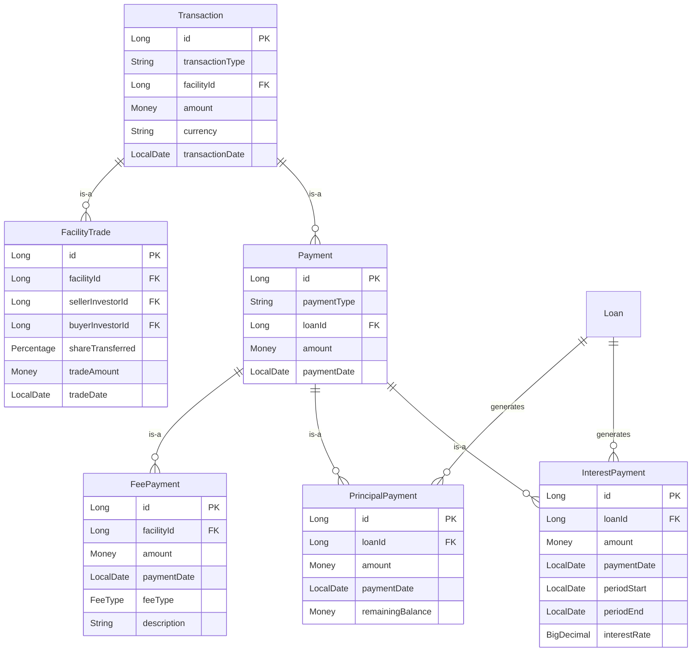
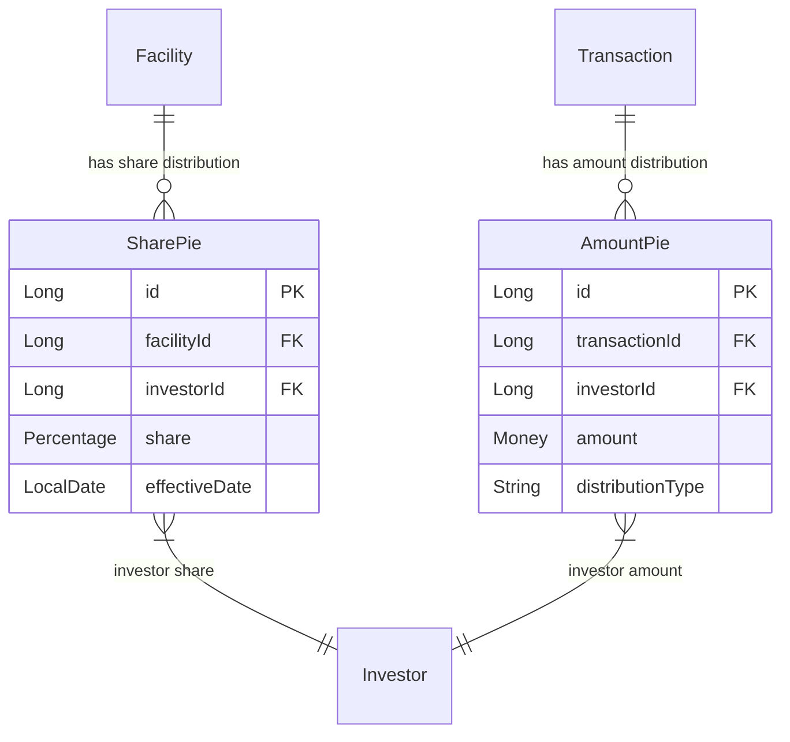
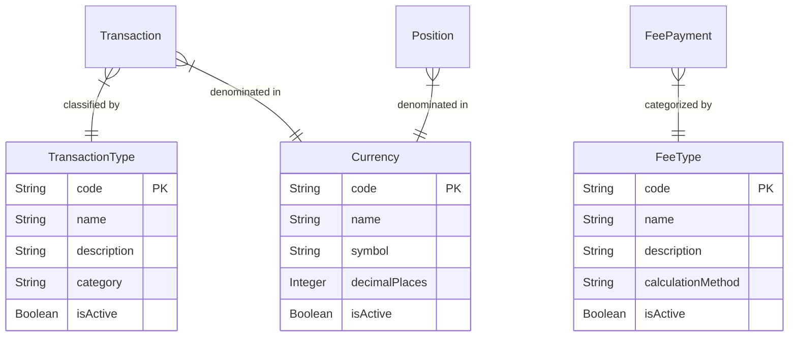
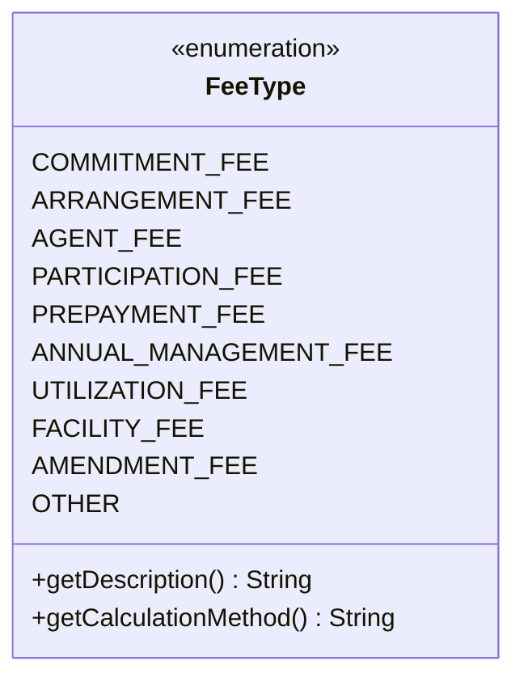
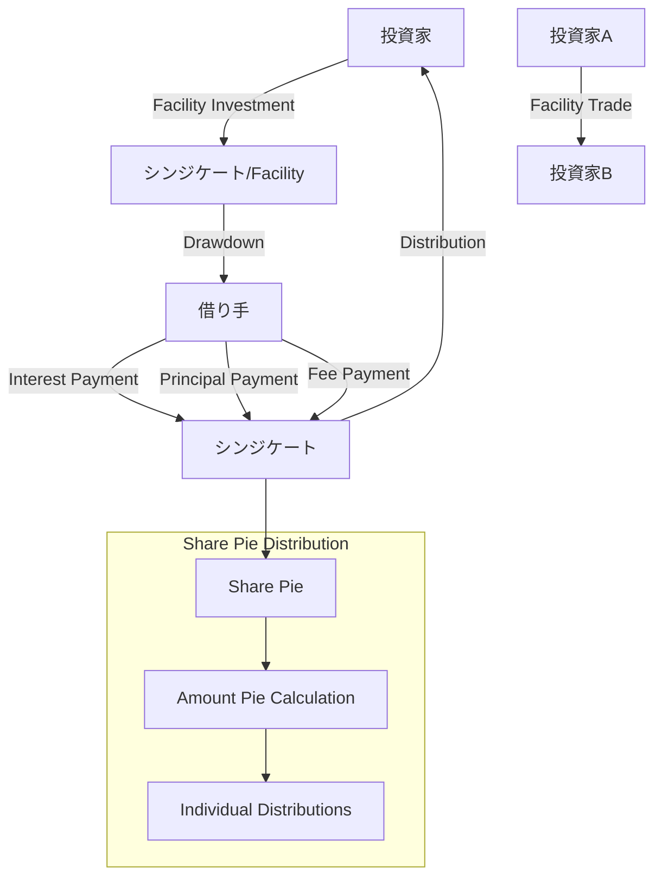
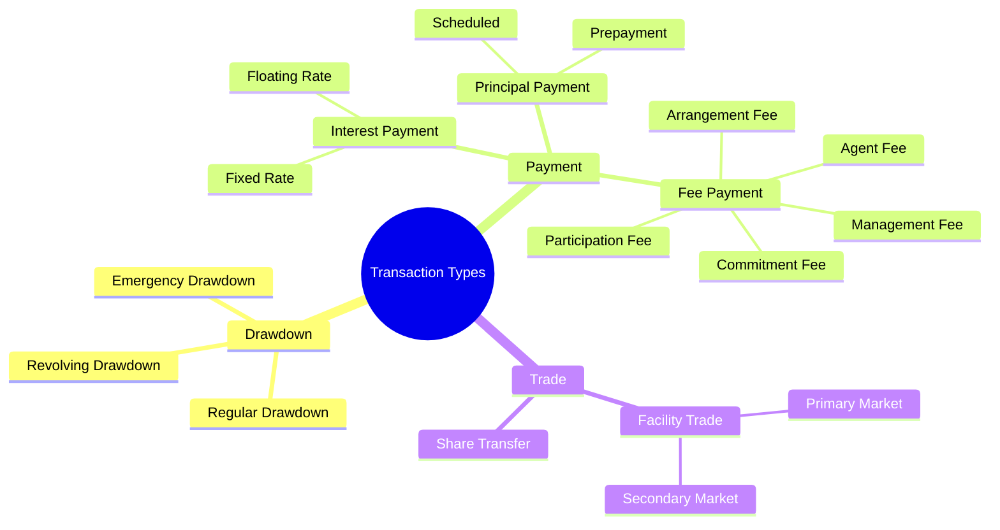

# シンジケートローン管理システム - データモデル

このドキュメントでは、シンジケートローン管理システムのデータモデルをMermaid形式で記述します。現在実装済みのエンティティと将来実装予定の概念レベルのモデルを含みます。

## 1. 現在実装済みデータモデル

### 1.1 メインエンティティ関係図

### 1.2 Value Objects

### 1.3 列挙型定義

## 2. 将来実装予定データモデル（概念レベル）

### 2.1 Transaction階層の拡張と支払い処理

### 2.2 配分管理の拡張（Share Pie vs Amount Pie）

### 2.3 マスタデータ

### 2.4 手数料種別詳細

## 3. 資金の流れ（業務プロセス）

### 3.1 主要な資金フロー

### 3.2 取引タイプ別分類

## 4. データモデル設計原則

### 4.1 継承戦略
- **Position階層**: Table Per Class（各サブタイプが独立テーブル）
- **Transaction階層**: Table Per Class（各サブタイプが独立テーブル）
- **Payment階層**: Single Table（discriminator使用）

### 4.2 Value Object活用
- **Money**: 金額計算の精度保証
- **Percentage**: 持分比率の正確な管理
- **Currency**: 多通貨対応の基盤

### 4.3 監査・履歴管理
- 全エンティティに監査フィールド（created_at, updated_at）
- 集約ルートに楽観的排他制御（version）
- Transaction系は不変（Immutable）として設計

### 4.4 拡張性考慮
- 抽象基底クラス（Position, Transaction）による柔軟な拡張
- 列挙型による分類の標準化
- 配分管理の二層構造（Share Pie → Amount Pie）

---

**注記**: 
- 現在実装済み: Company, Borrower, Investor, Syndicate, Facility, SharePie, Transaction, FacilityInvestment, Drawdown, Loan, PaymentDetail, AmountPie
- 将来実装予定: Payment階層（InterestPayment, PrincipalPayment, FeePayment）, FacilityTrade, マスタデータ
- 共通フィールド（created_at, updated_at, version）は図から省略
