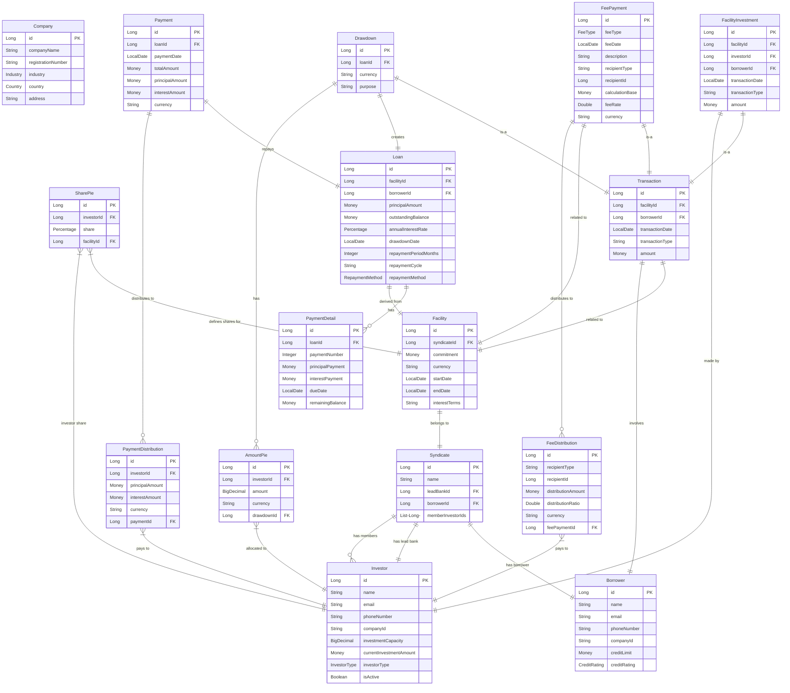
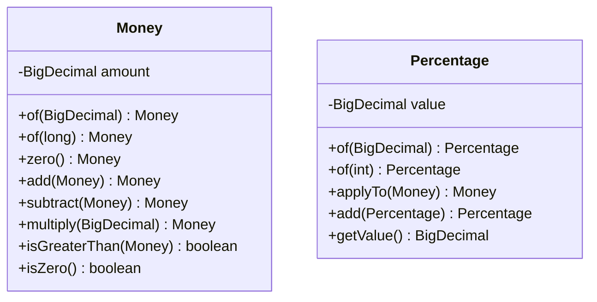
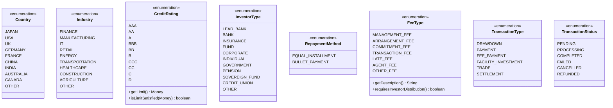
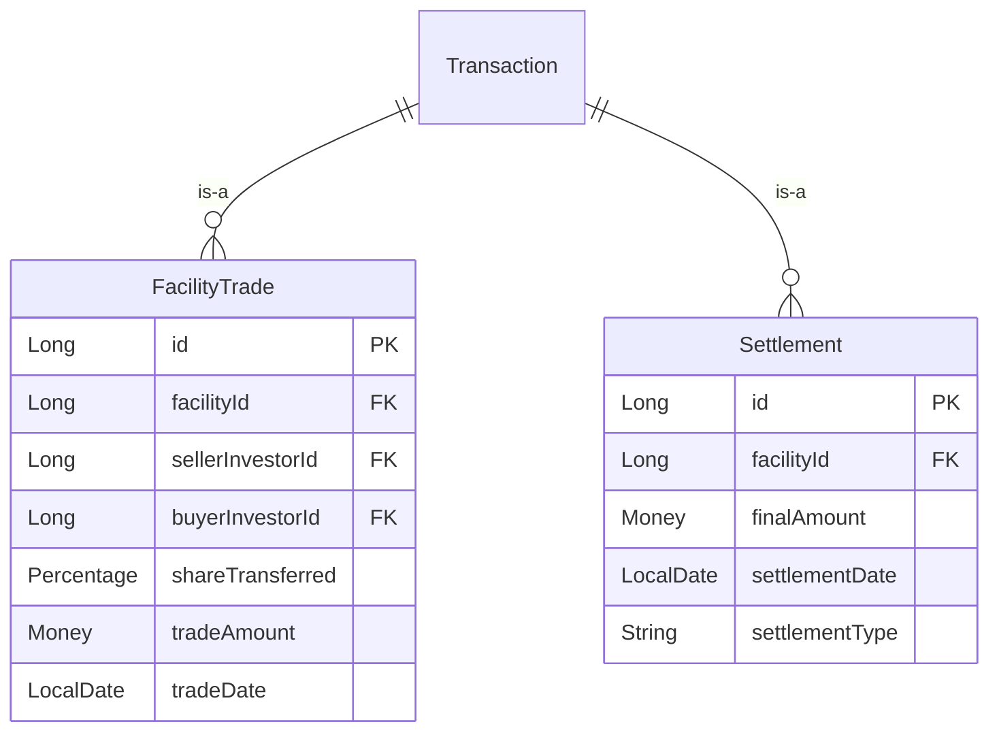
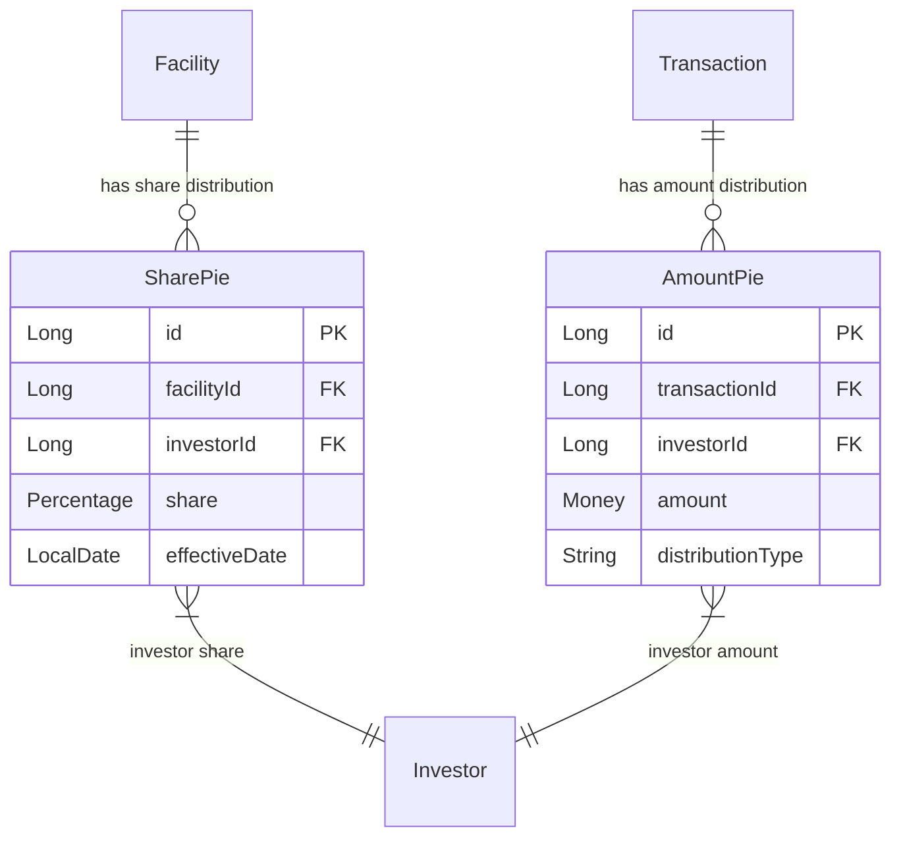
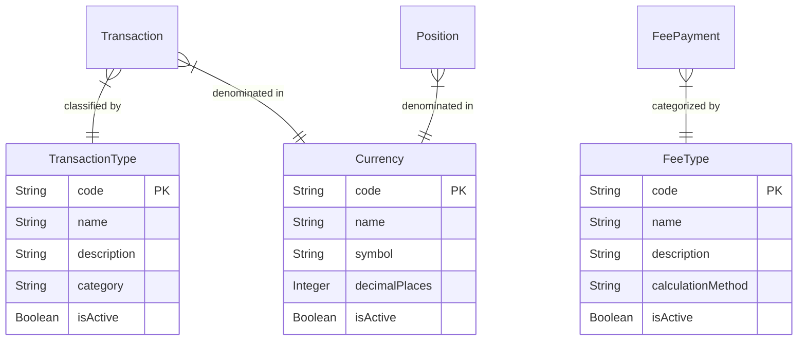
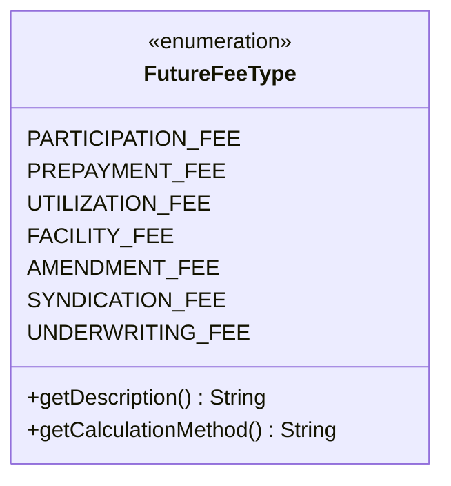
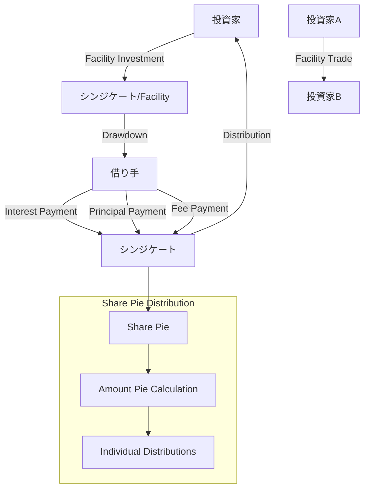
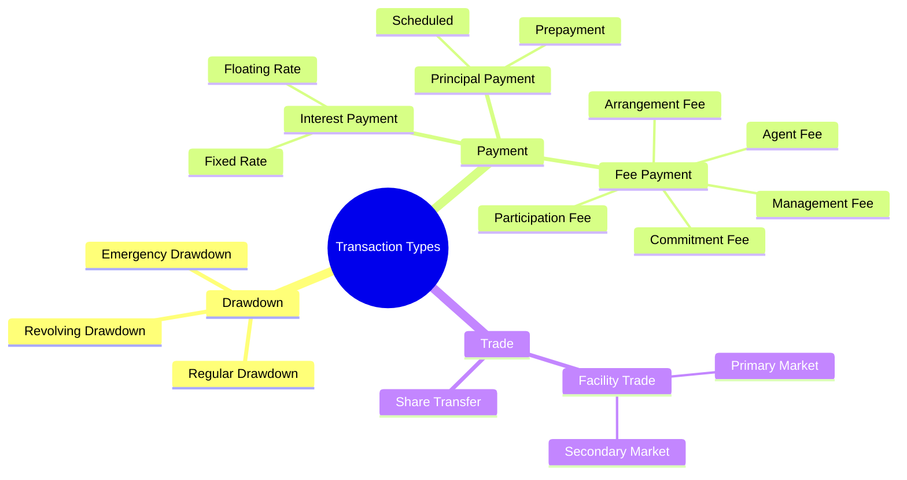

# シンジケートローン管理システム - データモデル

このドキュメントでは、シンジケートローン管理システムのデータモデルをMermaid形式で記述します。現在実装済みのエンティティと将来実装予定の概念レベルのモデルを含みます。

## 1. 現在実装済みデータモデル

### 1.1 メインエンティティ関係図

### 1.2 Value Objects

### 1.3 列挙型定義

## 2. 将来実装予定データモデル（概念レベル）

### 2.1 将来の取引タイプ拡張

### 2.2 配分管理の拡張（Share Pie vs Amount Pie）

### 2.3 マスタデータ

### 2.4 将来拡張予定手数料タイプ

## 3. 資金の流れ（業務プロセス）

### 3.1 主要な資金フロー

### 3.2 取引タイプ別分類

## 4. データモデル設計原則

### 4.1 継承戦略
- **Position階層**: Table Per Class（各サブタイプが独立テーブル）
- **Transaction階層**: Table Per Class（各サブタイプが独立テーブル）
- **Payment階層**: Single Table（discriminator使用）

### 4.2 Value Object活用
- **Money**: 金額計算の精度保証
- **Percentage**: 持分比率の正確な管理
- **Currency**: 多通貨対応の基盤

### 4.3 監査・履歴管理
- 全エンティティに監査フィールド（created_at, updated_at）
- 集約ルートに楽観的排他制御（version）
- Transaction系は不変（Immutable）として設計

### 4.4 拡張性考慮
- 抽象基底クラス（Position, Transaction）による柔軟な拡張
- 列挙型による分類の標準化
- 配分管理の二層構造（Share Pie → Amount Pie）

---

**注記**: 
- **現在実装済み**: Company, Borrower, Investor (投資額管理機能含む), Syndicate, Facility, SharePie, Transaction (基底クラス), FacilityInvestment, Drawdown, Loan, PaymentDetail, AmountPie, Payment, PaymentDistribution, **FeePayment, FeeDistribution**
- **将来実装予定**: FacilityTrade, Settlement, マスタデータ、追加手数料タイプ
- **Transaction統合管理**: 全取引タイプ（Drawdown, Payment, FeePayment, FacilityInvestment）の統一的管理・追跡
- 共通フィールド（created_at, updated_at, version）は図から省略
- Payment/PaymentDistribution: 元本・利息返済処理と投資家別配分
- **FeePayment/FeeDistribution**: 手数料処理と投資家別配分（SharePie比率ベース）
