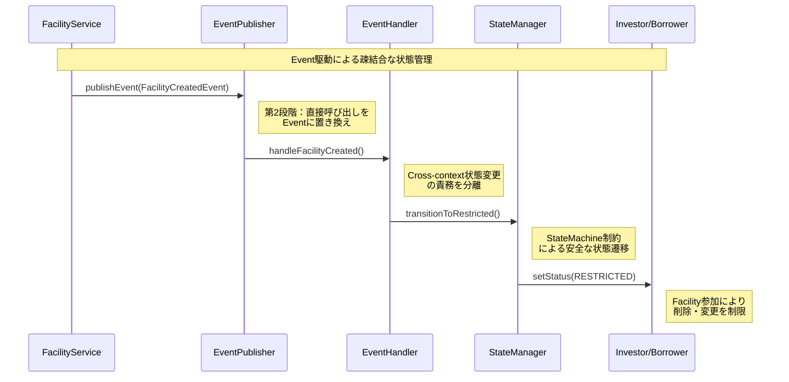
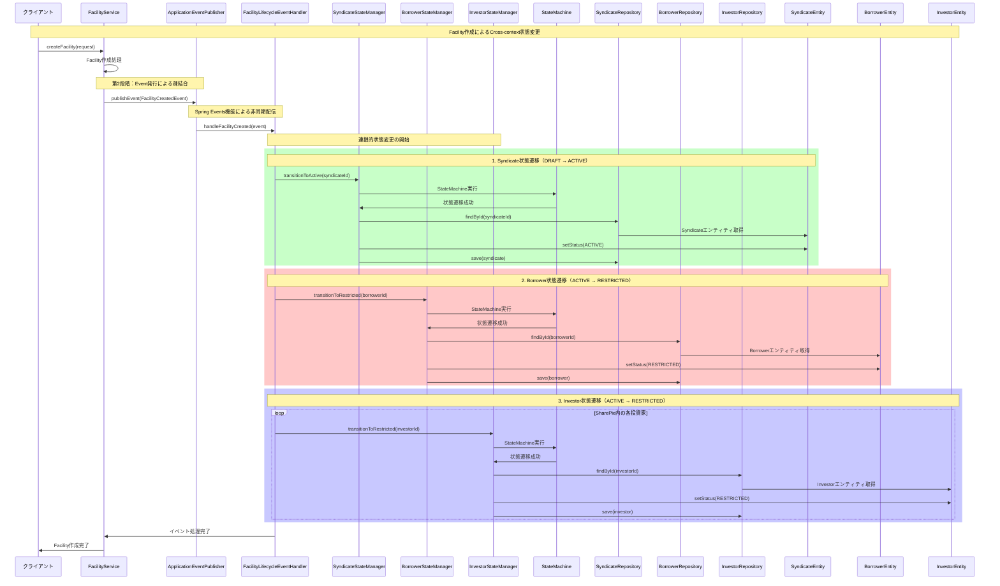
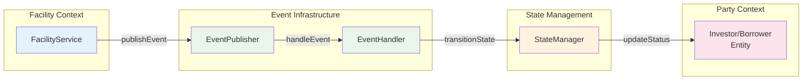
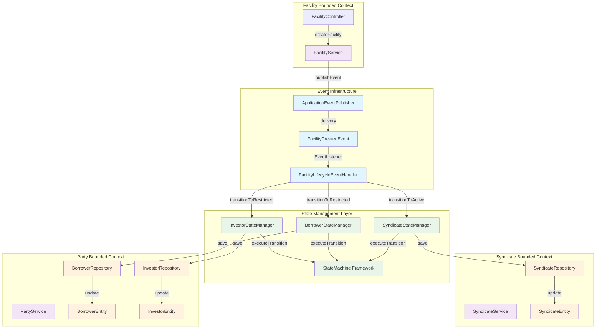

# Event駆動アーキテクチャ実装

このドキュメントでは、シンジケートローン管理システムにおけるEvent駆動アーキテクチャの実装について、Mermaidコミュニケーション図を用いて説明します。

## 概要

BoundedContext間の依存関係を解決するため、直接的なサービス呼び出しからEvent駆動アーキテクチャに移行しました。これにより、疎結合で拡張性の高いシステムを実現しています。

## 問題の背景

### 第1段階の問題（直接呼び出しパターン）
- FacilityServiceが直接InvestorStateを更新
- Cross-context双方向依存
- 状態更新ロジックの巨大化・複雑化
- AIによる修正で他部分が壊れる問題

### 第2段階の解決（Event駆動パターン）
- Eventを発行して間接的に状態更新
- 疎結合なCross-context通信
- 責務の明確な分離
- 拡張性とテスト容易性の向上

## Event駆動アーキテクチャフロー

### 概略図（エッセンス）



### 詳細フロー（実装レベル）

### Facility作成時の状態変更フロー



### コミュニケーション図（概略）



### コミュニケーション図（詳細）



## アーキテクチャの特徴

### 1. **疎結合の実現**
- FacilityServiceは他のBoundedContextを直接知らない
- Eventを通じた間接的な通信
- 依存方向の一方向化

### 2. **責務の明確な分離**
```java
// Event発行側（FacilityService）
eventPublisher.publishEvent(new FacilityCreatedEvent(savedFacility));

// Event処理側（FacilityLifecycleEventHandler）
@EventListener
public void handleFacilityCreated(FacilityCreatedEvent event) {
    syndicateStateManager.transitionToActive(syndicate.getId());
    borrowerStateManager.transitionToRestricted(syndicate.getBorrowerId());
    // ...
}
```

### 3. **State Machineとの統合**
```java
// InvestorStateManager内での状態遷移
boolean success = stateMachineExecutor.executeTransition(
    investorStateMachine,
    investor.getStatus(),          // 現在状態
    InvestorEvent.FACILITY_PARTICIPATION,  // イベント
    investorId,
    "Investor"
);

if (success) {
    investor.setStatus(InvestorState.RESTRICTED);  // 新状態
    investorRepository.save(investor);
}
```

### 4. **トランザクション管理**
- 各EventHandlerは独立したトランザクション
- 状態変更の原子性を保証
- エラー時の適切なロールバック

## 実現された効果

### ✅ **解決された問題**
1. **Cross-context双方向依存の排除**
2. **状態管理ロジックの分散化**
3. **テスト容易性の向上**
4. **保守性の大幅改善**

### ✅ **追加された価値**
1. **拡張性**: 新しいEventListenerを追加するだけで機能拡張
2. **監査性**: 全ての状態変更がEventとして記録
3. **非同期処理**: Spring Eventsによる非同期実行
4. **エラーハンドリング**: 各段階での適切なエラー処理

### ✅ **DDD原則の遵守**
1. **BoundedContextの独立性維持**
2. **ドメインイベントパターンの実装**
3. **集約間の疎結合**
4. **ビジネスルールの適切な配置**

## コード例

### Event定義
```java
public class FacilityCreatedEvent {
    private final Facility facility;
    private final LocalDateTime occurredAt;
    
    // 以下の連鎖的状態変更を引き起こす：
    // - Syndicate: DRAFT → ACTIVE
    // - Borrower: ACTIVE → RESTRICTED  
    // - Investor: ACTIVE → RESTRICTED
}
```

### EventHandler実装
```java
@Component
@Transactional
public class FacilityLifecycleEventHandler {
    
    @EventListener
    public void handleFacilityCreated(FacilityCreatedEvent event) {
        // 1. Syndicate状態遷移
        syndicateStateManager.transitionToActive(syndicate.getId());
        
        // 2. Borrower状態遷移
        borrowerStateManager.transitionToRestricted(syndicate.getBorrowerId());
        
        // 3. 関連Investor状態遷移
        for (Long investorId : investorIds) {
            investorStateManager.transitionToRestricted(investorId);
        }
    }
}
```

## 今後の発展方向

1. **Event Store導入**: イベントの永続化と再生機能
2. **Saga Pattern**: 複数BoundedContextにまたがる複雑なビジネス処理
3. **CQRS統合**: コマンドとクエリの分離
4. **マイクロサービス化**: BoundedContextの物理的分離

---

この Event駆動アーキテクチャにより、複雑なシンジケートローン業務における**Cross-context依存関係の問題を根本的に解決**し、**保守性・拡張性・テスト容易性**を大幅に向上させることができました。