# シンジケートローン管理システム - 簡易データモデル

このドキュメントでは、シンジケートローン管理システムの実装済みデータモデルを簡潔に示します。

## 概要

シンジケートローンは **複数の金融機関が協調して単一企業に大規模融資を行う仕組み** です。このシステムは以下の主要な特徴を持ちます：

- **統一Transaction基盤**: 全取引タイプ（Drawdown, Payment, FeePayment）が継承階層で管理
- **状態管理**: Spring State Machineによる包括的ライフサイクル制御
- **持分・配分管理**: SharePie（比率）→ AmountPie/Distribution（金額）の二層構造
- **投資額追跡**: 投資家の現在投資額を自動管理
- **金融計算**: Money/Percentage値オブジェクトによる精密計算

## データモデル

## 主要エンティティ説明

### 参加者管理
- **Company**: 企業情報（業界、国、住所等）
- **Borrower**: 融資を受ける企業、信用限度額とBorrowerState状態管理
- **Investor**: 資金提供する金融機関、現在投資額を自動追跡、InvestorState状態管理
- **Syndicate**: 特定融資のための投資家グループ、SyndicateState状態管理

### 融資枠管理
- **Facility**: 借り手が利用可能な融資枠、FacilityState状態管理
- **SharePie**: 各投資家の持分比率（合計100%必須）
- **FacilityInvestment**: ファシリティへの投資取引（Transaction継承）

### 取引管理（統一基盤）
- **Transaction**: 全取引の抽象基底クラス、JPA JOINED継承、TransactionStatus状態管理
- **Drawdown**: 融資枠からの資金引き出し（Transaction継承）
- **Payment**: 元本・利息の返済（Transaction継承）
- **FeePayment**: 各種手数料支払い（Transaction継承、7種類FeeType対応）

### ローン・配分管理
- **Loan**: ドローダウンで生成される融資残高、LoanState状態管理
- **PaymentDetail**: 返済スケジュール（自動生成、PaymentStatus管理）
- **AmountPie**: ドローダウン時の投資家別金額配分
- **PaymentDistribution**: 返済時の投資家別配分（元本・利息別）
- **FeeDistribution**: 手数料の投資家別配分

## 主要な業務フロー

1. **シンジケート組成**: Borrower + 複数Investor → Syndicate
2. **融資枠設定**: SharePieで投資家持分比率を設定 → Facility
3. **資金引き出し**: Drawdown → Loan生成 + AmountPie配分
4. **返済処理**: Payment → PaymentDistribution配分
5. **手数料処理**: FeePayment → FeeDistribution配分

## 状態管理

各エンティティはSpring State Machineで制御：

- **FacilityState**: DRAFT → ACTIVE → COMPLETED
- **BorrowerState**: DRAFT → ACTIVE
- **InvestorState**: DRAFT → ACTIVE
- **SyndicateState**: DRAFT → ACTIVE → COMPLETED
- **TransactionStatus**: DRAFT → ACTIVE → COMPLETED（取り消し可能、FAILED/CANCELLED/REFUNDED対応）
- **LoanState**: DRAFT → ACTIVE → OVERDUE → COMPLETED
- **PaymentStatus**: PENDING → PAID（OVERDUE対応）

## Value Objects

- **Money**: BigDecimalベースの精密金融計算
- **Percentage**: 持分比率の正確な管理と計算

## 実装状況

✅ **完全実装済み**: 全コアエンティティ、統一Transaction基盤、状態管理、配分計算、REST API  
🔄 **将来拡張**: 投資家間取引（FacilityTrade）、追加手数料タイプ

---

**作成日**: 2025-07-23  
**実装完了度**: 95%（コア機能完全実装済み）