# Facility State Transition Diagram

## Current State Machine Configuration

### States and Events
- **States**: DRAFT, FIXED
- **Events**: DRAWDOWN_EXECUTED
- **Missing Events**: REVERT_TO_DRAFT ❌

### State Transition Diagram

```mermaid
stateDiagram-v2
    [*] --> DRAFT : Facility Creation
    
    DRAFT --> FIXED : DRAWDOWN_EXECUTED
    FIXED --> DRAFT : ⚠️ Direct Bypass\n(Missing Event)
    
    DRAFT : Can be modified
    DRAFT : SharePie editable
    DRAFT : Commitment changeable
    
    FIXED : Read-only
    FIXED : No modifications allowed
    FIXED : Prevents duplicate drawdowns
    
    note right of FIXED
        Transition back to DRAFT
        currently bypasses State Machine
        (FacilityService.java:279)
    end note
    
    note left of DRAFT
        Created with initial status DRAFT
        Allows full editing capabilities
    end note
```



## Implementation Status

### ✅ **Properly Implemented Transitions**

#### DRAFT → FIXED (DRAWDOWN_EXECUTED)
**Location**: `FacilityService.java:224-242`

```java
// Proper State Machine usage
boolean result = stateMachine.sendEvent(FacilityEvent.DRAWDOWN_EXECUTED);
if (!result) {
    throw new BusinessRuleViolationException(
        "状態遷移が失敗しました。DRAFT状態からのみドローダウンが可能です。");
}
facility.setStatus(FacilityState.FIXED);
facilityRepository.save(facility);
```

**Guard Condition**: 
```java
// FacilityStateMachineConfig.java:78-85
private Guard<FacilityState, FacilityEvent> drawdownOnlyFromDraftGuard() {
    return context -> {
        FacilityState currentState = context.getStateMachine().getState().getId();
        return FacilityState.DRAFT.equals(currentState);
    };
}
```

**Business Rules Enforced**:
- Only DRAFT facilities can execute drawdowns
- Prevents duplicate drawdown execution
- Maintains facility integrity across bounded contexts

### ❌ **Problematic Implementation**

#### FIXED → DRAFT (Missing Event)
**Location**: `FacilityService.java:278-280`

```java
// ANTI-PATTERN: Direct status bypass
// Note: 既存のFacilityEvent列挙型にREVERT_TO_DRAFTがない場合は追加が必要
// 一時的に直接状態を変更
facility.setStatus(FacilityState.DRAFT);  // ❌ BYPASS!
facilityRepository.save(facility);
```

**Problems**:
- Bypasses all State Machine validation
- No guard conditions applied
- Breaks state management consistency
- Could allow invalid state transitions

## Business Rules and Constraints

### **DRAFT State Rules**
- ✅ Facility can be modified (commitment, dates, terms)
- ✅ SharePie can be updated (investor allocations)
- ✅ Facility can be deleted
- ✅ Drawdown can be executed (triggers FIXED transition)

### **FIXED State Rules**
- ❌ No modifications allowed (`canBeModified()` returns false)
- ❌ SharePie cannot be changed
- ❌ Facility cannot be deleted (business constraint)
- ❌ Additional drawdowns prevented

### **Transition Constraints**
- **DRAFT → FIXED**: Only when drawdown is executed
- **FIXED → DRAFT**: Should only occur when all drawdowns are cancelled/deleted
- **Invalid Transitions**: Any other state changes should be rejected

## Cross-Bounded Context Impact

### **When Facility Transitions to FIXED**
1. **Syndicate State Change**: DRAFT → ACTIVE (via EntityStateService)
2. **Borrower State Change**: ACTIVE → RESTRICTED 
3. **Investor State Changes**: ACTIVE → RESTRICTED (for all participants)


### **When Facility Reverts to DRAFT**
⚠️ **Currently No Cross-Context Coordination**

Expected behavior:
1. All related drawdowns must be deleted first
2. Borrower and Investor restrictions should be evaluated
3. Syndicate status should potentially revert to DRAFT

## Required State Machine Enhancements

### **Missing Event Definition**
```java
// Required addition to FacilityEvent.java
public enum FacilityEvent {
    DRAWDOWN_EXECUTED,  // Existing
    REVERT_TO_DRAFT     // ✅ REQUIRED ADDITION
}
```

### **Required State Machine Configuration**
```java
// Required addition to FacilityStateMachineConfig.java
transitions
    .withExternal()
        .source(FacilityState.FIXED)
        .target(FacilityState.DRAFT)
        .event(FacilityEvent.REVERT_TO_DRAFT)
        .guard(revertToDraftGuard())
        .action(revertToDraftAction());
```

### **Required Guard Implementation**
```java
private Guard<FacilityState, FacilityEvent> revertToDraftGuard() {
    return context -> {
        // Business rule: Can only revert if no active drawdowns exist
        Long facilityId = (Long) context.getExtendedState()
            .getVariables().get("facilityId");
        
        // Verify no active drawdowns exist for this facility
        return drawdownRepository.countByFacilityIdAndStatus(
            facilityId, DrawdownStatus.ACTIVE) == 0;
    };
}
```

### **Recommended Action Implementation**
```java
private Action<FacilityState, FacilityEvent> revertToDraftAction() {
    return context -> {
        // Coordinate cross-context state reversions
        Long facilityId = (Long) context.getExtendedState()
            .getVariables().get("facilityId");
        
        entityStateService.onFacilityReverted(facilityId);
    };
}
```

## Testing Requirements

### **State Machine Tests**
```java
@Test
void testDrawdownExecutedTransition() {
    // Verify DRAFT → FIXED transition
    // Verify guard conditions
    // Verify cross-context coordination
}

@Test
void testRevertToDraftTransition() {
    // Verify FIXED → DRAFT transition (when implemented)
    // Verify business rule validation
    // Verify state consistency
}

@Test
void testInvalidTransitions() {
    // Verify rejection of invalid state changes
    // Verify error handling
    // Verify state machine consistency
}
```

### **Integration Tests**
```java
@Test
void testFacilityLifecycle() {
    // Create facility (DRAFT)
    // Execute drawdown (DRAFT → FIXED)
    // Verify cross-context effects
    // Delete drawdown
    // Revert to DRAFT (when implemented)
    // Verify state consistency
}
```

## Performance Considerations

### **Current Performance Pattern**
```java
// Heavy operations for each transition:
stateMachine.getStateMachineAccessor().doWithAllRegions(access -> {
    access.resetStateMachine(null);
});
stateMachine.start();
boolean result = stateMachine.sendEvent(event);
stateMachine.stop();
```

### **Optimization Opportunities**
1. **State Machine Pooling**: Reuse instances instead of reset/restart
2. **Lazy Initialization**: Initialize State Machine only when needed
3. **Batch Transitions**: Handle multiple state changes in single transaction
4. **Caching**: Cache State Machine configurations

## Monitoring and Observability

### **Recommended Metrics**
- State transition success/failure rates
- Cross-context coordination timing
- Guard condition evaluation performance
- State Machine instantiation overhead

### **Recommended Logging**
```java
logger.info("Facility state transition: {} -> {} for facility ID: {}", 
    oldState, newState, facilityId);
logger.warn("State transition rejected by guard: {} for facility ID: {}", 
    event, facilityId);
logger.error("State transition failed: {} for facility ID: {}", 
    event, facilityId, exception);
```

## Summary

The Facility State Machine has **solid foundation** but **critical gaps**:

✅ **Strengths**:
- Proper DRAFT → FIXED implementation
- Effective guard conditions
- Cross-context coordination via EntityStateService

❌ **Critical Issues**:
- Missing REVERT_TO_DRAFT event forces bypass
- No validation for reverse transitions
- Incomplete business rule enforcement

🎯 **Priority Actions**:
1. Add REVERT_TO_DRAFT event definition
2. Implement proper State Machine configuration
3. Replace direct bypass with proper State Machine usage
4. Add comprehensive testing