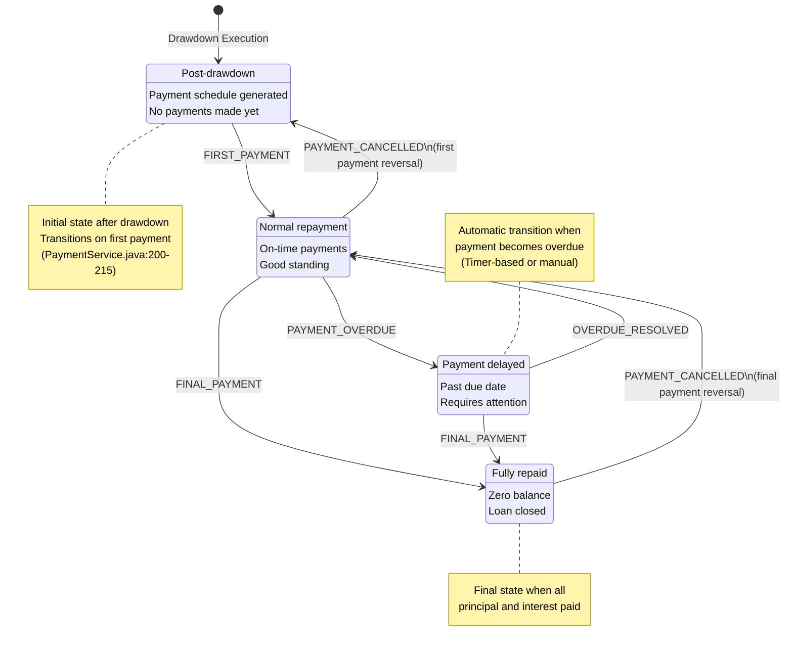
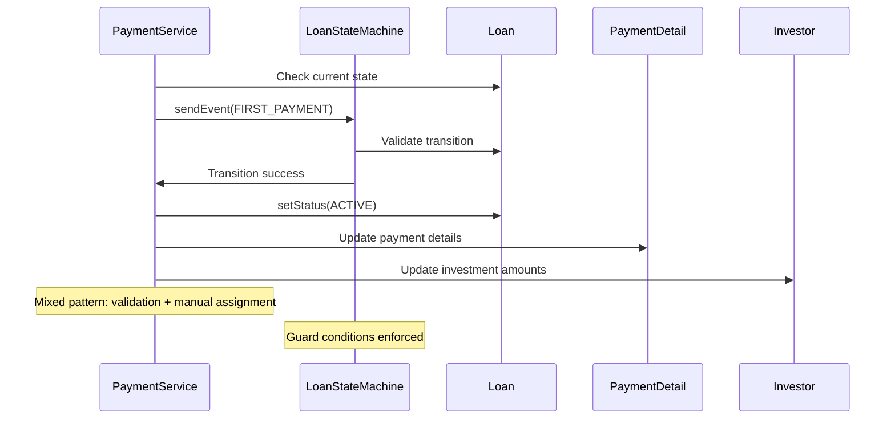

# Loan State Transition Diagram

## Current State Machine Configuration

### States and Events
- **States**: DRAFT, ACTIVE, OVERDUE, COMPLETED
- **Events**: FIRST_PAYMENT, PAYMENT_OVERDUE, OVERDUE_RESOLVED, FINAL_PAYMENT, PAYMENT_CANCELLED
- **Status**: ✅ Complete event model

### State Transition Diagram



## Implementation Status

### ✅ **Properly Implemented Transitions**

#### DRAFT → ACTIVE (FIRST_PAYMENT)
**Location**: `PaymentService.java:200-215`

```java
private void updateLoanStateForFirstPayment(Loan loan) {
    if (loan.getStatus() == LoanState.DRAFT) {
        List<Payment> existingPayments = paymentRepository
            .findByLoanIdOrderByPaymentDateDesc(loan.getId());
        
        if (existingPayments.size() <= 1) {
            if (executeLoanStateTransition(loan, LoanEvent.FIRST_PAYMENT)) {
                loan.setStatus(LoanState.ACTIVE);  // Mixed pattern
                loanRepository.save(loan);
            }
        }
    }
}
```

**Business Logic**:
- Triggered when first payment is processed
- Validates loan is in DRAFT state
- Ensures this is actually the first payment
- Transitions to ACTIVE state for ongoing management

### 🟡 **Partially Implemented Patterns**

#### State Machine Execution Pattern
**Location**: `PaymentService.java:224-242`

```java
private boolean executeLoanStateTransition(Loan loan, LoanEvent event) {
    try {
        loanStateMachine.getStateMachineAccessor().doWithAllRegions(access -> {
            access.resetStateMachine(null);
        });
        
        loanStateMachine.getExtendedState().getVariables().put("loanId", loan.getId());
        return loanStateMachine.sendEvent(event);
    } catch (Exception e) {
        // ❌ PROBLEMATIC: Silent failure handling
        System.err.println("Loan state transition failed for ID: " + loan.getId());
        return false;
    }
}
```

**Issues**:
- Silent error handling allows business processes to continue
- No proper logging or alerting
- State inconsistencies may go unnoticed

### ❌ **Missing or Incomplete Implementations**

#### Automatic OVERDUE Transitions
**Expected**: Timer-based or scheduled process to detect overdue payments
**Current Status**: ❓ Implementation unknown
**Required Events**: PAYMENT_OVERDUE

#### Payment Cancellation Support
**Events Defined**: PAYMENT_CANCELLED
**Implementation Status**: ❓ Unknown
**Business Impact**: Cannot reverse payments or handle corrections

## State Machine Configuration Analysis

### **Guard Conditions**
**Location**: `LoanStateMachineConfig.java`

```java
// Proper guard implementations for all transitions
private Guard<LoanState, LoanEvent> firstPaymentGuard() {
    return context -> {
        LoanState currentState = context.getStateMachine().getState().getId();
        return LoanState.DRAFT.equals(currentState);
    };
}

private Guard<LoanState, LoanEvent> finalPaymentGuard() {
    return context -> {
        LoanState currentState = context.getStateMachine().getState().getId();
        return LoanState.ACTIVE.equals(currentState) || 
               LoanState.OVERDUE.equals(currentState);
    };
}
```

**Assessment**: ✅ **Excellent** - All transitions have proper guard conditions

### **Missing Actions**
**Current**: No Action implementations
**Opportunities**:
- Automatic balance updates
- Notification triggers
- Cross-system integrations
- Audit trail generation

## Business Rules and Constraints

### **DRAFT State Rules**
- ✅ Created automatically after drawdown execution
- ✅ Payment schedule is pre-generated
- ✅ No payments processed yet
- ✅ Can transition to ACTIVE on first payment

### **ACTIVE State Rules**
- ✅ Normal repayment state
- ✅ Regular payments expected
- ✅ Can transition to OVERDUE if payment delayed
- ✅ Can transition to COMPLETED on final payment

### **OVERDUE State Rules**
- ✅ Payment is past due date
- ✅ Requires borrower action or intervention
- ✅ Can resolve back to ACTIVE with payment
- ✅ Can still complete with final payment

### **COMPLETED State Rules**
- ✅ All principal and interest paid
- ✅ Loan balance is zero
- ✅ No further payments expected
- ⚠️ Payment cancellation may revert state

## Cross-System Integration Points

### **Payment Processing Integration**


### **Investment Amount Updates**
**Location**: `PaymentService.java:182-192`

```java
private void updateInvestorAmountsForPayment(List<PaymentDistribution> paymentDistributions) {
    for (PaymentDistribution distribution : paymentDistributions) {
        Investor investor = investorRepository.findById(distribution.getInvestorId())
            .orElseThrow(() -> new ResourceNotFoundException(
                "Investor not found with id: " + distribution.getInvestorId()));
        
        // Only principal payments reduce investment amounts
        investor.decreaseInvestmentAmount(distribution.getPrincipalAmount());
        investorRepository.save(investor);
    }
}
```

**Coordination**: Loan state changes trigger investment amount updates

## Required Enhancements

### **1. Proper Error Handling**
```java
// REPLACE silent failure with proper exception handling
private boolean executeLoanStateTransition(Loan loan, LoanEvent event) {
    try {
        // ... state machine execution
        return loanStateMachine.sendEvent(event);
    } catch (Exception e) {
        logger.error("Critical: Loan state transition failed for ID: {}", 
            loan.getId(), e);
        throw new BusinessRuleViolationException(
            "Loan state transition failed", e);
    }
}
```

### **2. Automatic OVERDUE Detection**
```java
// Required: Scheduled process for overdue detection
@Scheduled(fixedRate = 3600000) // Every hour
public void detectOverdueLoans() {
    List<Loan> activeLoans = loanRepository.findByStatus(LoanState.ACTIVE);
    LocalDate today = LocalDate.now();
    
    for (Loan loan : activeLoans) {
        if (hasOverduePayments(loan, today)) {
            transitionLoanToOverdue(loan);
        }
    }
}
```

### **3. Payment Cancellation Support**
```java
// Required: Payment cancellation implementation
@Transactional
public void cancelPayment(Long paymentId) {
    Payment payment = getPaymentById(paymentId);
    Loan loan = payment.getLoan();
    
    // Determine appropriate cancellation event
    LoanEvent event = determineReversalEvent(payment, loan);
    
    if (executeLoanStateTransition(loan, event)) {
        // Handle payment reversal
        reversePaymentEffects(payment);
        // Update loan status
        updateLoanStatusAfterCancellation(loan, payment);
    }
}
```

### **4. Action Implementation for Automation**
```java
// Recommended: Action implementations for side effects
private Action<LoanState, LoanEvent> firstPaymentAction() {
    return context -> {
        Long loanId = (Long) context.getExtendedState()
            .getVariables().get("loanId");
        
        // Automatic actions on first payment
        notificationService.sendFirstPaymentConfirmation(loanId);
        auditService.recordLoanActivation(loanId);
        reportingService.updateLoanMetrics(loanId);
    };
}
```

## Performance Considerations

### **Current Performance Issues**
1. **State Machine Reset Overhead**: Each transition requires full reset
2. **Database Queries**: Multiple queries for payment history validation
3. **Investor Updates**: Individual updates for each distribution

### **Optimization Opportunities**
```java
// Batch investor updates
@Transactional
public void updateInvestorAmountsBatch(List<PaymentDistribution> distributions) {
    Map<Long, Money> investorUpdates = distributions.stream()
        .collect(groupingBy(
            PaymentDistribution::getInvestorId,
            mapping(PaymentDistribution::getPrincipalAmount, 
                reducing(Money.ZERO, Money::add))));
    
    investorUpdates.forEach((investorId, amount) -> {
        Investor investor = investorRepository.findById(investorId)
            .orElseThrow();
        investor.decreaseInvestmentAmount(amount);
    });
    
    investorRepository.saveAll(investorUpdates.keySet().stream()
        .map(investorRepository::findById)
        .map(Optional::get)
        .collect(toList()));
}
```

## Testing Requirements

### **State Machine Transition Tests**
```java
@Test
void testLoanStateTransitions() {
    // Test DRAFT → ACTIVE
    // Test ACTIVE → OVERDUE
    // Test OVERDUE → ACTIVE
    // Test ACTIVE/OVERDUE → COMPLETED
}

@Test
void testGuardConditions() {
    // Verify only valid transitions allowed
    // Test edge cases
    // Verify business rule enforcement
}

@Test
void testErrorHandling() {
    // Test state machine failures
    // Verify proper exception handling
    // Test transaction rollback
}
```

### **Integration Tests**
```java
@Test
void testPaymentProcessingIntegration() {
    // Create loan in DRAFT state
    // Process first payment
    // Verify ACTIVE transition
    // Verify investor amount updates
    // Verify payment distribution creation
}

@Test
void testOverdueDetectionIntegration() {
    // Create overdue scenario
    // Run detection process
    // Verify OVERDUE transition
    // Test resolution process
}
```

## Monitoring and Alerting

### **Recommended Metrics**
- Loan state distribution (counts by state)
- State transition frequency and timing
- Failed state transition rate
- Overdue detection accuracy

### **Recommended Alerts**
- State machine transition failures
- Unexpected state transitions
- Overdue detection process failures
- Payment processing errors

### **Recommended Logging**
```java
// Structured logging for state transitions
logger.info("Loan state transition executed", 
    Map.of(
        "loanId", loan.getId(),
        "fromState", oldState,
        "toState", newState,
        "event", event,
        "timestamp", Instant.now()
    ));
```

## Summary

The Loan State Machine shows **good architecture** with **room for improvement**:

✅ **Strengths**:
- Complete event model covers all business scenarios
- Proper guard conditions for all transitions
- Integration with payment processing
- Complex state lifecycle properly modeled

🟡 **Areas for Improvement**:
- Silent error handling needs fixing
- Mixed validation + assignment pattern
- Missing automatic overdue detection
- No Action implementations for automation

❌ **Critical Gaps**:
- Silent failure handling compromises reliability
- Payment cancellation events defined but not implemented
- No scheduled processes for automatic state changes

🎯 **Priority Actions**:
1. Fix error handling in executeLoanStateTransition()
2. Implement automatic overdue detection
3. Add payment cancellation support
4. Consider Action implementations for automation