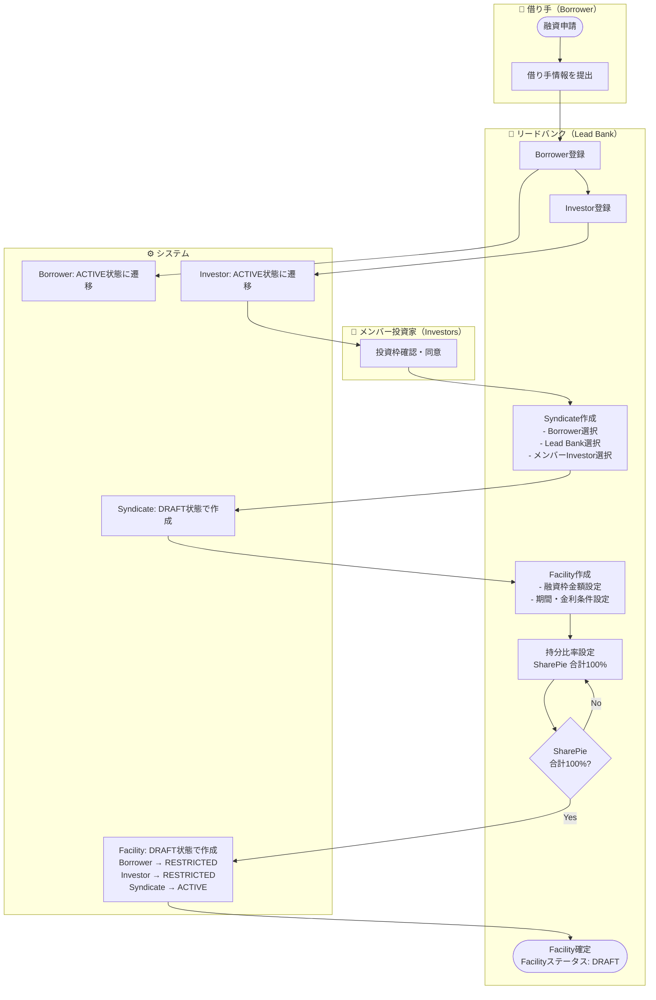
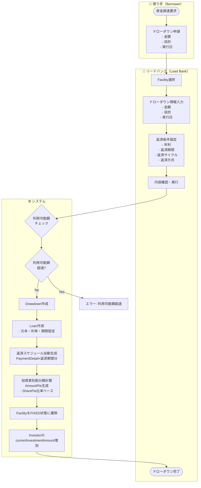
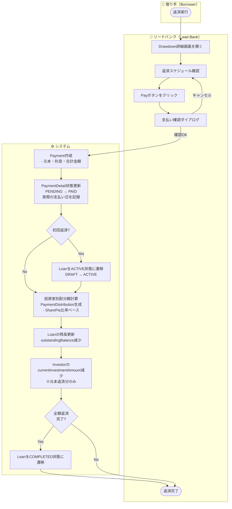
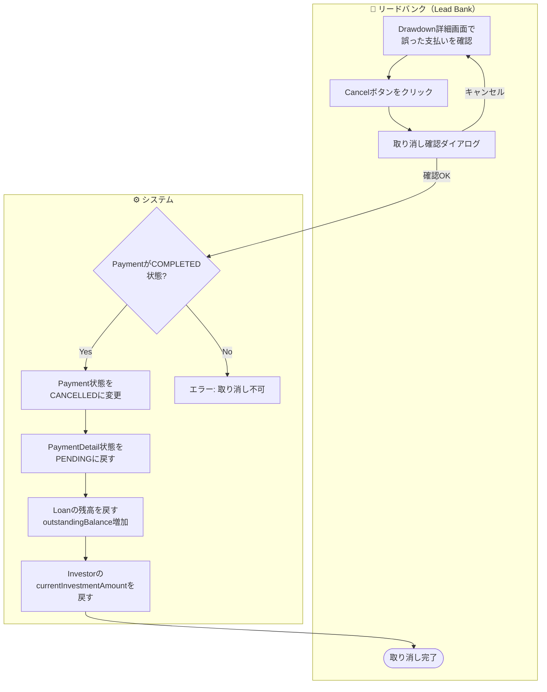
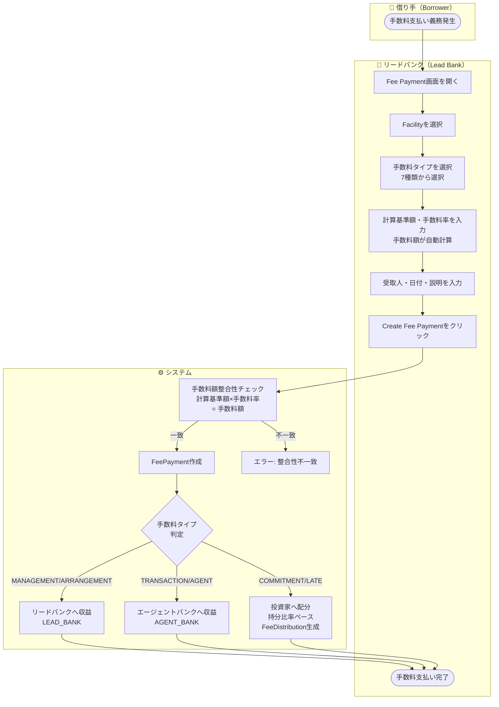
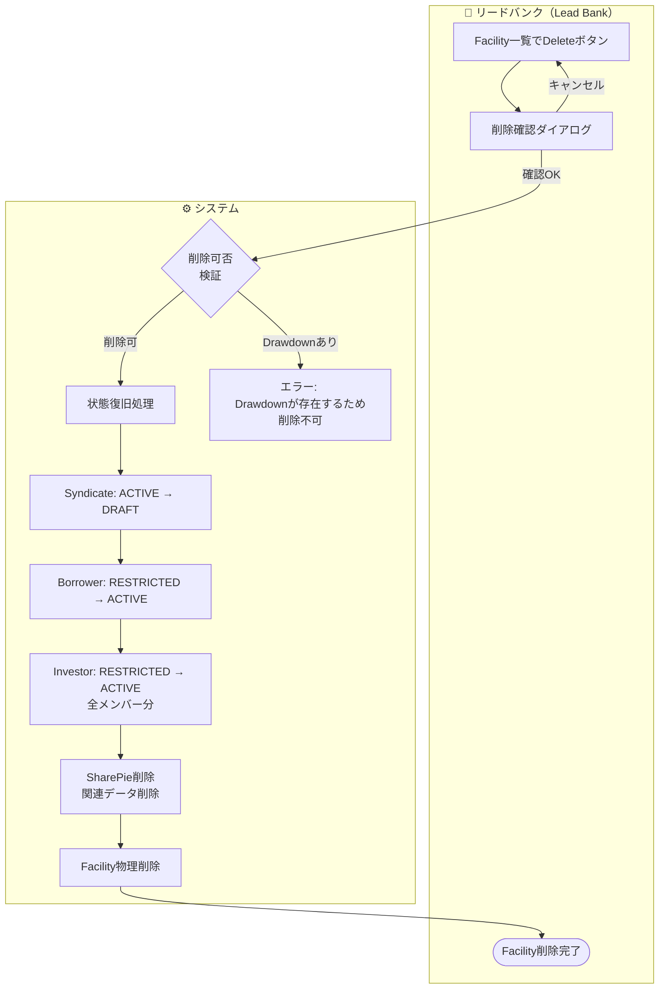

# 業務フロー

シンジケートローン管理システムの主要業務フロー（スイムレーン付き）。

---

## 1. シンジケートローン組成フロー

---

## 2. ドローダウン実行フロー

---

## 3. 返済実行フロー

---

## 4. 支払い取り消しフロー

---

## 5. 手数料支払いフロー

---

## 6. Facility削除フロー（状態復旧）

