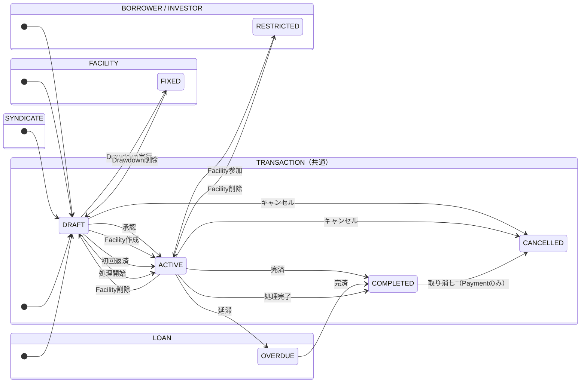

# 概念データモデル（ER図）

シンジケートローン管理システムの概念データモデル。

---

## ER図（Mermaid形式）

```mermaid
erDiagram

    %% ========== Party コンテキスト ==========
    BORROWER {
        Long id PK
        String name
        String email
        String phoneNumber
        String companyId
        BigDecimal creditLimit
        String creditRating "Enum: AAA/AA/A/BBB/BB/B/CCC/CC/C/D"
        String status "Enum: DRAFT/ACTIVE/RESTRICTED"
        LocalDateTime createdAt
        LocalDateTime updatedAt
    }

    INVESTOR {
        Long id PK
        String name
        String email
        String phoneNumber
        String companyId
        BigDecimal investmentCapacity
        BigDecimal currentInvestmentAmount
        String investorType "Enum: BANK/INSURANCE/PENSION_FUND/HEDGE_FUND/OTHER"
        String status "Enum: DRAFT/ACTIVE/RESTRICTED"
        LocalDateTime createdAt
        LocalDateTime updatedAt
    }

    %% ========== Syndicate コンテキスト ==========
    SYNDICATE {
        Long id PK
        String name
        Long leadBankId FK
        Long borrowerId FK
        String status "Enum: DRAFT/ACTIVE"
        LocalDateTime createdAt
        LocalDateTime updatedAt
    }

    SYNDICATE_MEMBER {
        Long syndicateId FK
        Long investorId FK
    }

    %% ========== Facility コンテキスト ==========
    FACILITY {
        Long id PK
        Long syndicateId FK
        BigDecimal commitment
        String currency
        LocalDate startDate
        LocalDate endDate
        String interestTerms
        String status "Enum: DRAFT/FIXED"
        LocalDateTime createdAt
        LocalDateTime updatedAt
    }

    SHARE_PIE {
        Long id PK
        Long facilityId FK
        Long investorId FK
        BigDecimal share "持分比率（%）"
        LocalDateTime createdAt
        LocalDateTime updatedAt
    }

    %% ========== Loan コンテキスト ==========
    LOAN {
        Long id PK
        Long facilityId FK
        Long borrowerId FK
        BigDecimal principalAmount
        BigDecimal outstandingBalance
        BigDecimal annualInterestRate
        LocalDate drawdownDate
        Integer repaymentPeriodMonths
        String repaymentCycle "Enum: MONTHLY/QUARTERLY/SEMI_ANNUAL/ANNUAL"
        String repaymentMethod "Enum: EQUAL_INSTALLMENT/BULLET_PAYMENT"
        String currency
        String status "Enum: DRAFT/ACTIVE/OVERDUE/COMPLETED"
        LocalDateTime createdAt
        LocalDateTime updatedAt
    }

    PAYMENT_DETAIL {
        Long id PK
        Long loanId FK
        Integer paymentNumber
        BigDecimal principalPayment
        BigDecimal interestPayment
        LocalDate dueDate
        BigDecimal remainingBalance
        String paymentStatus "Enum: PENDING/PAID/OVERDUE"
        LocalDate actualPaymentDate
        Long paymentId FK
        LocalDateTime createdAt
        LocalDateTime updatedAt
    }

    %% ========== Transaction コンテキスト（継承基底） ==========
    TRANSACTION {
        Long id PK
        Long facilityId FK
        Long borrowerId FK
        LocalDate transactionDate
        String transactionType "Enum: DRAWDOWN/PAYMENT/FEE_PAYMENT"
        String status "Enum: DRAFT/ACTIVE/COMPLETED/CANCELLED"
        BigDecimal amount
        LocalDateTime createdAt
        LocalDateTime updatedAt
    }

    DRAWDOWN {
        Long id PK_FK "Transaction継承"
        Long loanId FK
        String currency
        String purpose
    }

    AMOUNT_PIE {
        Long id PK
        Long drawdownId FK
        Long investorId FK
        BigDecimal amount
        String currency
        LocalDateTime createdAt
        LocalDateTime updatedAt
    }

    PAYMENT {
        Long id PK_FK "Transaction継承"
        Long loanId FK
        LocalDate paymentDate
        BigDecimal totalAmount
        BigDecimal principalAmount
        BigDecimal interestAmount
        String currency
    }

    PAYMENT_DISTRIBUTION {
        Long id PK
        Long paymentId FK
        Long investorId FK
        BigDecimal distributionAmount
        BigDecimal distributionRatio "配分比率（%）"
        String currency
        LocalDateTime createdAt
        LocalDateTime updatedAt
    }

    FEE_PAYMENT {
        Long id PK_FK "Transaction継承"
        String feeType "Enum: MANAGEMENT/ARRANGEMENT/COMMITMENT/TRANSACTION/LATE/AGENT/OTHER"
        LocalDate feeDate
        String description
        String recipientType "Enum: LEAD_BANK/AGENT_BANK/INVESTOR/AUTO_DISTRIBUTE"
        Long recipientId
        BigDecimal calculationBase "計算基準額"
        Double feeRate "手数料率（%）"
        String currency
    }

    FEE_DISTRIBUTION {
        Long id PK
        Long feePaymentId FK
        String recipientType "INVESTOR/BANK/BORROWER"
        Long recipientId
        BigDecimal distributionAmount
        Double distributionRatio "配分比率（%）"
        String currency
        LocalDateTime createdAt
        LocalDateTime updatedAt
    }

    %% ========== リレーション定義 ==========

    %% Syndicate - Party
    SYNDICATE }o--|| BORROWER : "borrowerId"
    SYNDICATE }o--|| INVESTOR : "leadBankId（リードバンク）"
    SYNDICATE ||--o{ SYNDICATE_MEMBER : "has"
    SYNDICATE_MEMBER }o--|| INVESTOR : "investorId"

    %% Facility - Syndicate
    FACILITY }o--|| SYNDICATE : "syndicateId"
    FACILITY ||--o{ SHARE_PIE : "has"
    SHARE_PIE }o--|| INVESTOR : "investorId"

    %% Loan - Facility
    LOAN }o--|| FACILITY : "facilityId"
    LOAN }o--|| BORROWER : "borrowerId"
    LOAN ||--o{ PAYMENT_DETAIL : "has"
    PAYMENT_DETAIL ||--o| PAYMENT : "paymentId（実績）"

    %% Transaction 継承
    TRANSACTION ||--o| DRAWDOWN : "JOINED継承"
    TRANSACTION ||--o| PAYMENT : "JOINED継承"
    TRANSACTION ||--o| FEE_PAYMENT : "JOINED継承"

    %% Drawdown
    DRAWDOWN }o--|| LOAN : "loanId"
    DRAWDOWN ||--o{ AMOUNT_PIE : "has"
    AMOUNT_PIE }o--|| INVESTOR : "investorId"

    %% Payment
    PAYMENT }o--|| LOAN : "loanId"
    PAYMENT ||--o{ PAYMENT_DISTRIBUTION : "has"
    PAYMENT_DISTRIBUTION }o--|| INVESTOR : "investorId"

    %% FeePayment
    FEE_PAYMENT ||--o{ FEE_DISTRIBUTION : "has"

    %% Transaction - Facility/Borrower（共通参照）
    TRANSACTION }o--|| FACILITY : "facilityId"
    TRANSACTION }o--|| BORROWER : "borrowerId"
```

---

## エンティティ概説

### Party コンテキスト

| エンティティ | 説明 |
|---|---|
| **BORROWER** | ローンを借り入れる企業・法人。信用格付け・与信限度を保持。Facility参加後はRESTRICTED状態になる |
| **INVESTOR** | ローンに出資する金融機関（銀行・保険等）。現在投資額を自動追跡。Facility参加後はRESTRICTED状態になる |

### Syndicate コンテキスト

| エンティティ | 説明 |
|---|---|
| **SYNDICATE** | 複数のInvestorが集まったシンジケート団。1名のBorrowerに対して組成される |
| **SYNDICATE_MEMBER** | シンジケート団のメンバー（Investor）の中間テーブル |

### Facility コンテキスト

| エンティティ | 説明 |
|---|---|
| **FACILITY** | シンジケートが提供する融資枠。CommitmentAmount・期間・金利条件を定義 |
| **SHARE_PIE** | 各InvestorのFacilityへの持分比率（合計100%必須） |

### Loan・取引コンテキスト

| エンティティ | 説明 |
|---|---|
| **LOAN** | ドローダウンによって生成されるローン。返済スケジュールを内包 |
| **PAYMENT_DETAIL** | 月次返済スケジュールの各明細行（自動生成） |
| **TRANSACTION** | 全取引の基底クラス（JOINED継承）。Drawdown/Payment/FeePaymentの共通属性を保持 |
| **DRAWDOWN** | ローン引き出し取引。実行時にFacilityをFIXED状態に遷移させる |
| **AMOUNT_PIE** | ドローダウン時の投資家別配分額（SharePie比率から自動計算） |
| **PAYMENT** | 元本・利息の返済取引。投資家への配分も自動計算 |
| **PAYMENT_DISTRIBUTION** | 返済時の投資家別配分額（SharePie比率ベースで自動計算） |
| **FEE_PAYMENT** | 手数料支払い取引（7種類のFeeTypeに対応） |
| **FEE_DISTRIBUTION** | 手数料の配分先明細（手数料タイプにより配分ルールが異なる） |

---

## 手数料配分ルール

| FeeType | 配分先 |
|---|---|
| MANAGEMENT_FEE（管理手数料） | リードバンク |
| ARRANGEMENT_FEE（アレンジメント手数料） | リードバンク |
| COMMITMENT_FEE（コミットメント手数料） | 投資家（持分比率ベース） |
| LATE_FEE（遅延手数料） | 投資家（持分比率ベース） |
| TRANSACTION_FEE（取引手数料） | エージェントバンク |
| AGENT_FEE（エージェント手数料） | エージェントバンク |
| OTHER_FEE（その他） | 手動指定 |

---

## 状態遷移サマリー


