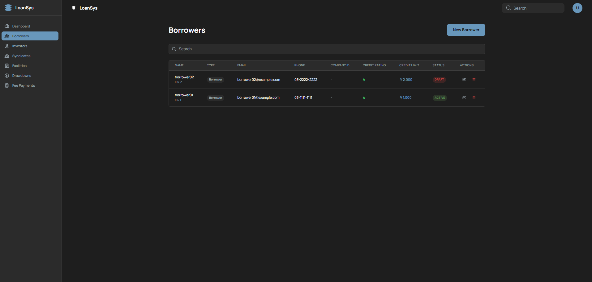
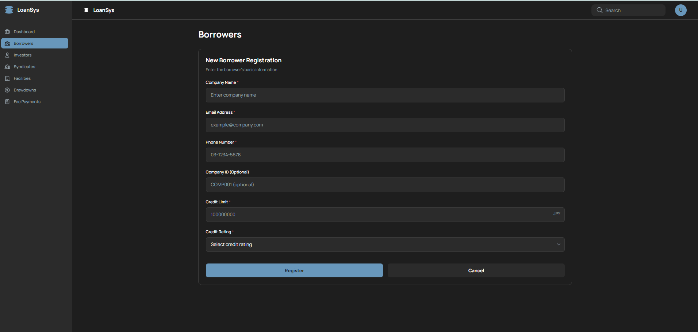
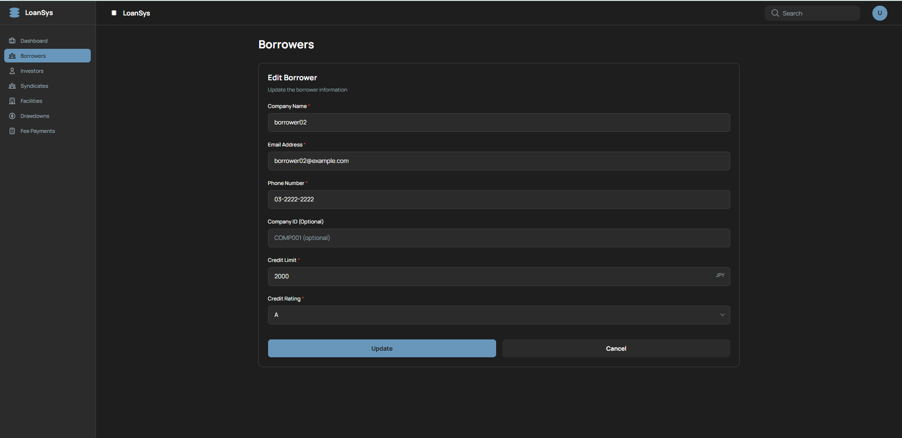

# Borrower管理 画面設計書

借り手（Borrower）の登録・一覧・編集・削除を行う画面。

---

## 1. 概要

| 項目 | 内容 |
|---|---|
| URL | `/borrowers` |
| 目的 | 借り手企業の情報管理（CRUD） |
| 関連スクリーンショット | `borrower-list.png` / `borrower-form.png` / `borrower-edit.png`（3枚） |

---

## 2. 画面レイアウト

### 2.1 一覧モード（showForm=false）



```
+--------------------------------------------------+
| Borrowers                    [New Borrower]      |
| ✅ 成功メッセージ（操作成功後3秒間表示）          |
+--------------------------------------------------+
| 検索ボックス（名前・メール・会社IDでフィルター）  |
+--------------------------------------------------+
| ID | 名前 | メール | 電話 | 会社ID | 格付 | 与信限度 | 状態 | ACTIONS   |
|----|------|--------|------|--------|------|----------|------|-----------|
| 1  | ...  | ...    | ...  | ...    | ...  | ...      | ...  | Edit Delete |
+--------------------------------------------------+
| ページネーション（totalPages > 1 のとき表示）    |
+--------------------------------------------------+
```

### 2.2 新規登録フォーム（showForm=true、mode='create'）



```
+--------------------------------------------------+
| Borrowers                                        |
+--------------------------------------------------+
| Company Name *  [________________________]       |
| Email Address * [________________________]       |
| Phone Number *  [________________________]       |
| Company ID      [________________________]       |
| Credit Limit *  [________________________] JPY   |
| Credit Rating * [▼ Select Credit Rating  ]       |
|                                                  |
|         [Cancel]           [Register]            |
+--------------------------------------------------+
```

- フォームは空欄で表示
- 送信中はボタンが "Registering..." に変わり disabled

### 2.3 編集フォーム（showForm=true、mode='edit'）



```
+--------------------------------------------------+
| Borrowers                                        |
+--------------------------------------------------+
| Company Name *  [既存の名前が入力済み]            |
| Email Address * [既存のメールが入力済み]          |
| Phone Number *  [既存の電話番号が入力済み]        |
| Company ID      [既存の会社IDが入力済み]          |
| Credit Limit *  [既存の与信限度が入力済み] JPY   |
| Credit Rating * [▼ 既存の格付が選択済み  ]       |
|                                                  |
|         [Cancel]            [Update]             |
+--------------------------------------------------+
```

- 既存データが入力済みの状態でフォームを表示
- 送信中はボタンが "Updating..." に変わり disabled
- APIリクエスト時に `version`（楽観的ロック番号）を付加

---

## 3. 項目定義

### 3.1 一覧テーブル列定義

| 列名 | データソース | 備考 |
|---|---|---|
| ID | `borrower.id` | |
| 名前 | `borrower.name` | |
| メール | `borrower.email` | |
| 電話 | `borrower.phoneNumber` | |
| 会社ID | `borrower.companyId` | |
| 格付 | `borrower.creditRating` | 色分けバッジ表示 |
| 与信限度 | `borrower.creditLimit` | 通貨フォーマット（JPY） |
| 状態 | `borrower.status` | DRAFT/ACTIVE/RESTRICTED バッジ |
| ACTIONS | — | Edit / Delete ボタン |

### 3.2 フォーム入力項目

| ラベル | フィールド名 | 型 | 必須 | バリデーション |
|---|---|---|---|---|
| Company Name | `name` | text | ✅ | 必須入力 |
| Email Address | `email` | email | ✅ | メール形式 |
| Phone Number | `phoneNumber` | tel | ✅ | 必須入力 |
| Company ID | `companyId` | text | — | 任意 |
| Credit Limit | `creditLimit` | number | ✅ | 最小1、最大1,000,000,000（JPY） |
| Credit Rating | `creditRating` | select | ✅ | AAA / AA / A / BBB / BB / B / CCC / CC / C / D |

---

## 4. 表示条件

| 要素 | 表示条件 |
|---|---|
| "New Borrower" ボタン | `showForm === false` のとき **のみ** 表示（フォーム表示中は消える） |
| 成功メッセージバナー | `successMessage !== null` のとき（3秒後に自動消去） |
| 検索ボックス | `showForm === false` のとき |
| 一覧テーブル | `showForm === false` のとき |
| フォーム | `showForm === true` のとき |
| "Register" ボタンラベル | `mode === 'create'` のとき |
| "Registering..." ラベル | 新規登録API呼び出し中 |
| "Update" ボタンラベル | `mode === 'edit'` のとき |
| "Updating..." ラベル | 更新API呼び出し中 |
| Delete ボタン disabled | `borrower.status === 'COMPLETED'` のとき（"Cannot delete restricted borrower" ツールチップ） |
| ページネーション | `totalPages > 1` のとき |

---

## 5. イベント一覧

| イベントID | イベント名 | トリガー |
|---|---|---|
| B-01 | 新規登録フォーム表示 | "New Borrower" ボタンクリック |
| B-02 | Borrower登録 | フォームの "Register" ボタンクリック（submit） |
| B-03 | Borrower更新 | フォームの "Update" ボタンクリック（submit） |
| B-04 | フォームキャンセル | フォームの "Cancel" ボタンクリック |
| B-05 | Borrower編集開始 | テーブル行の "Edit" ボタンクリック |
| B-06 | Borrower削除 | テーブル行の "Delete" ボタンクリック |
| B-07 | 検索フィルタリング | 検索ボックスへの入力 |
| B-08 | ページ切替 | ページネーションボタンクリック |
| B-09 | データ再取得 | 初回ロード・操作成功後 |

---

## 6. イベント詳細

### B-01: 新規登録フォーム表示

- **前提条件**: 一覧モード（`showForm === false`）
- **処理**: `setShowForm(true)`（`editMode` は 'create' のまま、フォームは空欄）
- **遷移**: 一覧モード → 新規登録フォームモード（URL変化なし）

---

### B-02: Borrower登録

- **前提条件**: 新規登録フォームモード（`mode === 'create'`）、全必須項目入力済み
- **API**: `POST /api/v1/parties/borrowers`
- **リクエスト**: `{ name, email, phoneNumber, companyId, creditLimit, creditRating }`
- **成功時**:
  1. `setSuccessMessage("Borrower registered successfully")`（3秒後に自動消去）
  2. `setRefreshTrigger(prev + 1)`（一覧リフレッシュ）
  3. `setShowForm(false)` + `setEditMode('create')` + `setEditData(undefined)`
- **失敗時**: `alert(errorMessage)` でエラー内容を通知

---

### B-03: Borrower更新

- **前提条件**: 編集フォームモード（`mode === 'edit'`）、全必須項目入力済み
- **API**: `PUT /api/v1/parties/borrowers/{id}`
- **リクエスト**: `{ name, email, phoneNumber, companyId, creditLimit, creditRating, version }` ※`version` は楽観的ロック用、編集元データから取得
- **成功時**: B-02と同様（成功メッセージ → 一覧リフレッシュ → フォームを閉じる）
- **失敗時（楽観的ロック競合）**: `alert()` でエラー通知（409 Conflict）

---

### B-04: フォームキャンセル

- **前提条件**: フォームモード（新規 / 編集どちらでも）
- **処理**: `setShowForm(false)` + `setEditMode('create')` + `setEditData(undefined)`
- **副作用**: 入力内容は破棄される。APIは呼ばれない

---

### B-05: Borrower編集開始

- **前提条件**: 一覧モード（`showForm === false`）
- **処理**:
  1. `setEditMode('edit')`
  2. `setEditData(borrower)`（選択した行のデータをフォームに渡す）
  3. `setShowForm(true)`
- **遷移**: 一覧モード → 編集フォームモード（既存データが入力済み）

---

### B-06: Borrower削除

- **前提条件**: `borrower.status !== 'COMPLETED'`（COMPLETED時はボタンが disabled）
- **処理**:
  1. `window.confirm("Are you sure you want to delete this borrower?")` でユーザー確認
  2. キャンセル時: 何もしない
  3. OK時: `DELETE /api/v1/parties/borrowers/{id}` を呼び出し
- **成功時**: 成功メッセージ表示 + `setRefreshTrigger(prev + 1)` で一覧リフレッシュ
- **失敗時**: `alert(errorMessage)` でエラー通知
- **制約（API側）**: Syndicate / Facility に参加中のBorrowerは削除不可（API が 400 を返却）

---

### B-07: 検索フィルタリング

- **処理**: 入力値で `borrowers` 配列をフロントエンド側でインメモリフィルタリング（APIリクエストは発生しない）
- **フィルター対象フィールド**: `name` / `email` / `companyId`（部分一致・大文字小文字区別なし）

---

### B-08: ページ切替

- **処理**: `GET /api/v1/parties/borrowers?page={n}&sort=id,desc` を呼び出してデータ再取得

---

### B-09: データ再取得

- **タイミング**: 初回マウント時 / `refreshTrigger` が変化した時（登録・更新・削除成功後）
- **API**: `GET /api/v1/parties/borrowers?page=0&sort=id,desc`
- **失敗時**: エラーUI（エラーメッセージ + "Retry" ボタン）に切り替わる
