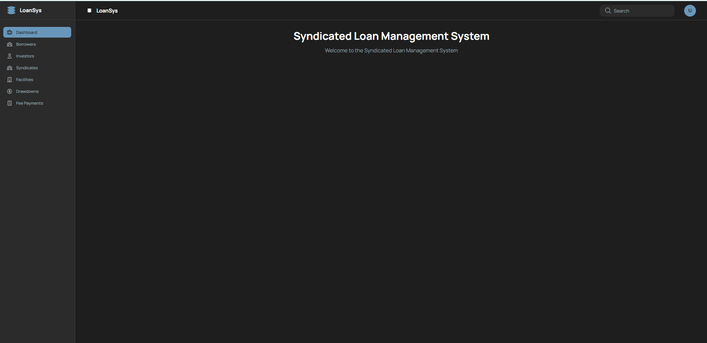

# 共通レイアウト 画面設計書

シンジケートローン管理システム 全画面共通のレイアウト・ナビゲーション定義。

---

## 1. 概要

| 項目 | 内容 |
|---|---|
| 対象 | 全ページ共通 |
| 関連スクリーンショット | `common-layout.png`（1枚） |

---

## 2. 画面レイアウト



```
+----+-------------------------------+------------------+----+
|[≡] LoanSys  | ■ LoanSys            | [🔍 Search    ] |[U]|
+----+-------------------------------+------------------+----+
| [⊞] Dashboard  (active/highlight)  |                       |
| [👤] Borrowers                     |                       |
| [👤] Investors                     |   Syndicated Loan     |
| [⊞] Syndicates                     |   Management System   |
| [⬜] Facilities                    |                       |
| [⊙] Drawdowns                      |  Welcome to the       |
| [📄] Fee Payments                  |  Syndicated Loan      |
|                                    |  Management System    |
+------------------------------------+-----------------------+
```

---

## 3. コンポーネント定義

### Header

| 要素 | 内容 |
|---|---|
| ロゴ / システム名 | "Syndicate Lending Management System" |
| 背景色 | プライマリカラー（ダークブルー系） |

### Sidebar

| メニュー名 | 遷移先URL |
|---|---|
| Dashboard | `/` |
| Borrowers | `/borrowers` |
| Investors | `/lenders` |
| Syndicates | `/syndicates` |
| Facilities | `/facilities` |
| Drawdowns | `/drawdowns` |
| Fee Payments | `/fees` |

---

## 4. 表示条件

| 要素 | 表示条件 |
|---|---|
| サイドバーのアクティブスタイル | 現在のURLパスに対応するメニュー項目のみ強調表示 |
| Header・Sidebar | 全ページで常時表示 |

---

## 5. イベント一覧

| イベントID | イベント名 | トリガー |
|---|---|---|
| C-01 | ページ遷移 | サイドバーの各メニュークリック |

---

## 6. イベント詳細

### C-01: ページ遷移

- **トリガー**: サイドバーのメニュー項目クリック
- **処理**: React Router の `navigate()` によるクライアントサイドルーティング
- **遷移先**: 各メニューに対応するURLへ遷移（ページリロードなし）
- **副作用**: 遷移先URLに対応するメニュー項目がアクティブスタイルに変更される
