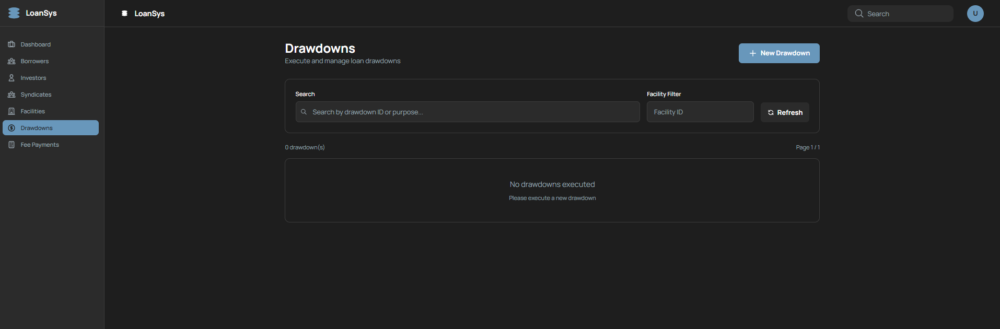
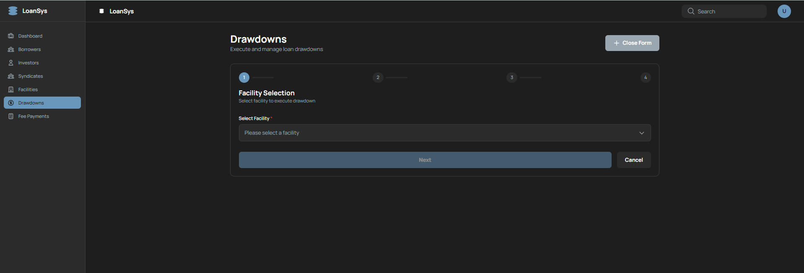
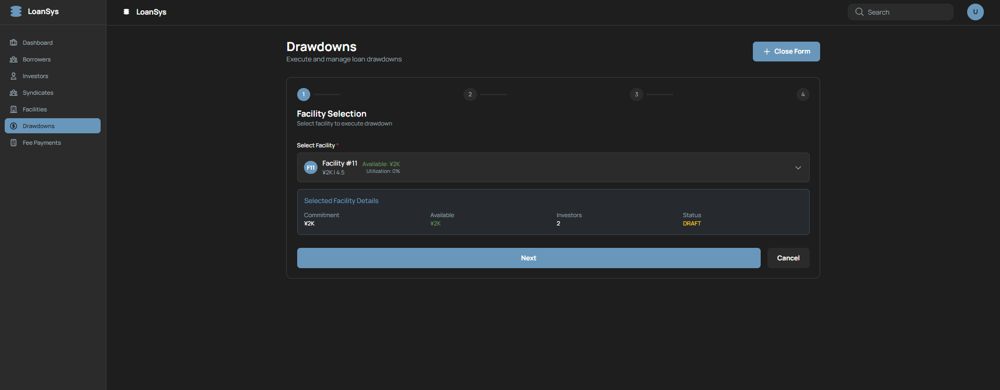
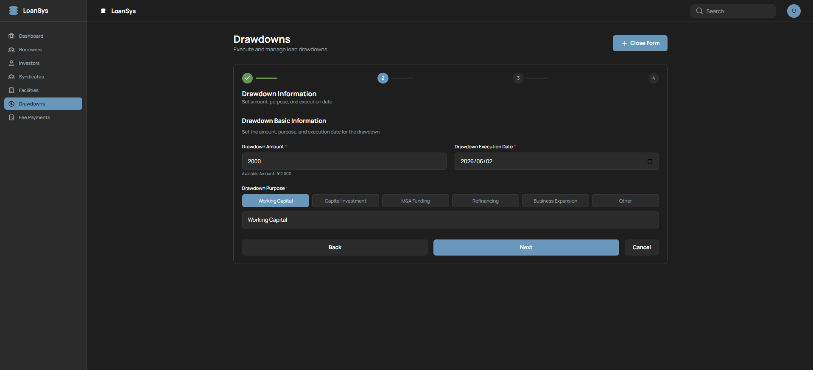
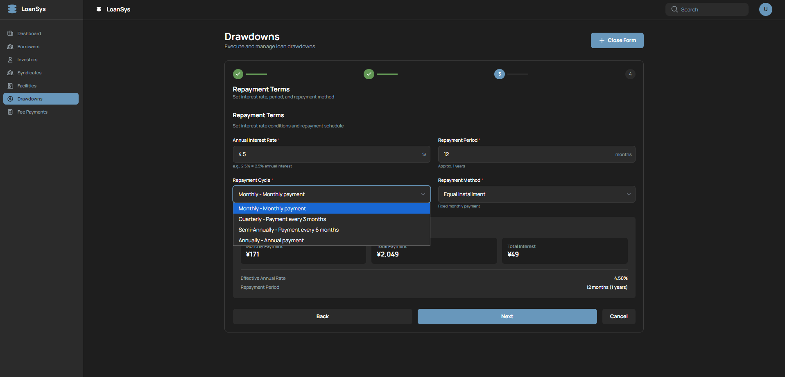
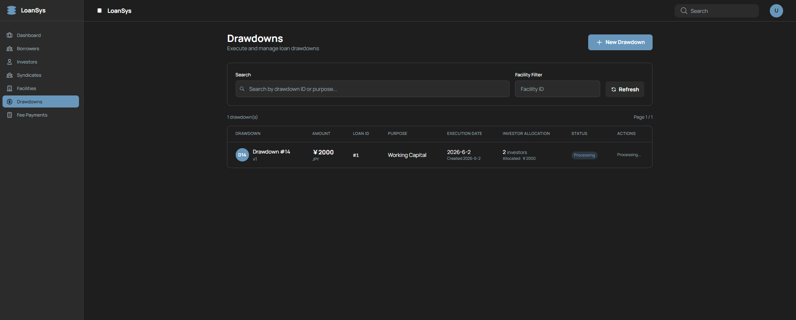
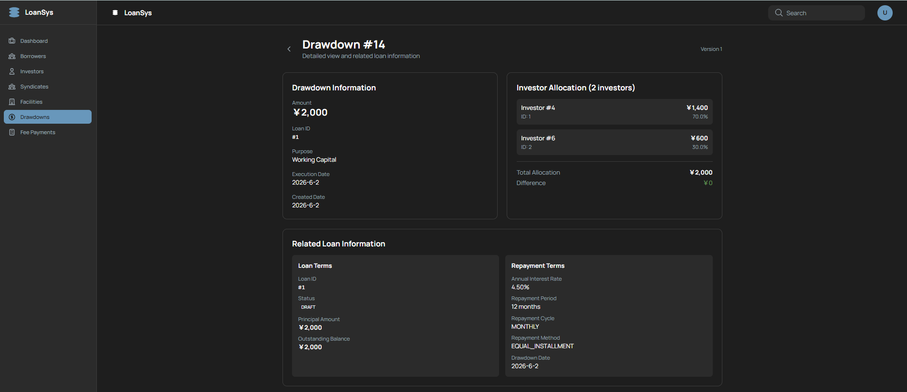
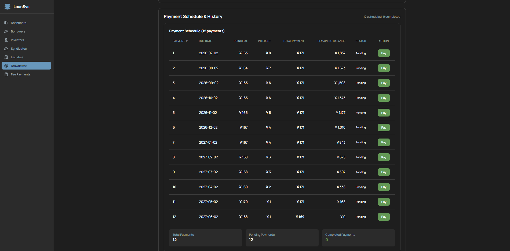
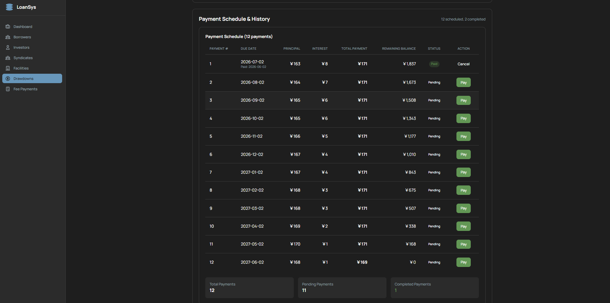

# Drawdown管理・詳細 画面設計書

ドローダウン（Drawdown）の実行・一覧・編集・削除と、ドローダウン詳細（返済スケジュール・支払い）を行う画面。

---

## 1. 概要

| 項目 | 内容 |
|---|---|
| URL1 | `/drawdowns`（一覧・ウィザード） |
| URL2 | `/drawdowns/:id`（詳細） |
| 目的 | ドローダウン実行・返済スケジュール管理・支払い実行・支払い取り消し |
| 関連スクリーンショット | `drawdown-list.png` / `drawdown-form-1-1.png` / `drawdown-form-1-2.png` / `drawdown-form-2.png` / `drawdown-form-3.png` / `drawdown-form-fin.png` / `drawdown-show-detail-1.png` / `drawdown-show-detail-2.png` / `payment-paid.png`（9枚） |

---

## 2. Drawdown管理画面（/drawdowns）

### 2.1 一覧モード（showForm=false）



```
+----------------------------------------------------------+
| Drawdowns  [New Drawdown]                                |
|            [Search: ________]  [Refresh]                 |
|            [Facility Filter: _____] [Clear Filter]       |
| ✅ 成功メッセージ（5秒間表示）    [×]                    |
+----------------------------------------------------------+
| ID | 金額 | Loan ID | 目的 | 実行日 | 投資家配分 | 状態 | ACTIONS     |
|----|------|---------|------|--------|-----------|------|-------------|
| 1  | ¥... | #1      | ...  | ...    | N件 / ¥XX | ...  | Edit Delete |
+----------------------------------------------------------+
| ページネーション（facilityFilterなし かつ totalPages>1） |
+----------------------------------------------------------+
```

> **注意**: 成功メッセージの表示時間は Borrower/Investor の3秒ではなく **5秒**。

### 2.2 ウィザード Step1: Facility選択

**選択前:**



**選択後:**



```
+----------------------------------------------------------+
| Drawdowns  [Close Form]                                  |
+----------------------------------------------------------+
| ●Step1  ○Step2  ○Step3  ○Step4                         |
| Select Facility                                          |
+----------------------------------------------------------+
| Facility * [FacilitySelectForDrawdownコンポーネント]     |
|   （FIXED状態のFacilityは選択不可）                      |
|                                                          |
| [Cancel]                              [Next →]          |
+----------------------------------------------------------+
```

> **編集モードではStep1をスキップ**し、Step2（基本情報）から開始する。

### 2.3 ウィザード Step2: 基本情報



```
+----------------------------------------------------------+
| ✓Step1（編集時はスキップ）  ●Step2  ○Step3  ○Step4    |
| Basic Information                                        |
+----------------------------------------------------------+
| Drawdown Amount * [__________] JPY  (max: Facilityの融資枠)|
| Drawdown Execution Date * [YYYY-MM-DD] (min: 今日)      |
| Drawdown Purpose * [_________________________]           |
|   クイック選択: [Working Capital] [Equipment Purchase]  |
|                 [Project Finance] [Real Estate]          |
|                 [Refinancing] [その他...]               |
|                                                          |
| [Cancel]              [← Back]  [Next →]                |
+----------------------------------------------------------+
```

### 2.4 ウィザード Step3: 返済条件



```
+----------------------------------------------------------+
| ✓Step1  ✓Step2  ●Step3  ○Step4                         |
| Repayment Terms                                          |
+----------------------------------------------------------+
| Annual Interest Rate * [_____] %                        |
| Repayment Period *     [_____] months                   |
| Repayment Cycle *      [▼ MONTHLY / QUARTERLY / ...]   |
| Repayment Method *     [▼ EQUAL_INSTALLMENT / BULLET]  |
|                                                          |
| [Cancel]              [← Back]  [Next →]                |
+----------------------------------------------------------+
```

### 2.5 ウィザード Step4: 確認・実行



```
+----------------------------------------------------------+
| ✓Step1  ✓Step2  ✓Step3  ●Step4                         |
| Confirmation & Execution                                 |
+----------------------------------------------------------+
| ⚠️ After drawdown execution, the facility will become   |
|    fixed and no further modifications will be allowed.  |
+----------------------------------------------------------+
| Facility     : [選択したFacility名]                      |
| Amount        : ¥XXX / JPY                               |
| Execution Date: YYYY-MM-DD                               |
| Purpose       : ...                                      |
| Annual Rate   : X.XX%                                    |
| Period        : XX months                                |
| Cycle / Method: ...                                      |
|                                                          |
| [Cancel]  [← Back]          [Execute Drawdown]          |
+----------------------------------------------------------+
```

> 編集モードでは "Update Drawdown" ボタンが表示される。

---

## 3. Drawdown詳細画面（/drawdowns/:id）

### 3.1 詳細画面上部



```
+----------------------------------------------------------+
| ← Back to Drawdowns                                      |
| Drawdown #ID              [Facility: #N / Status: XXX]  |
+----------------------------------------------------------+
| Drawdown Information          | Investor Allocation      |
| Amount: ¥XXX                  | Investor #1: ¥XXX (X%)  |
| Loan ID: #X                   | Investor #2: ¥XXX (X%)  |
| Purpose: XXX                  | ...                      |
| Execution Date: YYYY-MM-DD    | Total Allocation: ¥XXX   |
| Created Date: YYYY-MM-DD      | Difference: ¥0.00 ✅    |
+----------------------------------------------------------+
| Related Loan Information                                 |
| Loan Terms                  | Repayment Terms           |
| Loan ID: #X                 | Annual Rate: X.XX%        |
| Status: [ACTIVE ✅]         | Period: XX months         |
| Principal: ¥XXX             | Cycle: MONTHLY            |
| Outstanding: ¥XXX           | Method: EQUAL_INSTALLMENT |
| Drawdown Date: YYYY-MM-DD   |                           |
+----------------------------------------------------------+
```

### 3.2 詳細画面下部（返済スケジュール）



```
+----------------------------------------------------------+
| Payment Schedule & History   [X scheduled, X completed] |
+----------------------------------------------------------+
| No. | Due Date   | Principal | Interest | Total | Balance | Status    | Action  |
|-----|------------|-----------|----------|-------|---------|-----------|---------|
| 1   | YYYY-MM-DD | ¥XXX      | ¥XXX     | ¥XXX  | ¥XXX    | PAID ✅  | Cancel  |
| 2   | YYYY-MM-DD | ¥XXX      | ¥XXX     | ¥XXX  | ¥XXX    | PENDING ⚠️| Pay    |
| 3   | YYYY-MM-DD | ¥XXX      | ¥XXX     | ¥XXX  | ¥XXX    | PENDING ⚠️| Pay    |
+----------------------------------------------------------+
| Total Payments: N件  |  Pending: N件  |  Completed: N件  |
+----------------------------------------------------------+
```

### 3.3 支払い済み状態



> 支払い済み（PAID）行では "Cancel" ボタンが表示される。支払い取り消しが可能。

---

## 4. 項目定義

### 4.1 一覧テーブル列定義

| 列名 | データソース | 備考 |
|---|---|---|
| ID | `drawdown.id` | 丸アイコン付き |
| 金額 | `drawdown.amount` | 通貨フォーマット + currency |
| Loan ID | `drawdown.loanId` | `#${loanId}` |
| 目的 | `drawdown.purpose` | テキスト（長い場合トランケート） |
| 実行日 | `drawdown.transactionDate` | |
| 投資家配分 | `drawdown.amountPies` | 件数 + 合計額 + 差額（不一致時はwarning色） |
| 状態 | `drawdown.status` | バッジ（下記参照） |
| ACTIONS | — | Edit / Delete ボタン（DRAFT/FAILEDのみ表示） |

### 4.2 ステータスバッジ定義

| ステータス | 表示テキスト | 色 |
|---|---|---|
| DRAFT | Draft | warning（黄） |
| ACTIVE | Processing | accent（青） |
| COMPLETED | Completed | success（緑） |
| FAILED | Failed | error（赤） |
| CANCELLED | Cancelled | secondary（灰） |
| REFUNDED | Refunded | purple（紫） |

### 4.3 ウィザード各ステップの入力項目

| ステップ | ラベル | フィールド名 | 型 | 必須 | 備考 |
|---|---|---|---|---|---|
| Step1 | Facility | `facilityId` | FacilitySelectForDrawdownコンポーネント | ✅ | 編集時はスキップ |
| Step2 | Drawdown Amount | `amount` | number | ✅ | 最大値=Facilityのcommitment |
| Step2 | Drawdown Execution Date | `drawdownDate` | date | ✅ | min=今日 |
| Step2 | Drawdown Purpose | `purpose` | text | ✅ | クイック選択ボタン付き |
| Step3 | Annual Interest Rate | `annualInterestRate` | number | ✅ | step=0.01 |
| Step3 | Repayment Period | `repaymentPeriodMonths` | number | ✅ | months |
| Step3 | Repayment Cycle | `repaymentCycle` | select | ✅ | MONTHLY/QUARTERLY/SEMI_ANNUAL/ANNUAL |
| Step3 | Repayment Method | `repaymentMethod` | select | ✅ | EQUAL_INSTALLMENT/BULLET_PAYMENT |
| Step4 | — | — | 読み取り専用確認 | — | |

### 4.4 Drawdown詳細画面 表示項目

**Drawdown Information:**

| ラベル | データソース |
|---|---|
| Amount | `drawdown.amount`（通貨フォーマット） |
| Loan ID | `#${drawdown.loanId}` |
| Purpose | `drawdown.purpose` |
| Execution Date | `drawdown.transactionDate` |
| Created Date | `drawdown.createdAt` |

**Investor Allocation:**

| 項目 | データソース |
|---|---|
| 各投資家行 | `amountPies`（Investor #ID / 金額 / 比率%） |
| Total Allocation | `amountPies` 合計 |
| Difference | `drawdown.amount` - 合計（差額） |

**Related Loan Information:**

| ラベル | データソース |
|---|---|
| Loan ID / Status | `loan.id` / `loan.status` バッジ |
| Principal Amount | `loan.principalAmount` |
| Outstanding Balance | `loan.outstandingBalance` |
| Annual Interest Rate | `loan.annualInterestRate × 100`（%表示） |
| Repayment Period | `loan.repaymentPeriodMonths` months |
| Repayment Cycle | `loan.repaymentCycle` |
| Repayment Method | `loan.repaymentMethod` |
| Drawdown Date | `loan.drawdownDate` |

**Payment Schedule 列:**

| 列名 | データソース |
|---|---|
| Payment # | `paymentDetail.paymentNumber` |
| Due Date | `paymentDetail.dueDate`（支払済みは`actualPaymentDate`も表示） |
| Principal | `paymentDetail.principalPayment` |
| Interest | `paymentDetail.interestPayment` |
| Total Payment | principal + interest |
| Remaining Balance | `paymentDetail.remainingBalance` |
| Status | PENDING（黄） / PAID（緑） / OVERDUE（赤） |
| Action | Pay / Cancel / Completed / No Action |

---

## 5. 表示条件

### 5.1 Drawdown管理画面

| 要素 | 表示条件 |
|---|---|
| "New Drawdown" / "Close Form" トグルボタン | 常時表示（トグル動作） |
| 検索・フィルター・テーブル | `showForm === false` のとき |
| ウィザードフォーム | `showForm === true` のとき |
| "Clear Filter" ボタン | `facilityFilter !== undefined` のとき |
| テーブルの Edit ボタン | `status === 'DRAFT' \|\| status === 'FAILED'` のとき **のみ表示** |
| テーブルの Delete ボタン | `status === 'DRAFT' \|\| status === 'FAILED'` のとき **のみ表示** |
| AmountPie差額表示 | `amountPies.length > 0` のとき（差額 < 0.01 → success色、それ以外 → warning色） |
| ページネーション | `facilityFilter === undefined かつ totalPages > 1` |
| "Execute Drawdown" ボタン | Step4 かつ `mode === 'create'` |
| "Update Drawdown" ボタン | Step4 かつ `mode === 'edit'` |

### 5.2 Drawdown詳細画面

| 要素 | 表示条件 |
|---|---|
| ローディングスピナー | `loading === true` |
| エラー画面 | `error !== null \|\| drawdown === null` |
| Loan情報スピナー | `loanLoading === true` |
| Loan Terms / Repayment Terms | `loan !== null` |
| "Loan information not available" | `loan === null`（取得失敗時） |
| PaymentDetailTable | `paymentDetails.length > 0` |
| Loanステータスバッジ | ACTIVE: success（緑）/ DRAFT: warning（黄）/ その他: secondary（灰） |
| Investor Allocation 差額 success色 | 差額 < 0.01 |
| Investor Allocation 差額 warning色 | 差額 ≥ 0.01 |
| "Pay" ボタン | `paymentStatus === 'PENDING' \|\| paymentStatus === 'OVERDUE'` |
| "Cancel" ボタン | `paymentStatus === 'PAID' && paymentId !== null` |
| "Completed" テキスト | PAID かつ paymentId なし |
| "No Action" テキスト | 上記以外 |

---

## 6. イベント一覧

### 6.1 Drawdown管理画面（/drawdowns）

| イベントID | イベント名 | トリガー |
|---|---|---|
| D-01 | ウィザードフォーム表示/非表示トグル | "New Drawdown" / "Close Form" ボタンクリック |
| D-02 | 次ステップへ進む | "Next" ボタンクリック |
| D-03 | 前ステップへ戻る | "Back" ボタンクリック |
| D-04 | Drawdown実行 | Step4の "Execute Drawdown" ボタンクリック |
| D-05 | Drawdown更新 | Step4の "Update Drawdown" ボタンクリック |
| D-06 | フォームキャンセル | "Cancel" ボタンクリック |
| D-07 | Drawdown編集開始 | テーブル行の "Edit" ボタンクリック（DRAFT/FAILEDのみ表示） |
| D-08 | Drawdown削除 | テーブル行の "Delete" ボタンクリック（DRAFT/FAILEDのみ表示） |
| D-09 | Drawdown詳細画面へ遷移 | テーブルの行クリック |
| D-10 | Facility IDフィルター設定 | Facility Filterフィールドに入力 |
| D-11 | フィルタークリア | "Clear Filter" ボタンクリック |
| D-12 | 一覧リフレッシュ | "Refresh" ボタンクリック |

### 6.2 Drawdown詳細画面（/drawdowns/:id）

| イベントID | イベント名 | トリガー |
|---|---|---|
| DD-01 | 一覧画面へ戻る | "←" ボタン（ヘッダー左） |
| DD-02 | 返済実行（Pay） | "Pay" ボタンクリック |
| DD-03 | 支払い取り消し（Cancel） | "Cancel" ボタンクリック |
| DD-04 | エラー時に一覧へ戻る | エラー画面の "Back to Drawdowns" ボタン |

---

## 7. イベント詳細

### D-01: ウィザードフォーム表示/非表示トグル

- **処理（一覧中）**: `setShowForm(true)`（Step1から表示）
- **処理（フォーム中）**: `setShowForm(false)` + `setEditingDrawdown(null)`（フォームを閉じて一覧に戻る）
- ボタンラベル: `showForm === false` → "New Drawdown"、`showForm === true` → "Close Form" or "Edit Drawdown #N"

---

### D-02: 次ステップへ進む

- **前提条件**: 現ステップのバリデーション通過
  - Step1: `facilityId` が選択済み
  - Step2: `amount` / `drawdownDate` / `purpose` が入力済み
  - Step3: `annualInterestRate` / `repaymentPeriodMonths` / `repaymentCycle` / `repaymentMethod` が入力済み
- **処理**: `setCurrentStep(currentStep + 1)`

---

### D-03: 前ステップへ戻る

- **処理**: `setCurrentStep(currentStep - 1)`（入力内容は保持）
- **編集モードの制約**: `editingDrawdown !== null` のときはStep2が最初のステップのためStep2で"Back"は無効

---

### D-04: Drawdown実行

- **前提条件**: Step4（確認画面）表示中、`mode === 'create'`
- **API**: `POST /api/v1/loans/drawdowns`
- **リクエスト**: `{ facilityId, amount, drawdownDate, purpose, annualInterestRate, repaymentPeriodMonths, repaymentCycle, repaymentMethod, currency }`
- **成功時**: 成功メッセージ（5秒）+ `setRefreshTrigger(prev + 1)` + `setShowForm(false)`
- **失敗時**: `alert(errorMessage)`
- **副作用（API側）**:
  - Loan 新規作成（principalAmount / annualInterestRate / 返済スケジュール設定）
  - PaymentDetail 自動生成（`repaymentPeriodMonths` 件分の返済明細）
  - AmountPie 自動生成（SharePie比率ベースで投資家別配分計算）
  - Facility → FIXED 状態に遷移（以降のドローダウン・Facility変更は不可）
  - 各InvestorのcurrentInvestmentAmount増加

---

### D-05: Drawdown更新

- **前提条件**: Step4 表示中、`mode === 'edit'`、Drawdownが DRAFT/FAILED 状態
- **API**: `PUT /api/v1/loans/drawdowns/{id}`
- **リクエスト**: 実行と同様のフィールド + `version`

---

### D-06: フォームキャンセル

- **処理**: `setShowForm(false)` + `setEditingDrawdown(null)` + ステップをリセット

---

### D-07: Drawdown編集開始

- **前提条件**: `status === 'DRAFT' || status === 'FAILED'`（ボタンはこの条件でのみ表示）
- **処理**:
  1. `setEditingDrawdown(drawdown)`
  2. `setShowForm(true)`
  3. **Step1をスキップ**してStep2から表示

---

### D-08: Drawdown削除

- **前提条件**: `status === 'DRAFT' || status === 'FAILED'`（ボタンはこの条件でのみ表示）
- **処理**:
  1. `window.confirm(...)` でユーザー確認
  2. OK時: `DELETE /api/v1/loans/drawdowns/{id}` を呼び出し
- **成功時**: 成功メッセージ + `setRefreshTrigger(prev + 1)`
- **失敗時**: `alert(errorMessage)`
- **副作用（削除成功時）**: Facility → DRAFT 状態に復旧

---

### D-09: Drawdown詳細画面へ遷移

- **前提条件**: テーブルの任意の行をクリック（Edit/Delete ボタン以外）
- **処理**: `navigate('/drawdowns/${drawdown.id}')`（React Router ページ遷移）

---

### D-10: Facility IDフィルター設定

- **処理**: `setFacilityFilter(facilityId)` → テーブルで `GET /api/v1/loans/drawdowns/facility/{facilityId}` を呼び出し
- **副作用**: ページネーションが非表示になる（facilityFilter設定中はページングなし）

---

### D-11: フィルタークリア

- **処理**: `setFacilityFilter(undefined)` → 全件取得に戻る

---

### D-12: 一覧リフレッシュ

- **処理**: `setRefreshTrigger(prev + 1)` で DrawdownTable に再フェッチをトリガー

---

### DD-01: 一覧画面へ戻る

- **処理**: `navigate('/drawdowns')` でDrawdown管理画面へ遷移

---

### DD-02: 返済実行（Pay）

- **表示条件**: `paymentStatus === 'PENDING' || paymentStatus === 'OVERDUE'` の行
- **処理**:
  1. `window.confirm("Are you sure you want to process this payment?")` でユーザー確認
  2. OK時: `POST /api/v1/loans/payments/scheduled/{paymentDetailId}` を呼び出し
- **成功時**: `onPaymentSuccess()` コールバックで画面リフレッシュ（Loan残高・PaymentDetail一覧を再取得）
- **失敗時**: `alert(errorMessage)`
- **副作用（API側）**:
  - PaymentDetail → PAID 状態、`actualPaymentDate` に今日の日付を記録
  - PaymentDetail に関連する `paymentId` を設定
  - 初回返済の場合: Loan → ACTIVE 状態に遷移（DRAFT → ACTIVE）
  - PaymentDistribution 自動生成（SharePie比率ベースで投資家別配分計算）
  - Loanの`outstandingBalance`減少
  - 元本返済分: 各InvestorのcurrentInvestmentAmount減少

---

### DD-03: 支払い取り消し（Cancel）

- **表示条件**: `paymentStatus === 'PAID' && paymentId !== null` の行
- **処理**:
  1. `window.confirm("Are you sure you want to cancel this payment?")` でユーザー確認
  2. OK時: `DELETE /api/v1/loans/payments/{paymentId}/cancel` を呼び出し
- **成功時**: `onPaymentSuccess()` コールバックで画面リフレッシュ
- **失敗時**: `alert(errorMessage)`
- **副作用（API側）**:
  - Payment → CANCELLED 状態に変更
  - PaymentDetail → PENDING 状態に戻す（`actualPaymentDate` / `paymentId` をクリア）
  - Loanの`outstandingBalance`を取り消し前の金額に戻す
  - 元本返済分: 各InvestorのcurrentInvestmentAmountを戻す

---

### DD-04: エラー時に一覧へ戻る

- **表示条件**: `loading === false && (error !== null || drawdown === null)` のとき
- **処理**: `navigate('/drawdowns')`
