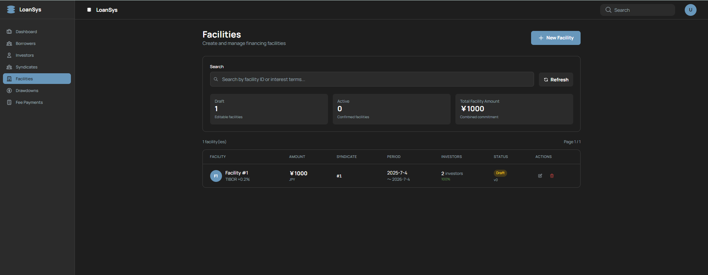
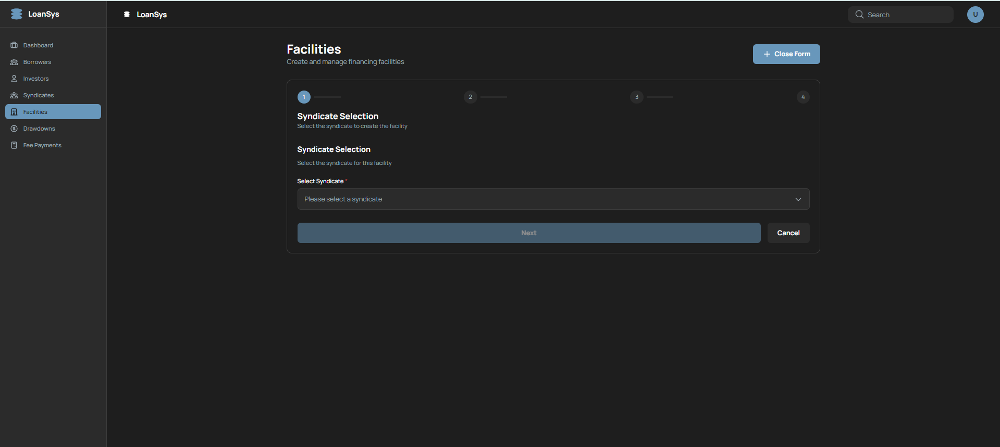
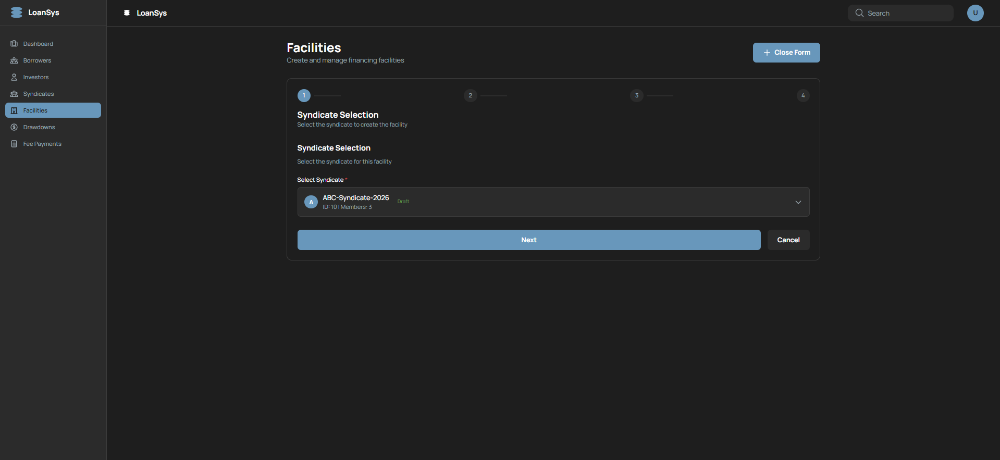
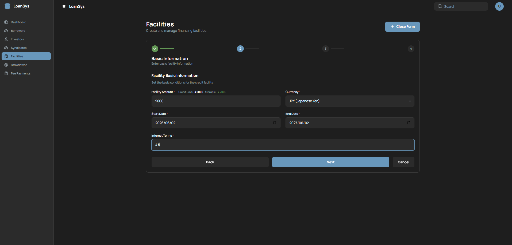
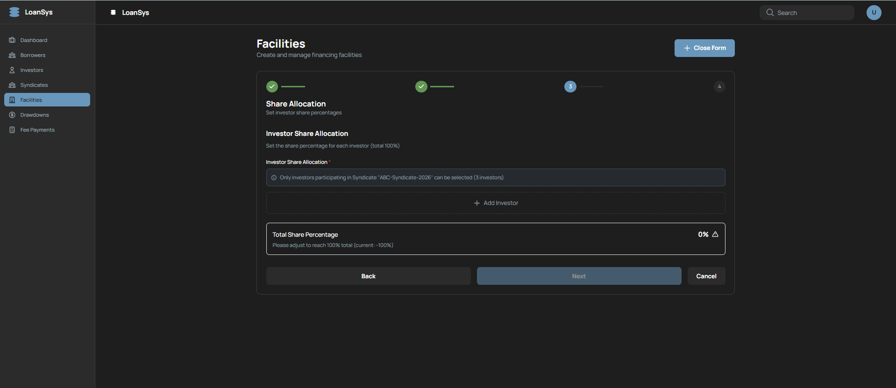
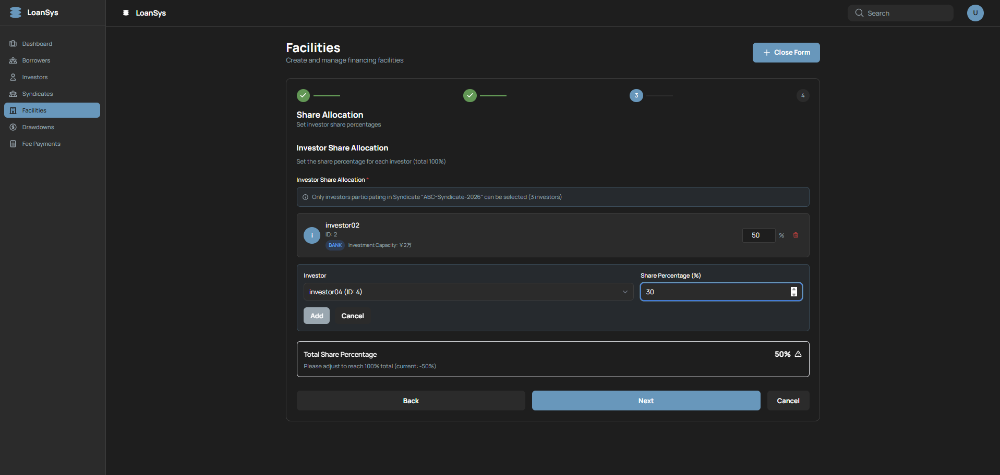
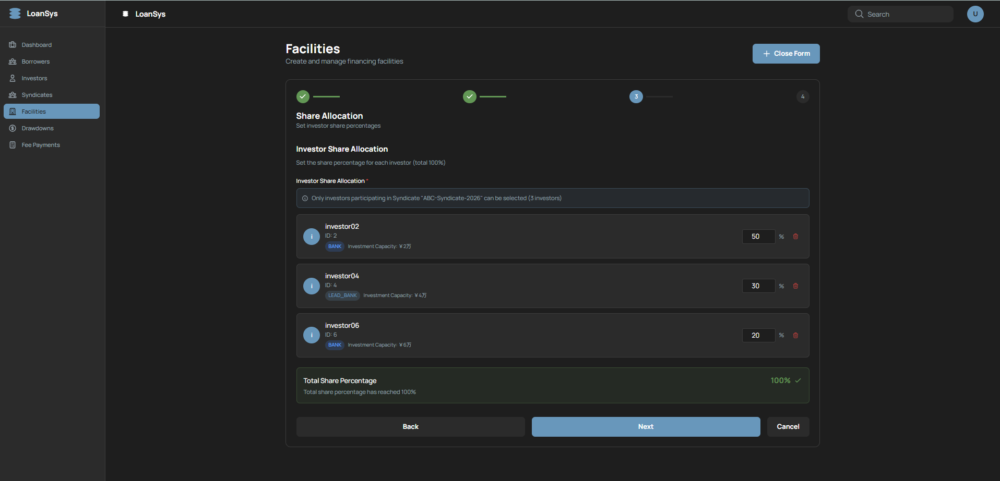
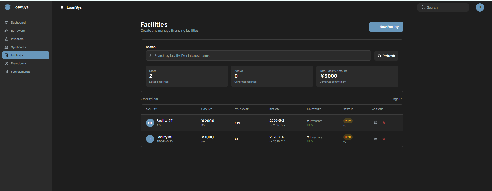
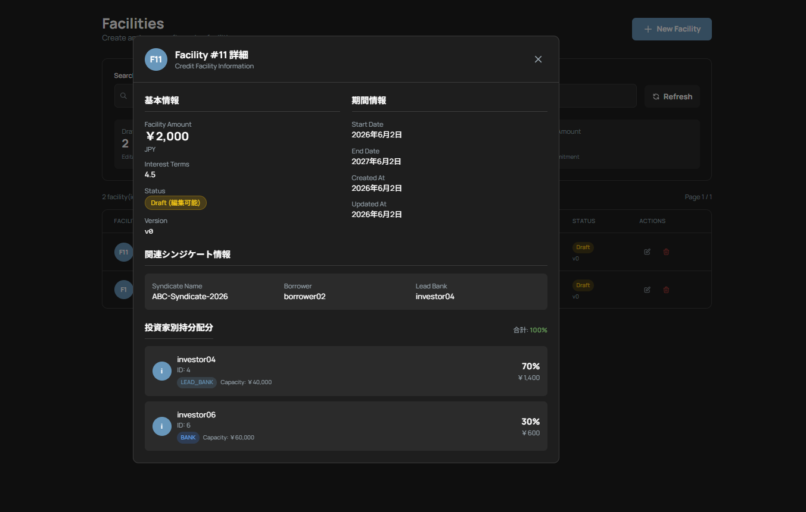

# Facility管理 画面設計書

融資枠（Facility）の作成・一覧・編集・削除・詳細確認を行う画面。4ステップのウィザード形式でSyndicate選択・融資条件・持分配分を設定する。

---

## 1. 概要

| 項目 | 内容 |
|---|---|
| URL | `/facilities` |
| 目的 | 融資枠の作成・管理（CRUD）・持分配分（SharePie）管理 |
| 関連スクリーンショット | `facilities-list.png` / `facilities-form-1-1.png` / `facilities-form-1-2.png` / `facilities-form-2.png` / `facilities-form-3-1.png` / `facilities-form-3-2.png` / `facilities-form-3-3.png` / `facilities-form-fin.png` / `facilities-show-detail.png`（9枚） |

---

## 2. 画面レイアウト

### 2.1 一覧モード（showForm=false）



```
+----------------------------------------------------------+
| Facilities  [New Facility]                               |
|             [Search: ________]  [Refresh]                |
| ✅ 成功メッセージ（3秒間表示）                            |
+----------------------------------------------------------+
| [Draft: N件] [Fixed: N件] [Total: ¥XXX,XXX,XXX]         |
+----------------------------------------------------------+
| ID | Syndicate | 融資枠 | 通貨 | 開始日 | 終了日 | 状態 | ACTIONS          |
|----|-----------|--------|------|--------|--------|------|------------------|
| 1  | ...       | ¥...   | JPY  | ...    | ...    | DRAFT | Detail Edit Delete |
+----------------------------------------------------------+
| ページネーション                                         |
+----------------------------------------------------------+
```

> **Borrower / Investor との違い**: "New Facility" ボタンはトグル動作（常時表示）。Quick Stats（Draft件数・Fixed件数・Total合計）を表示。

### 2.2 ウィザード Step1: Syndicate選択

**選択前:**



**選択後:**



```
+----------------------------------------------------------+
| Facilities  [Close Form]                                 |
+----------------------------------------------------------+
| ●Step1  ○Step2  ○Step3  ○Step4                         |
| Select Syndicate                                         |
+----------------------------------------------------------+
| Syndicate * [SyndicateSelectコンポーネント]              |
|  （編集モードでは disabled で変更不可）                   |
|                                                          |
| [Cancel]                              [Next →]          |
+----------------------------------------------------------+
```

### 2.3 ウィザード Step2: 基本情報



```
+----------------------------------------------------------+
| ✓Step1  ●Step2  ○Step3  ○Step4                         |
| Facility Basic Information                               |
+----------------------------------------------------------+
| Facility Amount *                                        |
|   [_________________] JPY                               |
|   💡 BorrowerのcreaitLimit: ¥XXX / 残高: ¥XXX [色表示]  |
| Currency *    [▼ JPY / USD / EUR / ...]                 |
| Start Date *  [YYYY-MM-DD]                               |
| End Date *    [YYYY-MM-DD]                               |
| Interest Terms * [例: LIBOR + 2%]                       |
|                                                          |
| [Cancel]              [← Back]  [Next →]                |
+----------------------------------------------------------+
```

> 与信残高（`creditLimit - currentFacilityAmount`）が正の場合は success色、0以下の場合は warning色で表示。

### 2.4 ウィザード Step3: 投資家持分配分（SharePie）

**初期状態（配分未設定）:**



**配分中（一部設定済み）:**



**配分完了（合計100%）:**



```
+----------------------------------------------------------+
| ✓Step1  ✓Step2  ●Step3  ○Step4                         |
| Investor Share Allocation                                |
+----------------------------------------------------------+
| [+ Add Investor]                                        |
|                                                          |
| Investor * [▼ 投資家選択]  Share(%) * [___] %  [✕]     |
| Investor * [▼ 投資家選択]  Share(%) * [___] %  [✕]     |
|                                                          |
| 合計: XX% （100%のとき ✅success色、それ以外 ⚠️warning色）|
|                                                          |
| [Cancel]              [← Back]  [Next →]                |
+----------------------------------------------------------+
```

> 合計が100%になるまで "Next" ボタンは disabled。

### 2.5 ウィザード Step4: 確認



```
+----------------------------------------------------------+
| ✓Step1  ✓Step2  ✓Step3  ●Step4                         |
| Confirmation                                             |
+----------------------------------------------------------+
| Syndicate     : [選択したSyndicate名]                    |
| Facility Amount: ¥XXX / [通貨]                          |
| Period        : YYYY-MM-DD ～ YYYY-MM-DD                 |
| Interest Terms: ...                                      |
| Share Pies    :                                          |
|   投資家A : XX%   ¥XXX                                  |
|   投資家B : XX%   ¥XXX                                  |
|                                                          |
| [Cancel]  [← Back]          [Create Facility]           |
+----------------------------------------------------------+
```

> 編集モードでは "Update Facility" ボタンが表示される。

### 2.6 詳細モーダル



```
+----------------------------------------------------------+
| Facility #ID                              [×]            |
+----------------------------------------------------------+
| 基本情報                    | 期間情報                  |
| Amount: ¥XXX / JPY          | Start Date: YYYY-MM-DD   |
| Interest Terms: ...          | End Date: YYYY-MM-DD     |
| Status: [DRAFT/FIXED バッジ]| Created At: YYYY-MM-DD  |
| Version: vN                  | Updated At: YYYY-MM-DD  |
+----------------------------------------------------------+
| 関連シンジケート情報（API取得成功時のみ）               |
| Syndicate: [名前]  Borrower: [名前]  Lead Bank: [名前]  |
+----------------------------------------------------------+
| 投資家別持分配分（sharePies.length > 0 のとき）          |
| 投資家名 | タイプ | 投資能力 | 持分 | 金額               |
|--------|------|--------|-----|-----|                   |
| ...    | ...  | ...    | X%  | ¥XX |                   |
|        |      | 合計   | XX% |     （✅100%で成功色）   |
+----------------------------------------------------------+
```

---

## 3. 項目定義

### 3.1 一覧テーブル列定義

| 列名 | データソース | 備考 |
|---|---|---|
| ID | `facility.id` | |
| Syndicate | `facility.syndicateId`（名前別途取得） | |
| 融資枠 | `facility.commitment` | 通貨フォーマット |
| 通貨 | `facility.currency` | |
| 開始日 | `facility.startDate` | |
| 終了日 | `facility.endDate` | |
| 状態 | `facility.status` | DRAFT（黄） / FIXED（緑） バッジ |
| ACTIONS | — | Detail / Edit / Delete ボタン |

### 3.2 Quick Stats 定義

| 表示名 | 算出方法 |
|---|---|
| Draft件数 | `facilities.filter(f => f.status === 'DRAFT').length` |
| Fixed件数 | `facilities.filter(f => f.status === 'FIXED').length` |
| Total Facility Amount | `facilities.reduce((sum, f) => sum + f.commitment, 0)` |

### 3.3 ウィザード各ステップの入力項目

| ステップ | ラベル | フィールド名 | 型 | 必須 | 備考 |
|---|---|---|---|---|---|
| Step1 | Syndicate | `syndicateId` | SyndicateSelectコンポーネント | ✅ | 編集時はdisabled |
| Step2 | Facility Amount | `commitment` | number | ✅ | Borrower与信残高を参考表示 |
| Step2 | Currency | `currency` | select | ✅ | JPY / USD / EUR 等 |
| Step2 | Start Date | `startDate` | date | ✅ | |
| Step2 | End Date | `endDate` | date | ✅ | |
| Step2 | Interest Terms | `interestTerms` | text | ✅ | 例: LIBOR + 2% |
| Step3 | 持分配分 | `sharePies[]` | SharePieAllocationコンポーネント | ✅ | 合計100%必須 |
| Step4 | — | — | 読み取り専用確認 | — | |

### 3.4 詳細モーダル 表示項目

| セクション | ラベル | データソース |
|---|---|---|
| 基本情報 | Facility Amount | `facility.commitment`（通貨フォーマット）+ `currency` |
| 基本情報 | Interest Terms | `facility.interestTerms` |
| 基本情報 | Status | `facility.status` バッジ |
| 基本情報 | Version | `v${facility.version}` |
| 期間情報 | Start Date | `facility.startDate` |
| 期間情報 | End Date | `facility.endDate` |
| 期間情報 | Created At / Updated At | タイムスタンプ |
| シンジケート情報 | Syndicate Name | `syndicateDetail.name` |
| シンジケート情報 | Borrower | `syndicateDetail.borrowerName` |
| シンジケート情報 | Lead Bank | `syndicateDetail.leadBankName` |
| 持分配分 | 各行 | 投資家名 / investorType バッジ / investmentCapacity / 持分% / 金額 |

---

## 4. 表示条件

| 要素 | 表示条件 |
|---|---|
| "New Facility" ボタン表示 | `showForm === false` のとき（トグル動作）  |
| "Close Form" ボタン表示 | `showForm === true` のとき |
| Quick Stats | `showForm === false` のとき |
| 検索ボックス・テーブル | `showForm === false` のとき |
| ウィザードフォーム | `showForm === true` のとき |
| "Next" ボタン活性 | 現ステップのバリデーション通過時のみ |
| 合計持分 success色 | `Math.abs(total - 1.0) < 0.0001`（100%） |
| 合計持分 warning色 | 上記以外 |
| 詳細モーダル表示 | `showDetail === true && selectedFacility !== null` |
| シンジケート情報セクション | `syndicateDetail !== null`（API取得成功時のみ） |
| 持分配分セクション | `facility.sharePies && facility.sharePies.length > 0` |
| Borrower与信残高 success色 | 残高が正（`creditLimit - currentFacilityAmount > 0`） |
| Borrower与信残高 warning色 | 残高が0以下 |

---

## 5. イベント一覧

| イベントID | イベント名 | トリガー |
|---|---|---|
| FA-01 | ウィザードフォーム表示/非表示トグル | "New Facility" / "Close Form" ボタンクリック |
| FA-02 | 次ステップへ進む | "Next" ボタンクリック |
| FA-03 | 前ステップへ戻る | "Back" ボタンクリック |
| FA-04 | Facility登録 | Step4の "Create Facility" ボタンクリック |
| FA-05 | Facility更新 | Step4の "Update Facility" ボタンクリック |
| FA-06 | フォームキャンセル | "Cancel" ボタンクリック |
| FA-07 | Facility詳細表示 | テーブル行の "Detail" ボタンクリック |
| FA-08 | 詳細モーダルを閉じる | モーダルの "×" ボタンクリック |
| FA-09 | Facility編集開始 | テーブル行の "Edit" ボタンクリック |
| FA-10 | Facility削除 | テーブル行の "Delete" ボタンクリック |
| FA-11 | 一覧リフレッシュ | "Refresh" ボタンクリック |

---

## 6. イベント詳細

### FA-01: ウィザードフォーム表示/非表示トグル

- **処理（一覧中）**: `setShowForm(true)`（ウィザード Step1 を表示）
- **処理（フォーム中）**: `setShowForm(false)` + `setEditMode('create')` + `setEditData(undefined)`
- ボタンラベル: `showForm === false` → "New Facility"、`showForm === true` → "Close Form"

---

### FA-02: 次ステップへ進む

- **前提条件**: 現ステップのバリデーション通過
  - Step1: `syndicateId` が選択済み
  - Step2: `commitment` / `currency` / `startDate` / `endDate` / `interestTerms` が全て入力済み
  - Step3: `sharePies` が1件以上かつ合計が100%
- **処理**: `setCurrentStep(currentStep + 1)`

---

### FA-03: 前ステップへ戻る

- **処理**: `setCurrentStep(currentStep - 1)`（入力内容は保持）

---

### FA-04: Facility登録

- **前提条件**: Step4（確認画面）表示中、`mode === 'create'`
- **API**: `POST /api/v1/facilities`
- **リクエスト**: `{ syndicateId, commitment, currency, startDate, endDate, interestTerms, sharePies }`
- **成功時**: 成功メッセージ + `setRefreshTrigger(prev + 1)` + `setShowForm(false)`
- **失敗時**: `alert(errorMessage)`
- **副作用（API側）**:
  - Borrower → RESTRICTED 状態に遷移
  - 全メンバーInvestor → RESTRICTED 状態に遷移
  - Syndicate → ACTIVE 状態に遷移
  - Facility → DRAFT 状態で作成

---

### FA-05: Facility更新

- **前提条件**: Step4 表示中、`mode === 'edit'`
- **API**: `PUT /api/v1/facilities/{id}`
- **リクエスト**: 登録と同様 + `version`（楽観的ロック）
- **制約**: DRAFT状態のFacilityのみ更新可能（FIXED状態では不可）

---

### FA-06: フォームキャンセル

- **処理**: `setShowForm(false)` + `setEditMode('create')` + `setEditData(undefined)` + ステップをStep1にリセット

---

### FA-07: Facility詳細表示

- **処理**:
  1. `setSelectedFacility(facility)`
  2. `setShowDetail(true)`
  3. モーダル内で `syndicateApi.getByIdWithDetails(facility.syndicateId)` を呼び出しシンジケート情報を取得
  4. `sharePies` の各投資家について `investorApi.getById(investorId)` を呼び出して投資家名を取得

---

### FA-08: 詳細モーダルを閉じる

- **処理**: `setShowDetail(false)` + `setSelectedFacility(null)`

---

### FA-09: Facility編集開始

- **前提条件**: 一覧モード（`showForm === false`）、`facility.status === 'DRAFT'`
- **処理**:
  1. `setEditMode('edit')`
  2. `setEditData(facility)`
  3. `setShowForm(true)`（ウィザード Step1 から表示、ただし syndicateId 選択欄は disabled）

---

### FA-10: Facility削除

- **処理**:
  1. `window.confirm(...)` でユーザー確認
  2. OK時: `DELETE /api/v1/facilities/{id}` を呼び出し
- **成功時**: 成功メッセージ + `setRefreshTrigger(prev + 1)`
- **失敗時**: `alert(errorMessage)`
- **制約（API側）**: Drawdownが存在するFacilityは削除不可
- **副作用（削除成功時）**:
  - Syndicate → DRAFT 状態に復旧
  - Borrower → ACTIVE 状態に復旧
  - 全メンバーInvestor → ACTIVE 状態に復旧

---

### FA-11: 一覧リフレッシュ

- **処理**: `setRefreshTrigger(prev + 1)` で FacilityTable に再フェッチをトリガー
