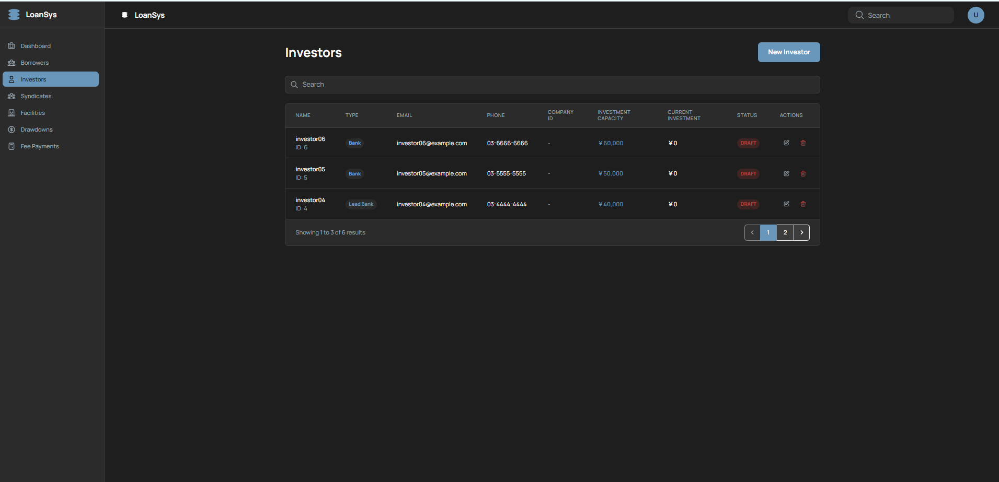
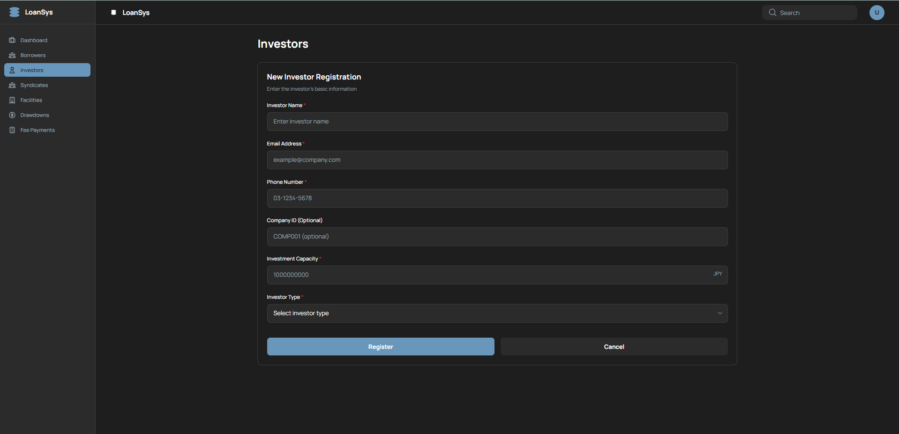
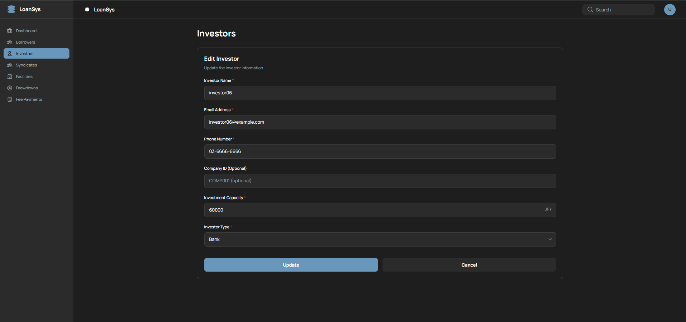

# Investor管理 画面設計書

投資家（Investor）の登録・一覧・編集・削除を行う画面。

---

## 1. 概要

| 項目 | 内容 |
|---|---|
| URL | `/lenders` |
| 目的 | 投資家（金融機関等）の情報管理（CRUD） |
| 関連スクリーンショット | `investor-list.png` / `investor-form.png` / `investor-edit.png`（3枚） |

---

## 2. 画面レイアウト

### 2.1 一覧モード（showForm=false）



```
+----------------------------------------------------------------------+
| Investors                                     [New Investor]         |
+----------------------------------------------------------------------+
| [🔍 Search                                                          ] |
+----------------------------------------------------------------------+
| NAME       | TYPE      | EMAIL               | PHONE       |COMPANY |
|            |           |                     |             |ID      |
| INVESTMENT CAPACITY    | CURRENT INVESTMENT  | STATUS      |ACTIONS |
|------------|-----------|---------------------|-------------|--------|
| investor06 | [Bank]    | investor06@examp..  |03-6666-6666 |  -     |
| ID: 6      |           | ¥60,000             | ¥0          |[DRAFT] | ✏️ 🗑️|
|------------|-----------|---------------------|-------------|--------|
| investor05 | [Bank]    | investor05@examp..  |03-5555-5555 |  -     |
| ID: 5      |           | ¥50,000             | ¥0          |[DRAFT] | ✏️ 🗑️|
|------------|-----------|---------------------|-------------|--------|
| investor04 |[Lead Bank]| investor04@examp..  |03-4444-4444 |  -     |
| ID: 4      |           | ¥40,000             | ¥0          |[DRAFT] | ✏️ 🗑️|
+----------------------------------------------------------------------+
| Showing 1 to 3 of 6 results              [<] [1] [2] [>]            |
+----------------------------------------------------------------------+
```

### 2.2 新規登録フォーム（showForm=true、mode='create'）



```
+------------------------------------------------------------------+
| Investors                                                        |
+------------------------------------------------------------------+
| +---------------------------------------------------------+      |
| | New Investor Registration                               |      |
| | Enter the investor's basic information                  |      |
| |                                                         |      |
| | Investor Name *                                         |      |
| | [Enter investor name                                  ] |      |
| |                                                         |      |
| | Email Address *                                         |      |
| | [example@company.com                                  ] |      |
| |                                                         |      |
| | Phone Number *                                          |      |
| | [03-1234-5678                                         ] |      |
| |                                                         |      |
| | Company ID (Optional)                                   |      |
| | [COMP001 (optional)                                   ] |      |
| |                                                         |      |
| | Investment Capacity *                             [JPY] |      |
| | [1000000000                                           ] |      |
| |                                                         |      |
| | Investor Type *                                         |      |
| | [Select investor type                               ▼ ] |      |
| |                                                         |      |
| | [         Register         ] [          Cancel         ]|      |
| +---------------------------------------------------------+      |
+------------------------------------------------------------------+
```

- フォームは空欄で表示
- 送信中はボタンが "Registering..." に変わり disabled

### 2.3 編集フォーム（showForm=true、mode='edit'）



```
+------------------------------------------------------------------+
| Investors                                                        |
+------------------------------------------------------------------+
| +---------------------------------------------------------+      |
| | Edit Investor                                           |      |
| | Update the investor information                         |      |
| |                                                         |      |
| | Investor Name *                                         |      |
| | [investor06                                           ] |      |
| |                                                         |      |
| | Email Address *                                         |      |
| | [investor06@example.com                               ] |      |
| |                                                         |      |
| | Phone Number *                                          |      |
| | [03-6666-6666                                         ] |      |
| |                                                         |      |
| | Company ID (Optional)                                   |      |
| | [COMP001 (optional)                                   ] |      |
| |                                                         |      |
| | Investment Capacity *                             [JPY] |      |
| | [60000                                                ] |      |
| |                                                         |      |
| | Investor Type *                                         |      |
| | [Bank                                               ▼ ] |      |
| |                                                         |      |
| | [          Update          ] [          Cancel         ]|      |
| +---------------------------------------------------------+      |
+------------------------------------------------------------------+
```

- 既存データが入力済みの状態でフォームを表示
- 送信中はボタンが "Updating..." に変わり disabled
- APIリクエスト時に `version`（楽観的ロック番号）を付加

---

## 3. 項目定義

### 3.1 一覧テーブル列定義

| 列名 | データソース | 備考 |
|---|---|---|
| ID | `investor.id` | |
| 名前 | `investor.name` | |
| タイプ | `investor.investorType` | 色分けバッジ（BANK/INSURANCE/PENSION_FUND/HEDGE_FUND/GOVERNMENT） |
| 投資能力 | `investor.investmentCapacity` | 通貨フォーマット（JPY） |
| 現在投資額 | `investor.currentInvestmentAmount` | 通貨フォーマット（JPY） |
| 状態 | `investor.status` | DRAFT/ACTIVE/RESTRICTED バッジ |
| ACTIONS | — | Edit / Delete ボタン |

### 3.2 フォーム入力項目

| ラベル | フィールド名 | 型 | 必須 | バリデーション |
|---|---|---|---|---|
| Investor Name | `name` | text | ✅ | 必須入力 |
| Email Address | `email` | email | ✅ | メール形式 |
| Phone Number | `phoneNumber` | tel | ✅ | 必須入力 |
| Company ID | `companyId` | text | — | 任意 |
| Investment Capacity | `investmentCapacity` | number | ✅ | 最小1、最大10,000,000,000（JPY） |
| Investor Type | `investorType` | select | ✅ | BANK / INSURANCE / PENSION_FUND / HEDGE_FUND / OTHER |

---

## 4. 表示条件

| 要素 | 表示条件 |
|---|---|
| "New Investor" ボタン | `showForm === false` のとき **のみ** 表示（フォーム表示中は消える） |
| 成功メッセージバナー | `successMessage !== null` のとき（3秒後に自動消去） |
| 検索ボックス | `showForm === false` のとき |
| 一覧テーブル | `showForm === false` のとき |
| フォーム | `showForm === true` のとき |
| "Register" ボタンラベル | `mode === 'create'` のとき |
| "Registering..." ラベル | 新規登録API呼び出し中 |
| "Update" ボタンラベル | `mode === 'edit'` のとき |
| "Updating..." ラベル | 更新API呼び出し中 |
| Delete ボタン disabled | `investor.status === 'COMPLETED'` のとき |
| ページネーション | `totalPages > 1` のとき |

> **Borrower との動作の違い**: Investor Type の色分けバッジあり。Credit Rating / Credit Limit ではなく Investment Capacity / Current Investment Amount を表示。

---

## 5. イベント一覧

| イベントID | イベント名 | トリガー |
|---|---|---|
| I-01 | 新規登録フォーム表示 | "New Investor" ボタンクリック |
| I-02 | Investor登録 | フォームの "Register" ボタンクリック（submit） |
| I-03 | Investor更新 | フォームの "Update" ボタンクリック（submit） |
| I-04 | フォームキャンセル | フォームの "Cancel" ボタンクリック |
| I-05 | Investor編集開始 | テーブル行の "Edit" ボタンクリック |
| I-06 | Investor削除 | テーブル行の "Delete" ボタンクリック |
| I-07 | 検索フィルタリング | 検索ボックスへの入力 |
| I-08 | ページ切替 | ページネーションボタンクリック |
| I-09 | データ再取得 | 初回ロード・操作成功後 |

---

## 6. イベント詳細

### I-01: 新規登録フォーム表示

- **前提条件**: 一覧モード（`showForm === false`）
- **処理**: `setShowForm(true)`（`editMode` は 'create' のまま、フォームは空欄）
- **遷移**: 一覧モード → 新規登録フォームモード（URL変化なし）

---

### I-02: Investor登録

- **前提条件**: 新規登録フォームモード（`mode === 'create'`）、全必須項目入力済み
- **API**: `POST /api/v1/parties/investors`
- **リクエスト**: `{ name, email, phoneNumber, companyId, investmentCapacity, investorType }`
- **成功時**:
  1. `setSuccessMessage(...)` （3秒後自動消去）
  2. `setRefreshTrigger(prev + 1)`
  3. `setShowForm(false)` + `setEditMode('create')` + `setEditData(undefined)`
- **失敗時**: `alert(errorMessage)` でエラー通知

---

### I-03: Investor更新

- **前提条件**: 編集フォームモード（`mode === 'edit'`）、全必須項目入力済み
- **API**: `PUT /api/v1/parties/investors/{id}`
- **リクエスト**: `{ name, email, phoneNumber, companyId, investmentCapacity, investorType, version }` ※`version` 必須
- **成功時**: I-02と同様
- **失敗時（競合）**: `alert()` でエラー通知（409 Conflict）

---

### I-04: フォームキャンセル

- **処理**: `setShowForm(false)` + `setEditMode('create')` + `setEditData(undefined)`
- **副作用**: 入力内容は破棄される。APIは呼ばれない

---

### I-05: Investor編集開始

- **前提条件**: 一覧モード（`showForm === false`）
- **処理**:
  1. `setEditMode('edit')`
  2. `setEditData(investor)`
  3. `setShowForm(true)`
- **遷移**: 一覧モード → 編集フォームモード（既存データが入力済み）

---

### I-06: Investor削除

- **前提条件**: `investor.status !== 'COMPLETED'`
- **処理**:
  1. `window.confirm(...)` でユーザー確認
  2. キャンセル時: 何もしない
  3. OK時: `DELETE /api/v1/parties/investors/{id}` を呼び出し
- **成功時**: 成功メッセージ表示 + `setRefreshTrigger(prev + 1)`
- **失敗時**: `alert(errorMessage)` でエラー通知
- **制約（API側）**: Syndicate / Facility に参加中のInvestorは削除不可（API が 400 を返却）

---

### I-07: 検索フィルタリング

- **処理**: 入力値で `investors` 配列をフロントエンド側でインメモリフィルタリング（APIリクエストは発生しない）
- **フィルター対象フィールド**: `name` / `email` / `companyId`（部分一致・大文字小文字区別なし）

---

### I-08: ページ切替

- **処理**: `GET /api/v1/parties/investors?page={n}&sort=id,desc` を呼び出してデータ再取得

---

### I-09: データ再取得

- **タイミング**: 初回マウント時 / `refreshTrigger` が変化した時
- **API**: `GET /api/v1/parties/investors?page=0&sort=id,desc`
- **失敗時**: エラーUI（エラーメッセージ + "Retry" ボタン）に切り替わる
