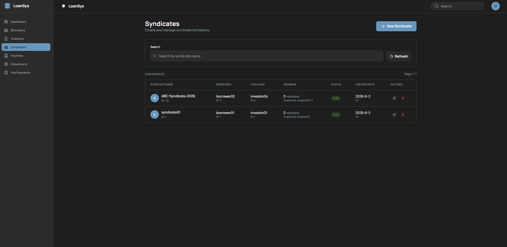
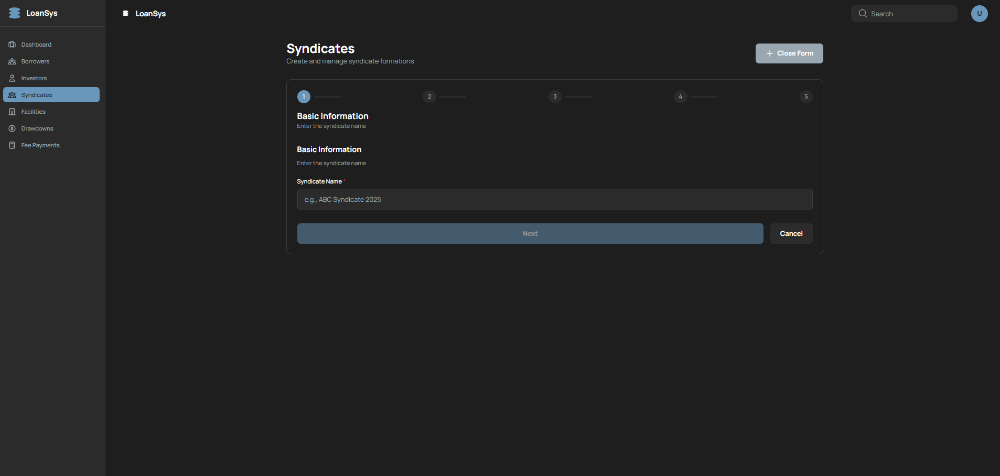
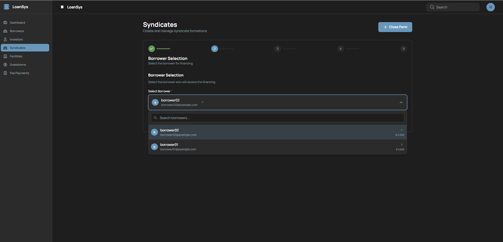
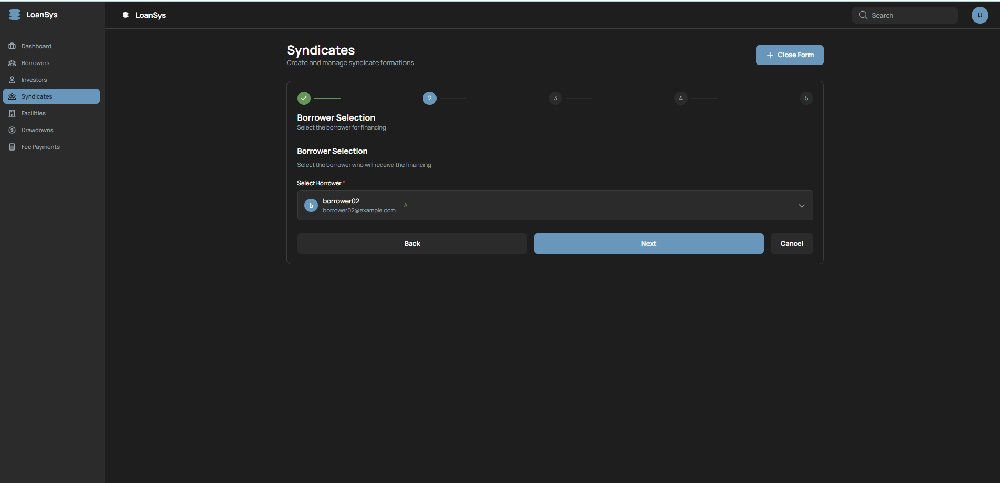
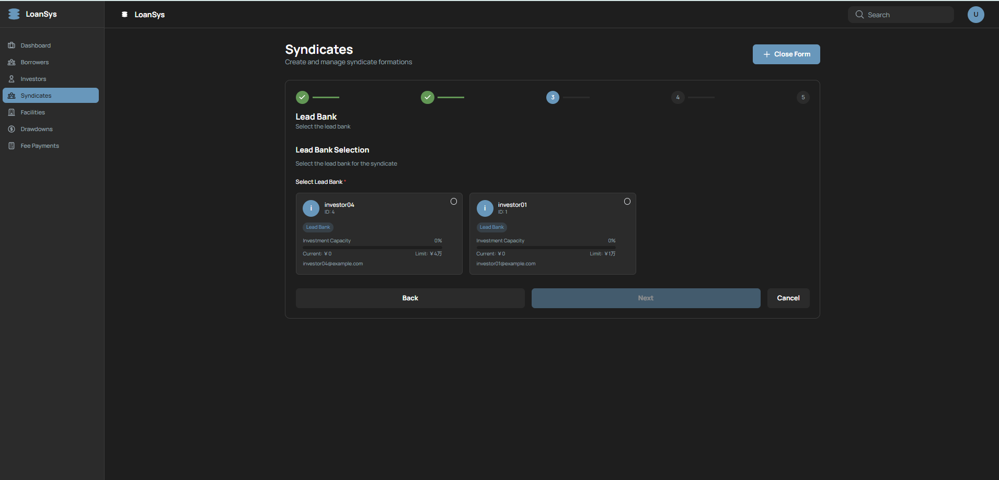
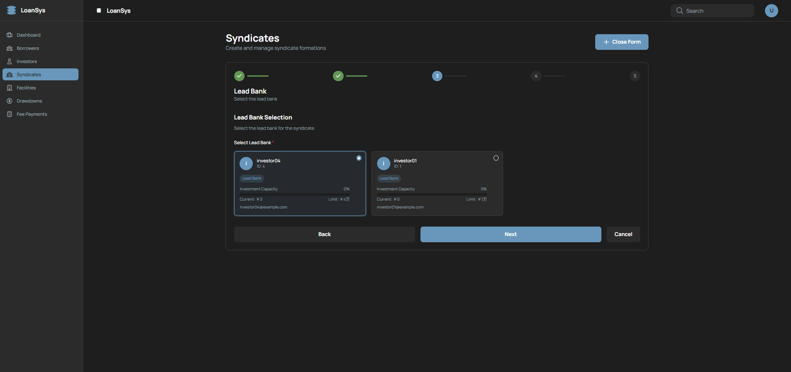
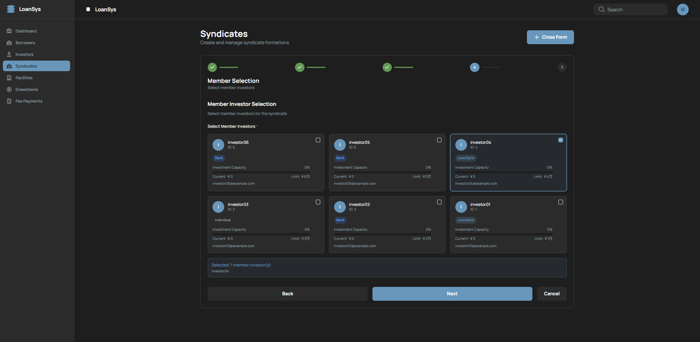
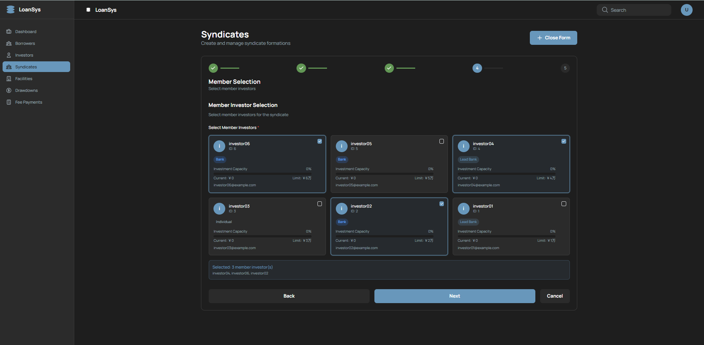

# Syndicate管理 画面設計書

シンジケート団（Syndicate）の組成・一覧・編集・削除を行う画面。5ステップのウィザード形式でBorrower・Lead Bank・メンバーInvestorを設定する。

---

## 1. 概要

| 項目 | 内容 |
|---|---|
| URL | `/syndicates` |
| 目的 | シンジケート団の組成・管理（CRUD） |
| 関連スクリーンショット | `syndicates-form-1.png` / `syndicates-form-2-1.png` / `syndicates-form-2-2.png` / `syndicates-form-3-1.png` / `syndicates-form-3-2.png` / `syndicates-form-4-1.png` / `syndicates-form-4-2.png` / `syndicates-form-fin.png`（8枚） |
| 備考 | 一覧画面のスクリーンショットは未取得（後日追加予定） |

---

## 2. 画面レイアウト

### 2.1 一覧モード（showForm=false）



```
+-------------------------------------------------------------------+
| Syndicates                        [+ New Syndicate]               |
| Create and manage syndicate formations                            |
+-------------------------------------------------------------------+
| Search                                                            |
| [🔍 Search by syndicate name...                        ] [Refresh]|
+-------------------------------------------------------------------+
| 2 syndicate(s)                                       Page 1 / 1   |
+-------------------------------------------------------------------+
| SYNDICATE NAME  | BORROWER      | LEAD BANK   | MEMBERS  |STATUS  |
| CREATED DATE    | ACTIONS                                         |
|-----------------|---------------|-------------|----------|--------|
| [A] ABC-Syndi.. | borrower02    | investor04  | 3 members|[Draft] |
|     ID: 10      | ID: 2         | ID: 4       | inv04,06+| 2026-6-2 v0 | ✏️ 🗑️ |
|-----------------|---------------|-------------|----------|--------|
| [S] syndicate01 | borrower01    | investor01  | 2 members|[Draft] |
|     ID: 1       | ID: 1         | ID: 1       | inv02,03 | 2026-6-2 v0 | ✏️ 🗑️ |
+-------------------------------------------------------------------+
```

> **Borrower / Investor との違い**: "New Syndicate" ボタンは常時表示（フォーム中は "Close Form" に変わるトグル動作）

### 2.2 ウィザード Step1: 基本情報



```
+-------------------------------------------------------------------+
| Syndicates                             [+ Close Form]             |
| Create and manage syndicate formations                            |
+-------------------------------------------------------------------+
| ①──────────── 2 ──────────── 3 ──────────── 4 ──────── 5        |
| Basic Information                                                 |
| Enter the syndicate name                                          |
+-------------------------------------------------------------------+
| Basic Information                                                 |
| Enter the syndicate name                                          |
|                                                                   |
| Syndicate Name *                                                  |
| [e.g., ABC Syndicate 2025                                       ] |
|                                                                   |
| [                    Next (disabled)                ] [Cancel]   |
+-------------------------------------------------------------------+
```

### 2.3 ウィザード Step2: Borrower選択

**選択前（ドロップダウン展開）:**



```
+-------------------------------------------------------------------+
| ✓ ──────────── ②──────────── 3 ──────────── 4 ──────── 5       |
| Borrower Selection                                                |
| Select the borrower for financing                                 |
+-------------------------------------------------------------------+
| Borrower Selection                                                |
| Select the borrower who will receive the financing                |
|                                                                   |
| Select Borrower *                                                 |
| [b borrower02   A                                             ▲ ] |
| +---------------------------------------------------------------+ |
| | [🔍 Search borrowers...                                     ] | |
| | [b] borrower02  borrower02@example.com              A ¥2,000 | |
| | [b] borrower01  borrower01@example.com              A ¥1,000 | |
| +---------------------------------------------------------------+ |
+-------------------------------------------------------------------+
```

**選択後:**



```
+-------------------------------------------------------------------+
| ✓ ──────────── ②──────────── 3 ──────────── 4 ──────── 5       |
| Borrower Selection                                                |
+-------------------------------------------------------------------+
| Select Borrower *                                                 |
| [b borrower02  borrower02@example.com  A                      ▼ ]|
|                                                                   |
| [        Back        ] [          Next          ] [Cancel]       |
+-------------------------------------------------------------------+
```

### 2.4 ウィザード Step3: Lead Bank選択

**選択前:**



```
+-------------------------------------------------------------------+
| ✓ ──────── ✓ ──────────── ③──────────── 4 ──────── 5           |
| Lead Bank                                                         |
| Select the lead bank                                              |
+-------------------------------------------------------------------+
| Lead Bank Selection                                               |
| Select the lead bank for the syndicate                            |
|                                                                   |
| Select Lead Bank *                                                |
| +-------------------------------+ +-----------------------------+ |
| | [i] investor04     ID: 4   ○ | | [i] investor01   ID: 1   ○ | |
| |    [Lead Bank]               | |    [Lead Bank]              | |
| |    Investment Capacity  0%   | |    Investment Capacity  0%  | |
| |    Current: ¥0  Limit: ¥4万 | |    Current: ¥0  Limit: ¥1万| |
| |    investor04@example.com    | |    investor01@example.com   | |
| +-------------------------------+ +-----------------------------+ |
|                                                                   |
| [        Back        ] [      Next (disabled)   ] [Cancel]       |
+-------------------------------------------------------------------+
```

**選択後（investor04 selected）:**



```
| Select Lead Bank *                                                |
| +-------------------------------+ +-----------------------------+ |
| | [i] investor04     ID: 4   ● | | [i] investor01   ID: 1   ○ | |
| |    [Lead Bank]   (selected)  | |    [Lead Bank]              | |
| +-------------------------------+ +-----------------------------+ |
|                                                                   |
| [        Back        ] [            Next         ] [Cancel]      |
```

> 選択したLead BankはmemberInvestorIdsにも自動で追加される。

### 2.5 ウィザード Step4: メンバーInvestor選択

**選択前（1件選択済み）:**



```
+-------------------------------------------------------------------+
| ✓ ──── ✓ ──── ✓ ──────────── ④──────────── 5                   |
| Member Selection                                                  |
| Select member investors                                           |
+-------------------------------------------------------------------+
| Member Investor Selection                                         |
| Select member investors for the syndicate                         |
|                                                                   |
| Select Member Investors *                                         |
| +------------------+ +------------------+ +------------------+   |
| |[i] investor06 □ | |[i] investor05 □  | |[i] investor04 ☑ |   |
| |    ID: 6         | |    ID: 5         | |    ID: 4         |   |
| |    [Bank]        | |    [Bank]        | |    [Lead Bank]   |   |
| |    Cap  0%       | |    Cap  0%       | |    Cap  0%       |   |
| |    ¥0 / ¥6万    | |    ¥0 / ¥5万    | |    ¥0 / ¥4万    |   |
| +------------------+ +------------------+ +------------------+   |
| +------------------+ +------------------+ +------------------+   |
| |[i] investor03 □ | |[i] investor02 □  | |[i] investor01 □ |   |
| |    ID: 3         | |    ID: 2         | |    ID: 1         |   |
| |    [Individual]  | |    [Bank]        | |    [Lead Bank]   |   |
| |    ¥0 / ¥3万    | |    ¥0 / ¥2万    | |    ¥0 / ¥1万    |   |
| +------------------+ +------------------+ +------------------+   |
|                                                                   |
| Selected: 1 member investor(s)                                    |
| investor04                                                        |
|                                                                   |
| [        Back        ] [            Next         ] [Cancel]      |
+-------------------------------------------------------------------+
```

**選択後（3件選択）:**



```
| investor06 ☑ / investor05 □ / investor04 ☑ (Lead Bank)          |
| investor03 □ / investor02 ☑ / investor01 □ (Lead Bank)          |
|                                                                   |
| Selected: 3 member investor(s)                                    |
| investor04, investor06, investor02                                |
```

> 1件以上の選択が必須。Lead Bankとして選択した投資家は既に選択済み状態。

### 2.6 ウィザード Step5: 確認

> **スクリーンショット未取得**（syndicates-form-fin.png は作成後の一覧画面）

```
+-------------------------------------------------------------------+
| ✓ ──── ✓ ──── ✓ ──── ✓ ──────────── ⑤                          |
| Confirmation                                                      |
+-------------------------------------------------------------------+
| Syndicate Name  : ABC-Syndicate-2026                              |
| Borrower        : borrower02 (ID: 2)                             |
| Lead Bank       : investor04 (ID: 4)                             |
| Member Investors: investor04, investor06, investor02              |
|                                                                   |
| [     Cancel     ] [    Back    ] [    Create Syndicate    ]      |
+-------------------------------------------------------------------+
```

> 編集モードでは "Update Syndicate" ボタンが表示される。

---

## 3. 項目定義

### 3.1 一覧テーブル列定義

| 列名 | データソース | 備考 |
|---|---|---|
| ID | `syndicate.id` | |
| 名前 | `syndicate.name` | |
| Borrower | `syndicate.borrowerName` | SyndicateDetail型から取得 |
| Lead Bank | `syndicate.leadBankName` | SyndicateDetail型から取得 |
| メンバー数 | `syndicate.memberInvestorIds.length` | |
| 状態 | `syndicate.status` | DRAFT / ACTIVE バッジ |
| ACTIONS | — | Edit / Delete ボタン |

### 3.2 ウィザード各ステップの入力項目

| ステップ | ラベル | フィールド名 | 型 | 必須 |
|---|---|---|---|---|
| Step1 | Syndicate Name | `name` | text | ✅ |
| Step2 | Borrower | `borrowerId` | BorrowerSelectコンポーネント | ✅ |
| Step3 | Lead Bank | `leadBankId` | InvestorCardsコンポーネント（single-select） | ✅ |
| Step4 | Member Investors | `memberInvestorIds` | InvestorCardsコンポーネント（multi-select） | ✅（1件以上） |
| Step5 | — | — | 読み取り専用 確認画面 | — |

---

## 4. 表示条件

| 要素 | 表示条件 |
|---|---|
| "New Syndicate" ボタン表示 | `showForm === false` のとき（トグル動作: 常時表示で内容が変わる） |
| "Close Form" ボタン表示 | `showForm === true` のとき |
| 検索ボックス・テーブル | `showForm === false` のとき |
| ウィザードフォーム | `showForm === true` のとき |
| ステップインジケーター（完了） | 完了済みステップ: チェックマーク（success色） |
| ステップインジケーター（現在） | 現在ステップ: アクセントカラー |
| ステップインジケーター（未到達） | 未到達ステップ: セカンダリカラー |
| "Next" ボタン活性 | 現ステップのバリデーション通過時のみ |
| "Create Syndicate" ボタン | Step5 かつ `mode === 'create'` のとき |
| "Update Syndicate" ボタン | Step5 かつ `mode === 'edit'` のとき |
| Delete ボタン disabled | **なし**（SyndicateTableに無効化制御の実装なし） |

> **注意**: Borrower/Investorと異なり、"New Syndicate" ボタンは `showForm=true` でも消えず、ラベルが "Close Form" に変わるトグル動作。

---

## 5. イベント一覧

| イベントID | イベント名 | トリガー |
|---|---|---|
| SY-01 | ウィザードフォーム表示/非表示トグル | "New Syndicate" / "Close Form" ボタンクリック |
| SY-02 | 次ステップへ進む | "Next" ボタンクリック |
| SY-03 | 前ステップへ戻る | "Back" ボタンクリック |
| SY-04 | Syndicate登録 | Step5の "Create Syndicate" ボタンクリック |
| SY-05 | Syndicate更新 | Step5の "Update Syndicate" ボタンクリック |
| SY-06 | フォームキャンセル | "Cancel" ボタンクリック |
| SY-07 | Syndicate編集開始 | テーブル行の "Edit" ボタンクリック |
| SY-08 | Syndicate削除 | テーブル行の "Delete" ボタンクリック |
| SY-09 | 一覧リフレッシュ | "Refresh" ボタンクリック |
| SY-10 | 検索フィルタリング | 検索ボックスへの入力 |

---

## 6. イベント詳細

### SY-01: ウィザードフォーム表示/非表示トグル

- **処理（一覧中）**: `setShowForm(true)`（ウィザード Step1 を表示）
- **処理（フォーム中）**: `setShowForm(false)` + `setEditMode('create')` + `setEditData(undefined)`（フォームを閉じて一覧に戻る）
- ボタンラベル: `showForm === false` → "New Syndicate"、`showForm === true` → "Close Form"

---

### SY-02: 次ステップへ進む

- **前提条件**: 現ステップのバリデーション通過（"Next" ボタンが活性状態）
  - Step1: `name` が入力済み
  - Step2: `borrowerId` が選択済み
  - Step3: `leadBankId` が選択済み
  - Step4: `memberInvestorIds` が1件以上
- **処理**: `setCurrentStep(currentStep + 1)`

---

### SY-03: 前ステップへ戻る

- **処理**: `setCurrentStep(currentStep - 1)`（入力内容は保持）

---

### SY-04: Syndicate登録

- **前提条件**: Step5（確認画面）表示中、`mode === 'create'`
- **API**: `POST /api/v1/syndicates`
- **リクエスト**: `{ name, borrowerId, leadBankId, memberInvestorIds }`
- **成功時**:
  1. 成功メッセージ表示 + `setRefreshTrigger(prev + 1)` + `setShowForm(false)`
- **失敗時**: `alert(errorMessage)` でエラー通知
- **副作用（API側）**:
  - Borrower → RESTRICTED 状態に遷移
  - 全メンバーInvestor → RESTRICTED 状態に遷移
  - Syndicate → ACTIVE 状態で作成

---

### SY-05: Syndicate更新

- **前提条件**: Step5（確認画面）表示中、`mode === 'edit'`
- **API**: `PUT /api/v1/syndicates/{id}`
- **リクエスト**: `{ name, borrowerId, leadBankId, memberInvestorIds, version }`
- **成功時**: SY-04と同様

---

### SY-06: フォームキャンセル

- **処理**: `setShowForm(false)` + `setEditMode('create')` + `setEditData(undefined)`（`setCurrentStep(1)` でステップもリセット）
- **副作用**: 入力内容は破棄される

---

### SY-07: Syndicate編集開始

- **前提条件**: 一覧モード（`showForm === false`）
- **処理**:
  1. `setEditMode('edit')`
  2. `setEditData(syndicate)`（型は `SyndicateDetail`、Borrower名・Lead Bank名等の詳細情報を含む）
  3. `setShowForm(true)`（ウィザード Step1 から表示）

---

### SY-08: Syndicate削除

- **処理**:
  1. `window.confirm(...)` でユーザー確認
  2. OK時: `DELETE /api/v1/syndicates/{id}` を呼び出し
- **成功時**: 成功メッセージ + `setRefreshTrigger(prev + 1)`
- **失敗時**: `alert(errorMessage)` でエラー通知
- **制約（API側）**: Facilityが存在するSyndicateは削除不可（API が 400 を返却）
- **注意**: SyndicateTableにボタンの disabled 制御なし（どのステータスでも押下可能）

---

### SY-09: 一覧リフレッシュ

- **処理**: `setRefreshTrigger(prev + 1)` で SyndicateTable に再フェッチをトリガー

---

### SY-10: 検索フィルタリング

- **処理**: `setSearchTerm(value)` → SyndicateTable の `useEffect` が再実行され APIクエリに `search=keyword` を付加してリクエスト
- **Borrower / Investor との違い**: Borrower/InvestorはフロントエンドのメモリフィルタリングだがSyndicateはAPIレベルでの検索
- **API**: `GET /api/v1/syndicates/details/paged?page=0&sort=id,desc&search={keyword}`
