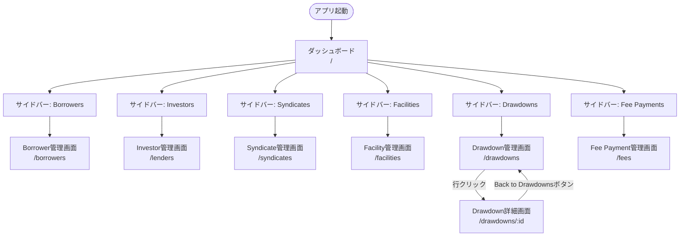
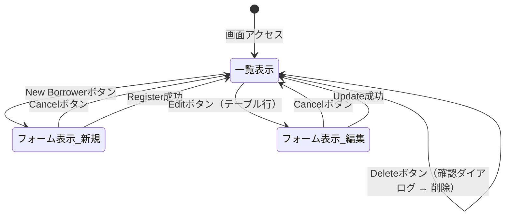
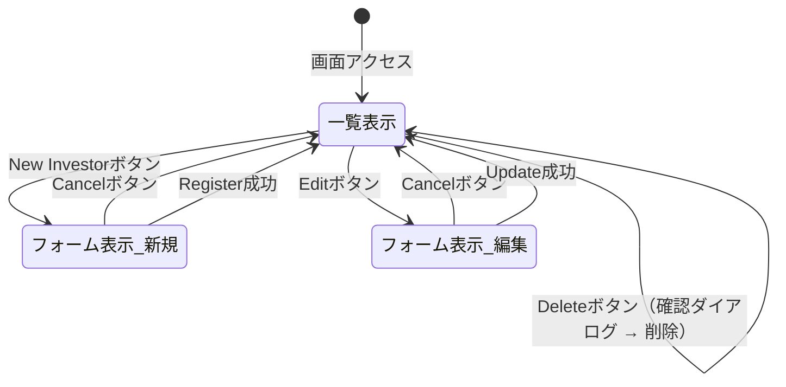
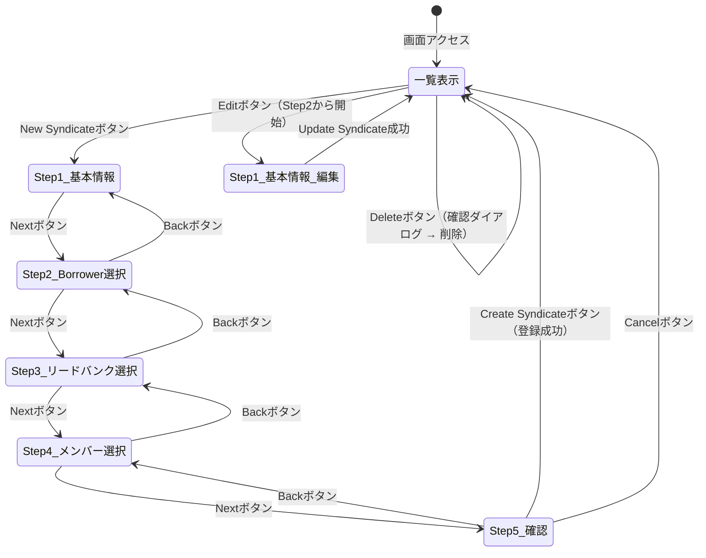
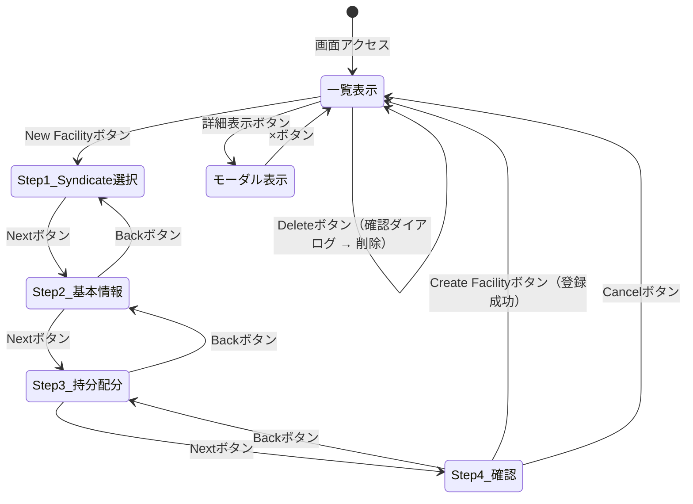
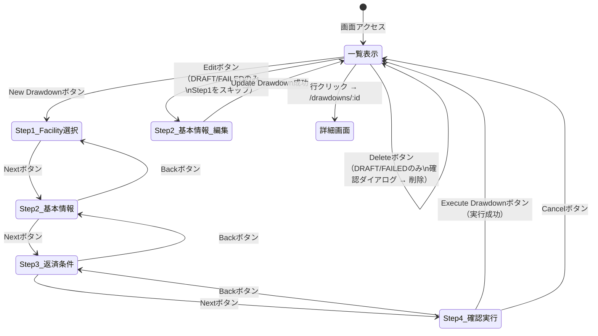
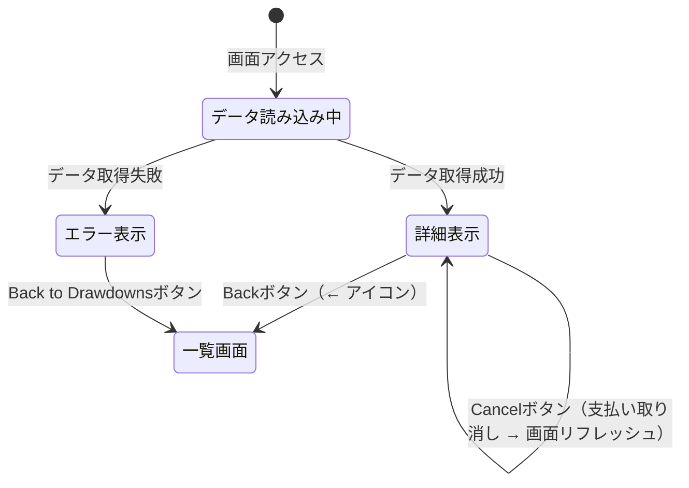
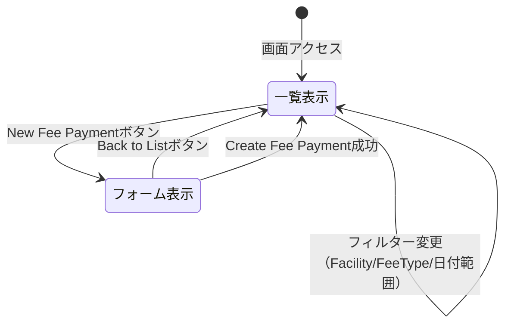

# 画面遷移図

シンジケートローン管理システムの画面遷移。

---

## 全体画面遷移図

---

## ページ内遷移詳細

### Borrower管理画面（/borrowers）

### Investor管理画面（/lenders）

### Syndicate管理画面（/syndicates）

### Facility管理画面（/facilities）

### Drawdown管理画面（/drawdowns）

### Drawdown詳細画面（/drawdowns/:id）

### Fee Payment管理画面（/fees）

---

## 画面間の遷移サマリー

| 遷移元 | 遷移先 | トリガー |
|---|---|---|
| サイドバー | Borrower管理画面 | "Borrowers" クリック |
| サイドバー | Investor管理画面 | "Investors" クリック |
| サイドバー | Syndicate管理画面 | "Syndicates" クリック |
| サイドバー | Facility管理画面 | "Facilities" クリック |
| サイドバー | Drawdown管理画面 | "Drawdowns" クリック |
| サイドバー | Fee Payment管理画面 | "Fee Payments" クリック |
| Drawdown管理画面 | Drawdown詳細画面 | テーブル行クリック |
| Drawdown詳細画面 | Drawdown管理画面 | Back ボタン |

> **注**: Borrower/Investor/Syndicate/Facility/Fee Payment画面はページ内遷移（フォーム表示切替）のみで、別URLへの遷移は発生しない。
